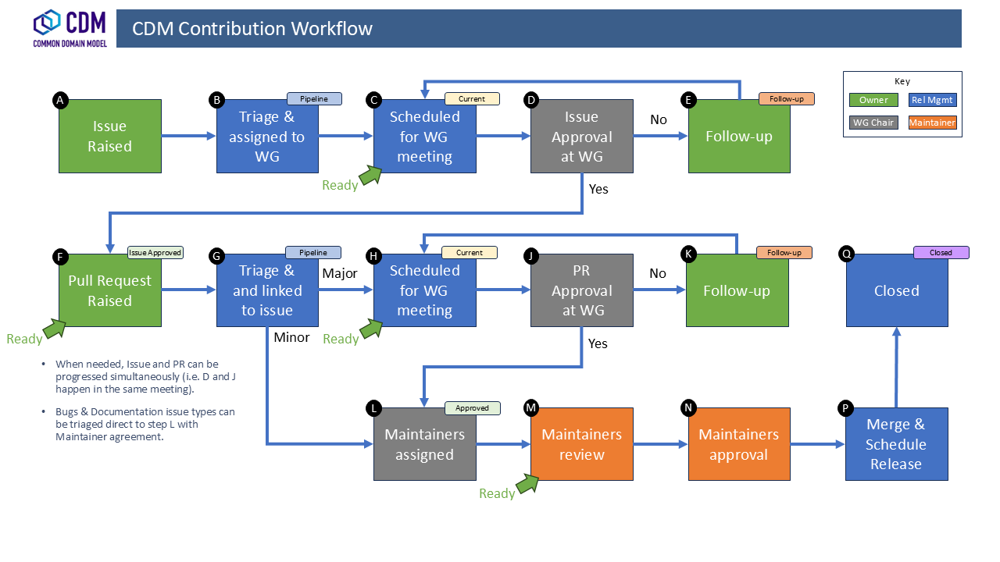
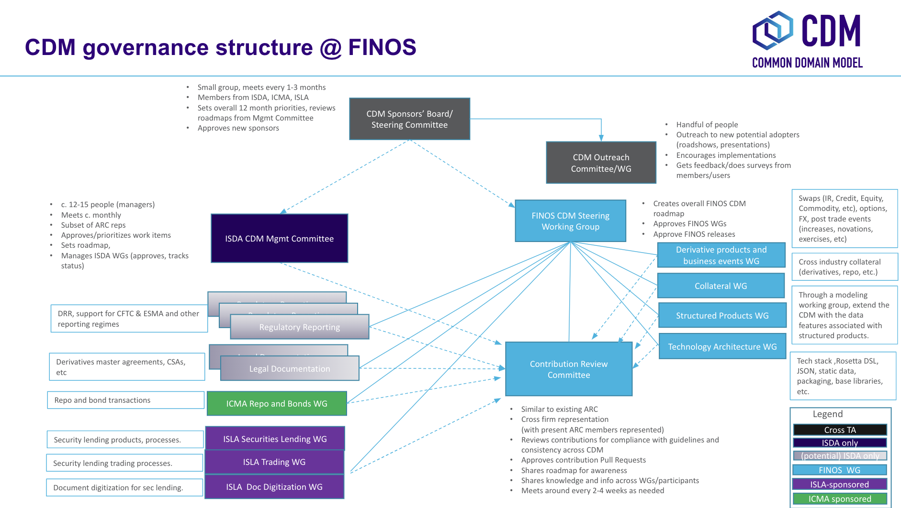

# Common Domain Model (CDM)

> [!TIP]
> Visit the [CDM Documentation website](https://cdm.finos.org/) for a complete description of the features and capabilities of the Common Domain Model.

The FINOS Common Domain Model (CDM) is a standardised, machine-readable and machine-executable blueprint for how financial products are traded and managed across the transaction lifecycle. It is represented as a domain model and distributed in open source.

## Purpose
A single, digital processing standard for trade events and actions enhances financial markets' operational efficiency in several ways:

- Enables inter-operability and straight-through processing across firms, solutions and platforms, reducing the need for reconciliation caused by variations in how each firm records trade lifecycle events.
- Accelerates financial technology innovation by providing a common, readily operational foundation for how technologies like distributed ledger, smart contracts, cloud computing, and artificial intelligence can be applied to financial markets.
- Delivers better regulatory oversight, promotes transparency and alignment between regulators and market participants and enables consistency in regulatory reporting, by providing a standard representation of trade data and supporting machine executable reporting requirements.

The Common Domain Model is an open standard project hosted under FINOS, the [Fintech Open Source Foundation](https://community.finos.org/docs/governance/Standards-Projects), starting in February 2023. The standard is developed through the [Community Specification](https://community.finos.org/docs/governance/#open-standard-projects) open governance process, and underlying code assets are released under the [Community Specification License 1.0](https://github.com/finos/standards-project-blueprint/blob/master/governance-documents/4._License.md). To participate in the standard process and working group meetings, [enroll as a participant](https://github.com/finos/standards-project-blueprint/blob/master/governance-documents/Getting%20Started.md#best-practices) by completing a [Community Specification Contributor License Agreement](https://community.finos.org/docs/governance/Standards-Projects#ip-licensing-requirements) (CSL CLA).  All meetings are to be held [in accordance with the FINOS policies and procedures](https://community.finos.org/docs/governance/meeting-procedures).

To subscribe to our mailing list using the following [link](mailto:cdm+subscribe@lists.finos.org).

## CDM Design Principles

Contributions to the CDM have to comply with the following set of design principles that include the following concepts:

* **Normalisation** through abstraction of common components
* **Composability** where objects are composed and qualified from the bottom up
* **Mapping** to existing industry messaging formats
* **Embedded logic** to represent industry processes
* **Modularisation** into logical layers \

## Getting involved 

Ways to interact with the CDM community: 

* **GitHub**: CDM activity primarily happens in this [CDM GitHub repository](https://github.com/finos/common-domain-model). [Watch](https://docs.github.com/en/account-and-profile/managing-subscriptions-and-notifications-on-github/setting-up-notifications/configuring-notifications#configuring-your-watch-settings-for-an-individual-repository) the repository in order to be notified of new Pull Requests and issues.
* **Email**: If you'd like to receive official updates, please send an email to help@finos.org. You can join the CDM mailing list by sending an email to [cdm+subscribe@lists.finos.org](mailto:cdm+subscribe@lists.finos.org). 
* **Meetings**: Finally, another great way to interact with the community is to attend the Working Groups.  Email help@finos.org to be added to the meeting invites directly, or find the meeting in the [FINOS Community Calendar](https://calendar.google.com/calendar/embed?src=finos.org_fac8mo1rfc6ehscg0d80fi8jig%40group.calendar.google.com). 

> [!TIP]
> **Need help?**  Email help@finos.org. if you need help getting started in the CDM Community or if you encounter technical difficulties accessing repositories, mailing lists or meetings. 

## Roadmap

- The latest CDM roadmap of expected contributions sponsored by the presently participating trade associations: ICMA, ISDA and ISLA can be found under [Roadmap.md](ROADMAP.md).

- Releases can be tracked on the [CDM Releases](https://github.com/finos/common-domain-model/releases/tag/5.0.0-dev.7) page.

## Contributing

> [!IMPORTANT]
> If you wish to add a new feature, make a change to the model, or fix a defect, you should start by raising an Issue in GitHub.  To implement changes in the CDM repository resolving an issue, you shoud raise a Pull Request.  

Please read our [development guidelines](https://cdm.finos.org/docs/dev-guidelines), [contribution guidelines](CONTRIBUTING.md) and [Community Code of Conduct](https://www.finos.org/code-of-conduct). See guidelines for the licensing agreement [here](https://github.com/finos/common-domain-model/blob/master/.github/CONTRIBUTING.md).  

> [!NOTE]
> Commits and pull requests to FINOS repositories will only be accepted from those contributors with an active, executed Individual Contributor License Agreement (ICLA) with FINOS, OR who are covered under an existing and active Corporate Contribution License Agreement (CCLA) executed with FINOS. Commits from individuals not covered under an ICLA or CCLA will be flagged and blocked by the Linux Foundation EasyCLA tool. Please note that some CCLAs require individuals/employees to be explicitly named on the CCLA. Need an ICLA? Unsure if you are covered under an existing CCLA? Email help@finos.org.

### Contribution Governance

The CDM Governance process defines the roles of the Maintainers and Working Groups to oversee changes to the model.  The sponsoring Trade Associations (ISDA, ISLA and ICMA) have commissioned REGnosys to provide the CDM Release Management Service to ensure that changes are advanced in a transparent and efficient manner.

### Pull Requests via Rosetta

> [!TIP]
> The [Rosetta Design](https://rosetta-technology.io/design) application can be used to contribute to the CDM without setting up any development environment. 

Steps:
  1. Create a Workspace for the CDM in Rosetta Design
  1. Make and review your change
  2. Contribute the change in Rosetta Design which will create a PR in the Finos Github.

### Pull Requests via GitHub

1. Fork it (https://github.com/finos/common-domain-model)
1. Create your feature branch (`git checkout -b feature/my-new-feature`)
1. Make a change - _hint_ you can make changes to Rosetta files directly on your desktop using the [Rosetta VS Code plugin](https://github.com/REGnosys/rosetta-dsl/tree/master/rosetta-ide/vscode)
1. Commit your changes (`git commit -am 'My New Feature'`)
1. Push to the branch (`git push origin feature/my-new-feature`)
1. Create a new Pull Request

## Documentation

The CDM has extensive documentation which is kept up to date. Any change to the CDM should be accompanied by documentation. See docs guide [here](https://cdm.finos.org/docs/contribution#documentation-style-guide)

## Governance overview

### Roles

The CSL specifies [three different contribution roles](https://github.com/finos/standards-project-blueprint/blob/master/governance-documents/5._Governance.md#1roles) for each specific Working Group:

* Maintainers - those who drive consensus within the working group
* [Editors](https://github.com/finos/common-domain-model/blob/master/GOVERNANCE.md#1-roles) - those who codify ideas into a formal specification
* Participants - anyone who provides contributions to the project under a signed CSL CLA. A great way to sign the CLA is to open a Pull Request to add your name to the [Participants.md](https://github.com/finos/standards-project-blueprint/blob/master/governance-documents/participants.md) file. 

### Active Working Groups

The following Working Groups are currently active in this project:

* [CDM Steering Working Group](https://cdm.finos.org/docs/CDM-Steering-WG)
* [CDM Contribution Review Working Group](https://cdm.finos.org/docs/CDM-Contribution-Review-WG)
* [CDM Collateral Working Group](https://cdm.finos.org/docs/CDM-Collateral-WG)
* [CDM Technology Architecture Working Group](https://cdm.finos.org/docs/CDM-Technology-Architecture-WG)
* [CDM Derivatives Working Group](https://cdm.finos.org/docs/CDM-Derivatives-WG) - previously known as Derivatives Products and Business Events Working Group
* [ISLA CDM Working Group (Securities Lending)](https://www.islaemea.org/working-groups/)
* [ISLA CDM Trading Working Group (Securities Lending)](https://www.islaemea.org/working-groups/)
* [ISLA Document Digitisation Working Group (GMSLA)](https://www.islaemea.org/working-groups/)
* [ICMA CDM SteerCo for Repo and Bonds](https://www.icmagroup.org/market-practice-and-regulatory-policy/repo-and-collateral-markets/fintech/common-domain-model-cdm/)

Changes to the CDM may be proposed by anyone but are governed by the process described here.

## Working Groups

**Any Participant may propose a Working Group.** Proposals for the formation of a new Working Group are made by completion of a [new CDM Working Group](https://github.com/finos/common-domain-model) template, clearly stating the objectives, deliverables and committed maintainers/editors for the proposed Working Group. 

**Approval of Specification Changes by Working Groups.** Participants of each Working Group approve the “proposed” changes from that working group; the “approved changes” within a given Working Group will be brought to the Steering Working Group as a proposed “Pre-Draft” contribution.

* Participants of the CDM Steering Working Group approve DRAFT specification releases.
* Maintainers of the CDM Steering Working Group will approve merging of the proposed “Pre-Draft” changes (coming from other Working Groups or otherwise from community) into the repo.

**CDM Steering Working Group.** The CDM Steering Working Group will review and approve completed Working Group formation proposals per 2.1.0.

**CDM Steering Working Group Purpose:** The Steering Working Group is responsible for developing the technical and modelling guidelines, setting and revising the project’s strategic roadmap, and for vetting proposed changes. The CDM Steering Working Group may approve or establish additional working groups.

The first Steering Group of each calendar year will include a review of existing governance measures and wording on the agenda for re-ratification.

**Appointment of CDM Maintainers:**

Maintainers are designated as either Organisational Representatives (OrgRep) or Private individuals. Private individuals are maintainers in their own right, acting on their own volition and not representing another legal entity. OrgReps are appointed by their organisation, acting on behalf and for that organisation. Organisations are recommended to appoint at least two representatives for coverage purposes. Organizations may change their OrgReps at any time.

A list of Maintainers along with their type will be kept visible within the governance documentation provided on the repo and mini-site.

* Additional Maintainers may be proposed by Participants. Proposed new Private individuals or new organisations will be approved via consensus of the Participants and with agreement of existing Maintainers, and should meet the following criteria:

 * Proven experience in data modelling and/or software development in financial markets.
 * In-depth understanding and proven track record of contribution to the CDM, as well as other data standards (such as ISO) and messaging protocols (such as FIX, FpML or Swift).Private individuals and Organisations may choose to rescind their maintainership at will but must notify the other maintainers. Any entity who has chosen to rescind their maintainership, but then at a later time would like to re-join the maintainer team, is subject to the voting process outlined above. Additionally any OrgRep who has been replaced by their organisation, but wishes to remain a maintainer as a Private Individual will also need to go through the voting process. For the voting purposes, each Organization will have one vote.

 Maintaining entities or representatives can have their maintainer status revoked by unanimous vote of other maintainers. This measure is expected to be used only in extreme circumstances such as in the event of a maintainer being inactive for a significant period of time, or being found to no longer meet the requirements of being a maintainer set out above. This is not intended to be an exhaustive list of circumstances.

Proposals for an entity to be given maintainership status or to have maintainership rescinded should be made at a Steering Group, with final approval or rejection at the following Steering Group to ensure fair notice for all. Proposals should be sent to the Steering Group chair to add to the agenda.

**CDM Steering Working Group Decision Making:** As outlined in [governance.md](https://github.com/finos/standards-project-blueprint/blob/master/governance-documents/5._Governance.md#2decision-making), The CDM Steering Working Group will operate by consensus-based decision-making. Maintainers are responsible for determining and documenting when consensus has been reached. In the event a clear consensus is not reached, Maintainers may call for a simple majority vote of Participants to determine outcomes.

**CDM Steering Working Group Appointment of the Editor(s):** Editors will review and implement pull requests not expressed in code, test and release new functionalities, resolve bugs and implement approved improvements. 

## FINOS CDM Project Maintainers

FINOS Common Domain Model is maintained by FINOS members and the wider open source in finance community. 

The following are the FINOS CDM maintainers and the firms they represent.  

|FINOS CDM Maintainer  |Representing    |Capacity                                     |GithubID              |    
| -------------------- | -------------- | ------------------------------------------- | -------------------- |           
| Gabriel Callsen      | ICMA           | OrgRep                                      | gabriel-ICMA         | 
| Tom Healey           | ICMA           | OrgRep                                      | tomhealey-icma       | 
| Vernon Alden-Smith   | ISDA           | OrgRep                                      | valdensmith          | 
| Eleonora Acuna       | ISDA           | OrgRep                                      | eacunaISDA           | 
| David Shone          | ISDA           | OrgRep                                      | dshoneisda           | 
| Lyteck Lynhiavu      | ISDA           | OrgRep                                      | llynhiavu            | 
| Adrian Dale          | ISLA           | OrgRep                                      | ADaleISLA            | 
| Chris Rayner         | ISLA           | OrgRep                                      | chrisisla            | 
| Minesh Patel         | Regnosys       | OrgRep                                      | minesh-s-patel       | 
| Leo Labeis           | Regnosys       | OrgRep                                      | lolabeis             | 
| Hugo Hills           | Regnosys       | OrgRep                                      | hugohills-regnosys   | 
| Manuel Martos        | TradeHeader    | OrgRep                                      | manel-martos         | 
| Marc Gratacos        | TradeHeader    | OrgRep                                      | mgratacos            | 
| Nicholas Moger       | JPMorgan Chase & Co.|  OrgRep                                | nicholas-moger         | 

If you would like to get in touch with the CDM maintainer team, contact them through their mailing list at [https://lists.finos.org/g/cdm-maintainers](https://lists.finos.org/g/cdm-maintainers). **You can do so by first subscribing at [cdm-maintainers+subscribe@lists.finos.org](mailto:cdm-maintainers+subscribe@lists.finos.org) and posting at [cdm-maintainers@lists.finos.org](mailto:cdm-maintainers@lists.finos.org) .**

## License

Copyright 2021 FINOS and CDM Participants

Specifications in the repository are subject to the Community Specification License 1.0 available in the [LICENSE.md](LICENSE.md) file.
