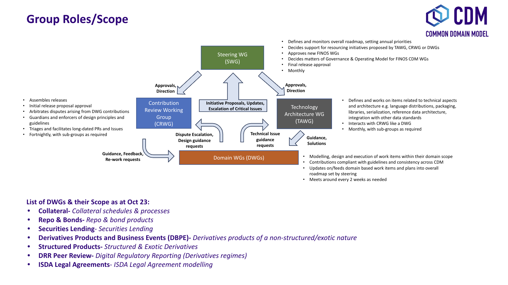
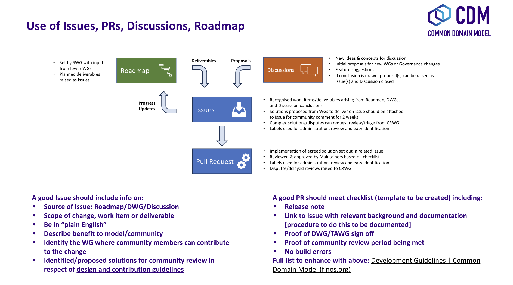
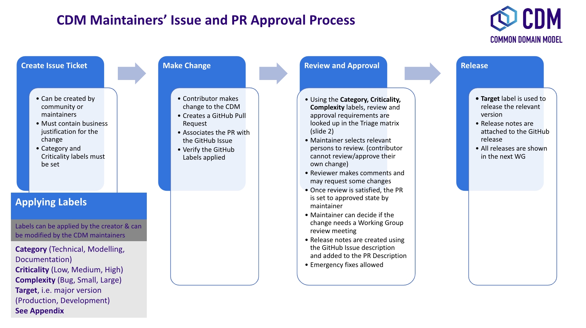

# Common Domain Model (CDM)

 [<kbd>   View CDM Homepage   </kbd>](https://cdm.finos.org/)

The Common Domain Model is an open standard project hosted under FINOS, the [Fintech Open Source Foundation](https://community.finos.org/docs/governance/Standards-Projects), starting in February 2023.   \
 \
The standard is developed through the [Community Specification](https://community.finos.org/docs/governance/#open-standard-projects) open governance process, and underlying code assets are released under the [Community Specification License 1.0](https://github.com/finos/standards-project-blueprint/blob/master/governance-documents/4._License.md). For versions before 4.0.0 and other license details, check [Notice.md](https://github.com/finos/common-domain-model/blob/master/NOTICE.md).

To participate in the standard process and working group meetings, [enroll as a participant](https://github.com/finos/standards-project-blueprint/blob/master/governance-documents/Getting%20Started.md#best-practices) by completing a [Community Specification Contributor License Agreement](https://community.finos.org/docs/governance/Standards-Projects#ip-licensing-requirements) (CSL CLA).  All meetings are to be held [in accordance with the FINOS policies and procedures](https://community.finos.org/docs/governance/meeting-procedures).

For a more detailed overview of the existing Working Group and standard Participants, Editors and Maintainers, please see [Governance.md](https://github.com/finos/standards-project-blueprint/blob/master/governance-documents/5._Governance.md). For more information on discussions and announcements subscribe to our mailing list using the following [link](mailto:cdm+subscribe@lists.finos.org).

Read more about project contribution guidelines, principles, frequently asked questions and the journey of [Common Domain Model into Open Source at FINOS](https://www.finos.org/hubfs/Accepted%20FINOS%20Edits_%20Common%20Domain%20Model%20into%20Open%20Source%20at%20FINOS.docx.pdf).

## Governance overview

### Roles

The CSL specifies [three different contribution roles](docs/governance.md#1roles) for each specific [Working Group](docs/working-groups.md):Mantainers, Editors and Participants. 

### Working Groups

Changes to the CDM may be proposed by CDM Working Groups, individual corporate contributors, or individual contributors.
The active Working Groups are covered by our [Working Groups](docs/working-groups.md) page.

## CDM Design Principles and Development Guidelines

Contributions to the CDM must comply with a set of [Design Principles](docs/design-principles.md) to be in line with the [CDM Development Guidelines](https://cdm.finos.org/docs/contribution).

## Getting involved 

Interact with the CDM community

### 
**GitHub**

CDM activity primarily happens in this [CDM GitHub repository](https://github.com/finos/common-domain-model). [Watch](https://docs.github.com/en/account-and-profile/managing-subscriptions-and-notifications-on-github/setting-up-notifications/configuring-notifications#configuring-your-watch-settings-for-an-individual-repository) the repository in order to be notified of new Pull Requests and issues.

### 
**Email**

If you'd like to receive official updates, please send an email to help@finos.org. You can join the CDM mailing list by sending an email to [cdm+subscribe@lists.finos.org](mailto:cdm+subscribe@lists.finos.org). 

### 
**Meetings**

Finally, as mentioned above, another great way to interact with the community is to attend a [Working Group](docs/working-groups.md)

### 
**Need help?**

Email help@finos.org. if you need help getting started in the CDM Community or if you encounter technical difficulties accessing repositories, mailing lists or meetings. 

## Roadmap

- The latest CDM roadmap of expected contributions sponsored by the presently participating trade associations: ICMA, ISDA and ISLA can be found [here](docs/roadmap.mdx)

- Releases can be tracked on the [CDM Releases](https://github.com/finos/common-domain-model/releases/tag/5.0.0-dev.7) page.

## Contributing

See guidelines for the licensing agreement [here](https://github.com/finos/common-domain-model/blob/master/.github/CONTRIBUTING.md).

To implement changes in the CDM repository resolving an issue please read our [contribution guidelines](https://cdm.finos.org/docs/contribution).

NOTE: Commits and pull requests to FINOS repositories will only be accepted from those contributors with an active, executed Individual Contributor License Agreement (ICLA) with FINOS, OR who are covered under an existing and active Corporate Contribution License Agreement (CCLA) executed with FINOS. Commits from individuals not covered under an ICLA or CCLA will be flagged and blocked by the Linux Foundation EasyCLA tool. Please note that some CCLAs require individuals/employees to be explicitly named on the CCLA.

Need an ICLA? Unsure if you are covered under an existing CCLA? Email help@finos.org.

### Contribution via Rosetta

The [Rosetta Design](https://rosetta-technology.io/design) application can be used to contribute to the CDM without setting up any development environment. Rosetta Design’s [source control integration](https://docs.rosetta-technology.io/rosetta/rosetta-products/1-workspace/#source-control-integration) means that a PR is automatically created to a fork of the FINOS CDM under the [Rosetta Models](https://github.com/rosetta-models) GitHub Organisation.

Steps:
  1. Create a Workspace for the CDM in Rosetta Design
  1. Review and contribute change in Rosetta Design - which will create PR in the rosetta-models organisation
  1. Create a PR to the Finos Github. See instructions [here](https://docs.github.com/en/pull-requests/collaborating-with-pull-requests/proposing-changes-to-your-work-with-pull-requests/creating-a-pull-request-from-a-fork)

### Contributing via GitHub

1. Fork it (https://github.com/finos/common-domain-model)
1. Create your feature branch (`git checkout -b feature/my-new-feature`)
1. Make a change - _hint_ you can make changes to Rosetta files directly on your desktop using the [Rosetta VS Code plugin](https://github.com/REGnosys/rosetta-dsl/tree/master/rosetta-ide/vscode)
1. Read our [contribution guidelines](.github/CONTRIBUTING.md) and [Community Code of Conduct](https://www.finos.org/code-of-conduct)
1. Commit your changes (`git commit -am 'My New Feature'`)
1. Push to the branch (`git push origin feature/my-new-feature`)
1. Create a new Pull Request

## Documentation

The CDM has extensive documentation which is kept up to date. Any change to the CDM should be accompanied by documentation. See docs guide [here](docs/documentation-style-guide.md)

_NOTE:_ Commits and pull requests to FINOS repositories will only be accepted from those contributors with an active, executed Individual Contributor License Agreement (ICLA) with FINOS OR who are covered under an existing and active Corporate Contribution License Agreement (CCLA) executed with FINOS. Commits from individuals not covered under an ICLA or CCLA will be flagged and blocked by the FINOS Clabot tool (or [EasyCLA](https://community.finos.org/docs/governance/Software-Projects/easycla)). Please note that some CCLAs require individuals/employees to be explicitly named on the CCLA.

*Need an ICLA? Unsure if you are covered under an existing CCLA? Email [help@finos.org](mailto:help@finos.org)*

## FINOS CDM Project Maintainers

FINOS Common Domain Model is maintained by FINOS members and the wider open source in finance community. 

The following are the FINOS CDM maintainers and the firms they represent.  

|FINOS CDM Maintainer  |Representing    |Capacity                                     |GithubID              |    
| -------------------- | -------------- | ------------------------------------------- | -------------------- |           
| Gabriel Callsen      | ICMA           | OrgRep                                      | gabriel-ICMA         | 
| Tom Healey           | ICMA           | OrgRep                                      | tomhealey-icma       | 
| Vernon Alden-Smith   | ISDA           | OrgRep                                      | valdensmith          | 
| Eleonora Acuna       | ISDA           | OrgRep                                      | eacunaISDA           | 
| David Shone          | ISDA           | OrgRep                                      | dshoneisda           | 
| Adrian Dale          | ISLA           | OrgRep                                      | ADaleISLA            | 
| Chris Rayner         | ISLA           | OrgRep                                      | chrisisla            | 
| Minesh Patel         | Regnosys       | OrgRep                                      | minesh-s-patel       | 
| Leo Labeis           | Regnosys       | OrgRep                                      | lolabeis             | 
| Hugo Hills           | Regnosys       | OrgRep                                      | hugohills-regnosys   | 
| Lyteck Lynhiavu      | ISDA           | OrgRep                                      | llynhiavu            | 
| Manuel Martos        | TradeHeader    | OrgRep                                      | manel-martos         | 
| Marc Gratacos        | TradeHeader    | OrgRep                                      | mgratacos            | 

If you would like to get in touch with the CDM maintainer team, contact them through their [mailing list](https://lists.finos.org/g/cdm-maintainers). **You can do so by first subscribing at [cdm-maintainers+subscribe@lists.finos.org](mailto:cdm-maintainers+subscribe@lists.finos.org) and posting at [cdm-maintainers@lists.finos.org](mailto:cdm-maintainers@lists.finos.org) .**

## License

Copyright 2021 FINOS and CDM Participants

Specifications in the repository are subject to the Community Specification License 1.0 available in the [LICENSE.md](LICENSE.md) file.
