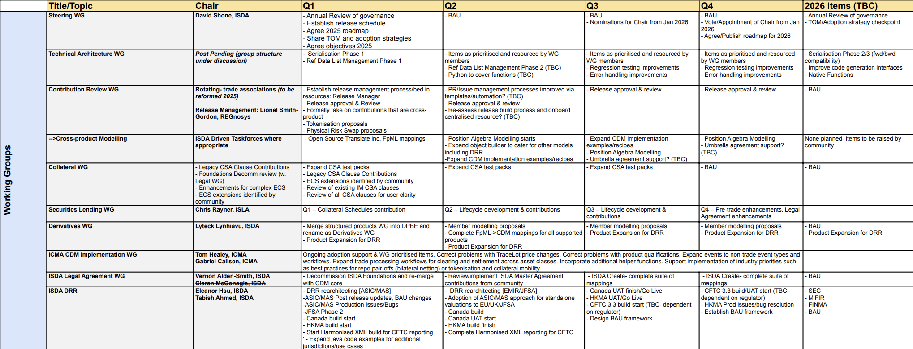
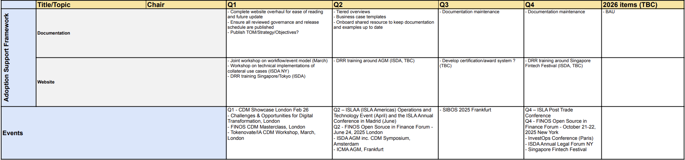

# 2025 CDM Roadmap from FINOS, ICMA, ISDA, & ISLA

# 2024-5 Release schedule

Release States
===============
Release states are defined as follows:
* Development – versions that include new designs from the “main” branch that are still under development.  All tests must pass but the model may continue to evolve before being released into production.
* Production - the "latest and greatest" stable version that ideally everyone should upgrade to, and where enhancements compatible with the existing models will be included. We should aim for a release to be in Production for around a year if we can, to alleviate upgrade costs to consumers. 
* Maintenance – when a new Production version is released then the current Production will go into Maintenance. Only critical bug fixes and changes related to critical regulatory requirements should be ported to Maintenance releases. Otherwise, functional changes would not be ported to maintenance releases.  The intention would be to have only 1 version at a time in maintenance, so each time a new Production version drops, the previous Maintenance release would go to Unsupported.
* Unsupported/End of Life – There will be no bug fixes or other support for the version.  TBD: We may perform security scans on some more recent unsupported versions and report any identified vulnerabilities, but will not perform security remediations.

  
At any point we want a maximum of 1 centrally supported development version, 1 production version, and one maintenance version.

