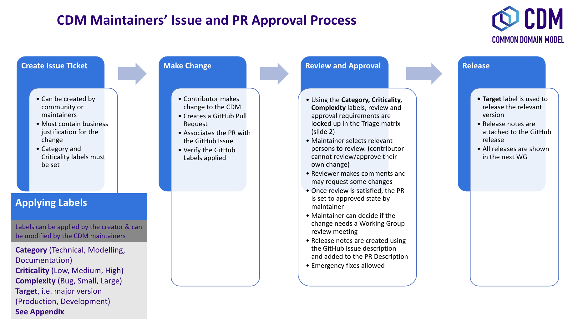

# Contributions 
This page will take you through how to contribute to the CDM, the necessary steps to take beforehand, editing and testing. 

## CDM development guidelines 

The CDM Development Guidelines are defined by the Steering Working Group. The full set of CDM development guidelines for how contributions are reviewed can be found [here](maintenance-and-release.md).

## Version Management

The CDM is developed, built and released using standard software
source-control management. Each new released version is announced to
users via a *release note* that describes the change introduced by that
new version. The CDM release history is available in the [Release
section](https://github.com/finos/common-domain-model/releases) of the CDM documentation. The most recent release can be found [here](RELEASE.md).

Information on semantic versioning, backwards compatibility and version availability can be found [here.](versioning.md).

## Agile Development Approach

The on-going development of the CDM adheres to a methodology inspired by
the *Agile* software development framework. This methodology is based on
two high-level principles:

1.  Focus on business value from the user's perspective, encapsulated
    in the concept of *user story*
2.  Delivery of small, releasable changes that contribute to that
    business value (sometimes referred to as *shippable increments*) -
    i.e. no "big bang" changes

 To learn more, visit our [development approach](development-approach.md) page. 

# How to Contribute

The purpose of this section is to provide guidance for submitting,
reviewing and releasing changes to the CDM contributed by the wider
industry community including market participants, trade associations and
technology or service vendors. It describes:

-   What a Contributor should do to edit and contribute changes to the
    CDM
-   What a Maintainer should do to review the changes
-   How to release a new CDM version once changes have been approved

# Modelling Platforms
Development of the CDM is supported through various modelling platforms,
including [Rosetta](https://rosetta-technology.io) and [Legend](https://legend.finos.org/studio). Regardless of the modelling
platform used, modelling and contribution to the CDM should go through
the contribution check-list below.

---

The steps required to change the CDM are aligned with the software
development lifecycle typically applicable to the development of any
other software. This development lifecycle is illustrated in the diagram
below. Each step is associated to the relevant component of the Rosetta
platform that can be used to support the development of the CDM.

---
**Note:**
This documentation is not an endorsement of any modelling platform and
associated products and CDM users remain invited to leverage the tools
of their choosing. This contribution guide has been contextualised with
references to Rosetta to ease understanding and align with the current
process.
---

## Before you start modelling

Before you start modelling, please make sure you have gone through the
following pre-modelling checklist:

-   Review the [design principles](design-principles.md) and
    [governance](governance.md)
-   Review the [Rosetta Starter Guide](https://docs.rosetta-technology.io/rosetta/rosetta-products/0-welcome-to-rosetta) or equivalent in your chosen
    modelling platform.

In addition, for large model changes or changes to core data types, it
is recommended that the Contributor reviews the
[agile-development-approach](development-approach.md) and follows
these steps:

-   **Define use case**. Identify and document one or more use cases
    with details (e.g. a sample trade).
-   **Draft conceptual design** (high level). Draft a conceptual view
    showing the set of data types, their definitions (and/or sample
    attributes but not the whole set of attributes), their relationships
    to each other, and, if applicable, a workflow.
-   **Design approval**. Obtain approval of high-level conceptual design
    from CDM stakeholders:
    -   CDM Owners (FINOS and other involved Trade Associations, where
        applicable)
    -   CDM Sub-Working Group, if applicable
    -   CDM Architecture and Review Committee
-   **Quality assurance**. Seek the early appointment of at least one
    CDM Maintainer who can assist modelling discussions and provide
    early feedback. CDM Maintainers are appointed by the CDM Owners as
    and when relevant. Please contact
    [cdm@lists.finos.org](mailto:cdm@lists.finos.org).
---

**Note:**
Unless explicitly instructed by a CDM Maintainer, a Contributor can only
ever develop changes to a development (i.e. pre-release) version of the
CDM.
---
## Editing the model

Please refer to the [Editing](editing.md) section which covers editing the model in more detail.

---   
## Contributing
Changes are contributed by submitting a Pull Request for review into the
CDM source-control repository. This pull request will invoke a build
process to compile and run all CDM unit tests and regression tests.

Given the alignment:

> 1 pull request = 1 contribution = 1 releasable unit = 1 user story,

we recommend labelling the pull request with the user story label, i.e.
"STORY-XYZ: ..." to facilitate its tracking.

**Note:**
All contributions are submitted as candidate changes to be incorporated
under [the CDM licence](https://portal.cdm.rosetta-technology.io/#/terms-isda).

### Contribution via Rosetta

The [Rosetta Design](https://rosetta-technology.io/design) application can be used to contribute to the CDM without setting up any development environment. Rosetta Design’s [source control integration](https://docs.rosetta-technology.io/rosetta/rosetta-products/1-workspace/#source-control-integration) means that a PR is automatically created to a fork of the FINOS CDM under the [Rosetta Models](https://github.com/rosetta-models) GitHub Organisation.

Steps:
  1. Create a Workspace for the CDM in Rosetta Design
  1. Review and contribute change in Rosetta Design - which will create PR in the rosetta-models organisation
  1. Create a PR to the Finos Github. See instructions [here](https://docs.github.com/en/pull-requests/collaborating-with-pull-requests/proposing-changes-to-your-work-with-pull-requests/creating-a-pull-request-from-a-fork)

When using Rosetta to contribute model changes, the contribution
interface allows to specify a title and description for the
contribution. Those inputs are used to create a Pull Request on a
one-off branch in the source-control repository. Please refer to the
[Rosetta Workspace Contribution Guide](https://docs.rosetta-technology.io/rosetta/rosetta-products/1-workspace/#contribute-workspace-changes) for more information.

### Contributing via GitHub

1. Fork it (https://github.com/finos/common-domain-model)
1. Create your feature branch (`git checkout -b feature/my-new-feature`)
1. Make a change - _hint_ you can make changes to Rosetta files directly on your desktop using the [Rosetta VS Code plugin](https://github.com/REGnosys/rosetta-dsl/tree/master/rosetta-ide/vscode)
1. Read our [contribution guidelines](contributions.md) and [Community Code of Conduct](https://www.finos.org/code-of-conduct)
1. Commit your changes (`git commit -am 'My New Feature'`)
1. Push to the branch (`git push origin feature/my-new-feature`)
1. Create a new Pull Request

---
**Note:**
It is not yet possible to contribute updated test expectations,
documentation, release notes or new sample data using Rosetta, so these
must be provided to the CDM Maintainers via Slack or email.

---
### Documentation

The CDM documentation must be kept up-to-date with the model in
production. Where applicable, the Contributor should provide
accompanying documentation (in text format) that can be added to the CDM
documentation for their proposed changes.

The documentation includes code snippets that directly illustrate
explanations about certain model components, and those snippets are
validated against the actual model definitions. When a model change
impacts those snippets, or if new relevant snippets should be added to
support the documentation, those snippets should be provided together
with the documentation update.

### Release note

A release note should be provided with the proposed model change that
concisely describes the high-level conceptual design, model changes and
how to review. Please refer to the
[content-of-release-notes](documentation-style-guide.md#content-of-release-notes) for further
guidance on editing release notes.

-   Update the CDM version number, using the [semantic
    versioning](versioning.md) format
-   Build release candidate, and test
-   Build documentation website release candidate, and test
-   Deploy release candidate and notify channels if need be
-   (Currently done at a later stage) Update the latest CDM version
    available in Rosetta

---
**Note:**
When the release process is handled through Rosetta Deploy, the
Maintainer should contact the Rosetta support team to request that
deployment and discuss a timeline for the release.

---
## Next Steps

Please visit the [maintenance page](maintenance-and-release.md) to continue reading about model maintenance and release.

