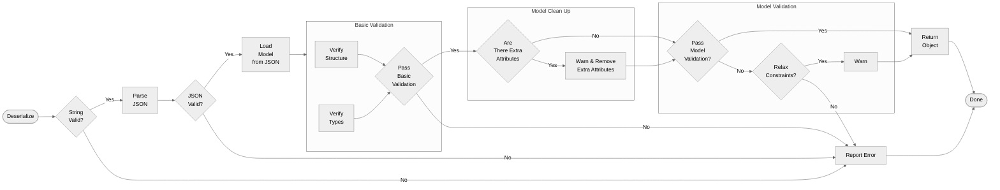
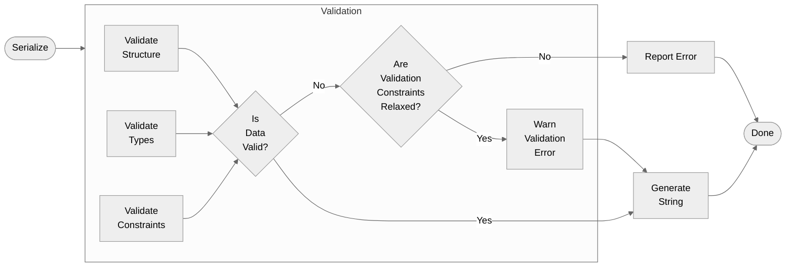

# Contents

- [1. Executive Summary](#1-executive-summary)
- [2. Principles](#2-principles)
- [3. Overview](#3-overview)
- [4. Implementation](#4-implementation)
  - [4.1 Include Model, Version and Type in Top level JSON](#41-include-model-version-and-type-in-top-level-json)
  - [4.2 Include Type when required](#42-include-type-when-required)
  - [4.3 Types with meta](#43-types-with-meta)
  - [4.4 Referencing Model](#44-referencing-model)
- [5. Processing](#5-processing)
  - [5.1 Generation](#51-generation)
  - [5.2 Ingestion](#52-ingestion)
  - [5.3 Validation](#53-validation)
  - [5.4 Error and Warning Reporting](#54-error-and-warning-reporting)
- [6. Examples](#6-examples)
- [7. Appendix](#7-appendix)
- [8. Acknowledgements](#8-acknowledgements)

## 1. Executive Summary

This document describes the standard for JSON serialization of Rune defined CDM objects.  This format includes all relevant object information and improves efficiency, readability, maintainability, and interoperability.

## 2. Principles

Principles of the design.

### 2.1 High level Goals

- **interoperability**: users of the same version of the model should be able to exchange data regardless of their programming language
- **completeness**: ability to represent the entire model
- **readibility**: serialized data should be human readible
- **compactness**: serialized data should be as compact as possible

### 2.2 Design reference point
An ordered list of principles to serve as reference when reviewing the serialization design

- **object generation**: serialized data should facilitate creation of Rune defined objects including enabling the "language's" polymorphic inheritance
- **model conformity**: to the fullest extent possible, the serialized data should directly conform to the model.  The reader has no obligation to keep fields that it does not recognise
- **error reporting**: report all failures
- **atomic types serialisation**: to the extent possible, basic data types such as dates, times and others should be serialised according to well established standards/formats as for example ISO.

Out of scope
- **cross major version support**: the current design does not address enabling serialization to support transformation across breaking changes

Some of the above may not be absolute and the design may have had to make compromises on the extent to which it meets the principles.

## 3. Overview

The following table illustrates all the _special_ attributes that are provided as part of the serialization process. Please refer to the [Implementation](#4-implementation) section for more details of where and how they are used.

| New | Example | Model Syntax | Specification | 
| --- | --- | --- | --- | 
|  `@model` | `"@model": "cdm"` | N/A | [See 4.1](#4-implementation) | 
|  `@version` | `"@version": "1.2.3"` | N/A | [See 4.1](#4-implementation) | 
|  `@type` | `"@type": "cdm.event.common.TradeState"` | N/A | [See 4.1](#4-implementation) | 
|  `@data`| `"@data": "attribute-data"` | [See 4.3](#43-types-with-meta) | [See 4.3](#43-types-with-meta) | 
|  `@key` | `"@key": "abcd1234"` | [See 4.4.1.1](#4411-global-key) | [See 4.4.1.1](#4411-global-key) |
|  `@ref` | `"@ref": "abcd1234"` | [See 4.4.1.2](#4412-global-reference) | [See 4.4.1.2](#4412-global-reference) |
|  `@key:external` | `"@key:external": "my-external-key"` | [See 4.4.1.1](#4411-global-key)  | [See 4.4.1.1](#4411-global-key)  |
|  `@ref:external` | `"@ref:external": "my-external-key"` | [See 4.4.1.2](#4412-global-reference)  | [See 4.4.1.2](#4412-global-reference)  |
|  `@key:scoped` | `"@key:scoped": "my-scoped-key"` | [See 4.4.2.1](#4421-location-key)  | [See 4.4.2.1](#4421-location-key)  |
|  `@ref:scoped` | `"@ref:scoped": "my-scoped-key"` | [See 4.4.2.2](#4422-address-reference)  | [See 4.4.2.2](#4422-address-reference)  |
|  `@scheme` | `"@scheme": "http://www.fpml.org/coding-scheme/external/iso17442"` | [See 4.4.3](#443-scheme) | [See 4.4.3](#443-scheme) | 

The [Examples](#6-examples) section contains illustrations of all the _special_ attributes.

## 4. Implementation

### 4.1 Include Model, Version and Type in Top level JSON

The serialized form contains the model, version and fully qualified type name. These will always appear at the top of the JSON.

| New | Example | Desc | 
| --- | --- | --- |
| `@model` | `"@model": "cdm"` | This is the short name for the model, as defined in a [config file](https://github.com/finos/common-domain-model/blob/master/rosetta-source/src/main/resources/rosetta-config.yml). 
| `@version` | `"@version": "1.2.3"` | This is the release of the model, as defined by the [GitHub Release](https://github.com/finos/common-domain-model/releases) | 
| `@type` | `"@type": "cdm.event.common.TradeState"` | This is formatted as the namespace followed by the type name in the CDM with the case matching the model (AKA "Fully Qualified Type Name") | 

``` Javascript
{
  "@model": "cdm",
  "@version": "1.2.3",
  "@type": "cdm.event.common.TradeState"
}
```

### 4.2 Include Type when required

When required, for example when a Choice type or Base class is used as an attribute, serialization includes `@type` to determine the subclass/choice.

``` Javascript
{
  "Payout": {
     "FixedPricePayout": {
       "paymentDates": {...},
       "fixedPrice": {...},
       "schedule": {...},
     },
     "@type": "cdm.product.template.FixedPricePayout"
  }
}
```

### 4.3 Types with meta

The serialized form reflects that any attribute with a meta annotation (regardless of cardinality or type i.e. basic, complex or enum) will ALWAYS be an object. 

This enables consistency, making it easier to understand the serialized format as we will have the same serialization rules for all types i.e.:
  -   Single cardinality basic types
  -   Multi cardinality basic types
  -   Single cardinality complex types
  -   Multi cardinality complex types
  -   Single cardinality enumerations
  -   Multi cardinality enumerations

For basic types and enumerations this will mean the serialized form has an additional wrapper, regardless of whether the meta is included in the data. Where required, the actual data (currently held in an additional `"value"` attribute) will now be included in an `@data` attribute.

**Rune Definition**

``` Haskell
type Trade:
    tradeDate date (1..1)
      [metadata id]
```

**Prior to CDMV7**

``` Javascript
   "trade": {
     "tradeDate": {
        "value": "2017-12-18",
        "meta": {
          "globalKey": "3f0b12"
        }
      }
    }
```

**From CDMV7 onwards**

``` Javascript
   "trade": {
     "tradeDate": {
        "@key": "3f0b12",
        "@data": "2017-12-18"
      }
    }
```

### 4.4 Referencing Model

The referencing mechanism in the Rune definitions of CDM uses keywords for keys and references. The following table compares these keywords across versions:

| Prior to CDMV7 Serialised Key / Reference | From CDMV7 onwards Serialised Key / Reference  |
| --- | --- |
| `globalKey` / `globalReference` | `@key` /  `@ref` |
| `location, scope` / `address, scope`  | `@key:scoped`  / `@ref:scoped` |
| `externalKey` / `externalReference`  | `@key:external` / `@ref:external`  |

> NOTE 1: Where a key is required for a basic type the `id` annotation is used instead of `key` i.e. `[metadata id]` instead of `[metadata key]`. Both `id` and `key` annotations will result in `@key` being put into the serialized form.

> NOTE 2: From CDMV7 onwards the `location`, `address` and `scope` annotations now all converge on the use of `@key:scoped` and `@ref:scoped`. The external keys and refs (`@key:external` and `@ref:external`) will remain for now, but may also be able to be replaced by `@key` and `@ref` in the future. Serialization needs to support existing behaviour, whilst paving a way forward so all Rune referencing mechanisms can be unified.

#### 4.4.1 Global/External References 

References and external references follow the structure and naming in the model.

In the default implementation `@key` is a generated hash (as `globalKey` is for versions prior to CDMV7) which is intended to be an identifier unique within the document. However, the implementation of `globalKey`/`@key` (i.e. how it is generated) can be overridden by the user application.

The external references i.e. `externalKey`/`@key:external` are user defined data, from another source.

Serialization is just taking the data in these _special_ attributes, not defining it i.e. the content of `@key` and `@key:external` is outside the scope of serialization.

##### 4.4.1.1 Global key

**Prior to CDMV7**

``` Javascript
    "party": {
      "meta": {
        "globalKey": "b6bdbfc2",
        "externalKey": "party1"
      },
      "name": "Party A"
    }
```

**From CDMV7 onwards**

``` Javascript
    "party": {
      "@key": "b6bdbfc2",
      "@key:external": "party1",
      "name": "Party A"
    }
```

##### 4.4.1.2 Global reference

**Prior to CDMV7**

``` Javascript
    "partyReference": {
      "globalReference": "b6bdbfc2",
      "externalReference": "party1"
    }
```

**From CDMV7 onwards**
    
``` Javascript
    "partyReference": {
      "@ref": "b6bdbfc2",
      "@ref:external": "party1"
    }
```
    
#### 4.4.2 Scoped references 

Scoped references also follow the structure in the model, and use `@key:scoped` and `@ref:scoped`.

Scoped references allow specific sections of a document to be referenced. For versions prior to CDMV7 the supported scoped references are:
- `location` - Specifies this is the target of an internal reference i.e. this is the key `@key:scoped`
- `address` - Specifies that this is an internal reference to an object that appears elsewhere i.e. this is the reference `@ref:scoped`

The `scope` annotation allows the scope of the reference to be defined e.g. to a specific type like `TradeLot`. However, the only scope available is `DOCUMENT`. This means the `scope` annotation keyword is not required.

More information on scoped references can be found in the Rune documentation [here](https://rune.finos.org/docs/modelling-components/metadata#3-cross-referencing)

##### 4.4.2.1 Location (key)

**Rune Definition**

``` Haskell
type PriceQuantity:
    quantity QuantitySchedule (0..*)
        [metadata location]

type QuantitySchedule:
    value number (0..1) 
    unit UnitType (0..1) 

type UnitType:
    financialUnit FinancialUnitEnum (0..1) 

enum FinancialUnitEnum:
    Share

```

**Prior to CDMV7**

``` Javascript
   "quantity": [ {
     "value": {
       "value": 150000,
       "unit": {
         "financialUnit": "Share"
       }
     },
     "meta": {
        "location": [ {
           "scope": "DOCUMENT",
           "value": "quantity-9"
         } ]
      }
   } ]
```

**From CDMV7 onwards**

``` Javascript
   "quantity": [
     {
       "@key:scoped": "quantity-9",
       "value": 150000,
       "unit": {
         "financialUnit": "Share"
       }
     }
   ]
```
    
##### 4.4.2.2 Address (reference)

**Prior to CDMV7**

``` Javascript
   "priceQuantity": {
     "quantitySchedule": {
       "address": {
         "scope": "DOCUMENT",
         "value": "quantity-1"
       }
     }
   }
```

**From CDMV7 onwards**

``` Javascript
   "priceQuantity": {
     "quantitySchedule": {
       "@ref:scoped": "quantity-1"
     }
   }
```

#### 4.4.3 Scheme
Scheme gives control over the set of values that an attribute can take, without having to define this attribute as an enumeration in the model.

##### 4.4.3.1 Single cardinality attribute with scheme

**Prior to CDMV7**

``` Javascript
   "issuer": {
     "value": "54930084UKLVMY22DS16",
     "meta": {
       "scheme": "http://www.fpml.org/coding-scheme/external/iso17442"
     }
   }
```

**From CDMV7 onwards**

``` Javascript
   "issuer": {
     "@scheme": "http://www.fpml.org/coding-scheme/external/iso17442",
     "@data": "54930084UKLVMY22DS16"
   } 
```

##### 4.4.3.2 Multiple cardinality (List) attribute, some with scheme

``` Javascript
   "issuer": [
     {
      "@scheme": "http://www.fpml.org/coding-scheme/external/iso17442",
      "@data": "54930084UKLVMY22DS16"
     },
     {
      "@data": "54930084UKLVMY2R36YY"
     }
  ]
```

## 5. Processing

The design includes additional enhancements intended to improve the generation and ingestion of the serialized form.

### 5.1 Generation

These details pertain to how the serialized form is to be generated i.e. the process of serialization.

#### 5.1.1 @key and @ref

If `@key` is not referenced by an `@ref` then it will not be included in the serialized form.

This will remove clutter and make the referencing provided by `@key`/`@ref` have more value and be easier to use.

#### 5.1.2 @key:external and @ref:external

The `@key:external` and `@ref:external` are user defined and will ALWAYS be included if defined. 

This means it will be possible to have external keys that do not have a corresponding reference, and vice-versa.

#### 5.1.3 @key:scoped and @ref:scoped

The `@key:scoped` and `@ref:scoped` are user defined and will ALWAYS be included if defined. 

This means it will be possible to have external keys that do not have a corresponding reference, and vice-versa.

#### 5.1.4 Null values

If a value is null then the attribute will not get written out.

If an array is null then it will also not get written out.

#### 5.1.5 Multiple References

There is the confusing potential that an attribute can have more than one reference (i.e. more than one of `@ref`, `@ref:external`, and `@ref:scoped`).

If the multiple references point to different parts of the object, reference resolution and, therefore, validation is not possible.  In this case, the outcome of deserialization depends on how strictly to conduct validation.  Strict validation will fail.  More permissive validation will give notice of conflicting references for later resolution but leave the object accessible in an "in valid" state.

If the multiple references point to the same part of the object, only one is needed.  The others are superfluous and will be pruned during serialization according to the following:

- `@ref:scoped` is viewed to have the most "value" and will be preserved in all cases where it is present.  All other references will be removed.
- If `@ref:scoped` is not present, `@ref:external` will be preserved as it is viewed to have greater "value" than `@ref`.

### 5.2 Ingestion

These details pertain to how the serialized form is to be ingested i.e. the process of deserialization.

#### 5.2.1 Null values

When a null value is encountered it will be ignored, it will not be processed.

Null arrays will also be ignored.

### 5.3 Validation

**Principles**
- Follow the [Robustness Principle](https://en.wikipedia.org/wiki/Robustness_principle): "be conservative in what you do, be liberal in what you accept from others. It is often reworded as: be conservative in what you send, be liberal in what you accept."
- Validation assumes that model is valid.

**Validation Process**
1. Check that the string is valid
2. Check that the string [decodes to JSON](https://www.w3schools.com/js/js_json_datatypes.asp); and
3. Check that the specified CDM type can be built from the JSON with three levels of validation:
   - The structure is valid
   - The types match the model definition
   - All relevant constraints are met

#### 5.3.1 Deserialization and Validation

Deserialization will provide a warning and discard any attributes that do not conform to the model.  

By default, input data must conform to the constraints a model places on attribute values if and when those constraints exist.  There is now a configuration option to relax this requirement in a manner which preserves the Robustness Principle.

The process prior to CDMV7 either fails (Python) or does not give a warning (Java) when it finds non-conforming attributes.


#### 5.3.2 Validation and Serialization

Following the Robustness Principle to enable interoperability, by default an entity must be valid prior to serialization.

Since the process prior to CDMV7 can be less strict, there is now a configuration option to relax this constraint.  This option will be marked as deprecated in a timeframe TBD.



### 5.4 Error and Warning Reporting

Errors and warnings from serialization/deserialization will be logged.

## 6. Examples

An example of a dummy Rosetta structure that includes the meta and referencing described in the previous sections is provided below. 

An example of the JSON that corresponds to the structure is then expressed to help illustrate how the serialized version would look.

**Rosetta format**

``` Haskell
type Trade:
   party Party (1..*)
   tradeId string (1..1)
      [metadata id]
   links Link (1..1)
   primaryPartyReference Party (1..1)
      [metadata reference]

type Link:
    tradeId string (1..*)
      [metadata reference]

type Party:
  [metadata key]
    name string (1..1)
    partyId string (1..1)
      [metadata scheme]
    issuers string (1..*)
      [metadata scheme]

```

**CDMV7 onwards Serialized JSON format**

``` Javascript
{
  "@model": "cdm",
  "@version": "1.2.3",
  "@type": "cdm.event.common.TradeState",
  "tradeId": {
    "@key": "gfkldd3k",
    "@data": "123456"
  },
  "links": {
    "tradeId": [
      {
        "@ref": "gfkldd3k"
      },
      {
        "@data": "99999"
      }
    ]
  },
  "party": [
    {
      "@key": "b6bdbfc2",
      "@key:external": "party1",
      "name": "ISLA",
      "partyId": {
        "@data": "999"
      },
      "issuers": [
        {
          "@data": "REGnosys"
        },
        {
          "@data": "FTA",
          "@scheme": "ISO999"
        }
      ]
    }
  ],
  "primaryPartyReference": {
    "@ref": "b6bdbfc2",
    "@ref:external": "party1"
  }
}
```

## 7. Appendix
Supporting and reference information.

### 7.1 JSONPath

JSONPath allows navigation through a JSON file. The serialized format that we has been implemented was tested against JSONPath. It was found that in all cases except for one JSONPath could successfully traverse our proposed JSON. 

The exception case was if a _special_ item was at the top level of the document. In this instance JSONPath failed to locate our item. This was found to be an issue with the JSONPath specification/implementation and had already been reported with error logs [here](https://github.com/ashphy/jsonpath-online-evaluator/issues/14) and [here](
https://github.com/ashphy/jsonpath-online-evaluator/issues/45))

### 7.2 Backwards compatibility

As a reference, we are using the terminology defined here: [Extending and Versioning Languages: Terminology](https://www.w3.org/2001/tag/doc/versioning)

Key points from that document that relate to our context are:
- A language change is **_backwards compatible_** if consumers of the revised language can correctly process all instances of the unrevised language. A software example is a word processor at version 5 being able to read and process version 4 documents. A schema example is a schema at version 5 being able to validate version 4 documents.
- A language change is **_forwards compatible_** if consumers of the unrevised language can correctly process all instances of the revised language. An example is a word processing software at version 4 being able to read and process version 5 documents.  A schema example is a schema at version 4 being able to validate version 5 documents.

## 8. Acknowledgements

ISLA would like to thank the following individuals and firms for drawing up this document: Minesh Patel and Hugo Hills, REGnosys; Daniel Schwartz, FTAdvisory; Plamen Neykov, CLOUDRISK; and Jason Polis, ISDA
