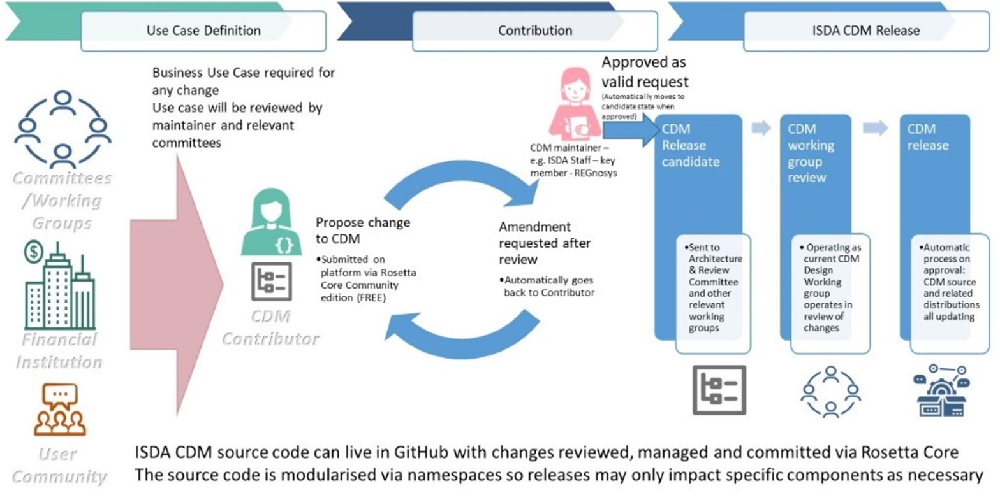

.. |trade|  unicode:: U+02122 .. TRADE MARK SIGN

Overview of the ISDA CDM
========================
.. role:: raw-html(raw)
    :format: html

**Continuous Integration:** |Codefresh build status| :raw-html:` `

What is the ISDA CDM
--------------------

The ISDA Common Domain Model (CDM) is a standardised, machine-readable and machine-executable blueprint for how financial products are traded and managed across the transaction lifecycle.

Purpose
^^^^^^^

A single, digital processing standard for trade events and actions enhances financial markets' operational efficiency in several ways:

* **Enables inter-operability and straight-through processing** across firms, solutions and platforms, reducing the need for reconciliation caused by variations in how each firm records trade lifecycle events.
* **Accelerates financial technology innovation** by providing a common, readily operational foundation for how technologies like distributed ledger, smart contracts, cloud computing, and artificial intelligence can be applied to financial markets.
* **Delivers better regulatory oversight**, promotes transparency and alignment between regulators and market participants and enables consistency in regulatory reporting, by providing a standard representation of trade data and supporting machine executable reporting requirements.

For further information about the CDM and its applications, please consult the `CDM section <https://www.isda.org/2019/10/14/isda-common-domain-model/>`_ of the ISDA website or contact ISDA directly at marketinfrastructureandtechnology@isda.org.

Design Principles
^^^^^^^^^^^^^^^^^

To support these objectives, the CDM is built according to a set of design principles that include the following concepts:

* **Normalisation** through abstraction of common components
* **Composability** where objects are composed and qualified from the bottom up
* **Mapping** to existing industry messaging formats
* **Embedded logic** to represent industry processes
* **Modularisation** into logical layers

These design principles are further detailed in the `Design Principles`_ section of the CDM documentation.

Scope
^^^^^

The product scope of the CDM includes OTC derivatives, cash securities, securities financing, and commodities.

CDM Components
--------------

**There are three sets of CDM components**, as laid-out in the ISDA CDM components diagram below:

* The Rosetta DSL
* The ISDA CDM Distribution
* CDM Applications

.. figure:: images/cdm-components-diagram.png

Rosetta DSL
^^^^^^^^^^^

The CDM is a `domain model <https://olegchursin.medium.com/a-brief-introduction-to-domain-modeling-862a30b38353>`_ written in a Domain-Specific Language (DSL) called the *Rosetta DSL*. The CDM is distributed into multiple common programming languages using a *code generation* mechanism from the Rosetta DSL.

The Rosetta DSL comprises a `language <https://github.com/REGnosys/rosetta-dsl>`_ (i.e. syntax and rules) and `code generators <https://github.com/REGnosys/rosetta-code-generators>`_. The language includes one default code generator, into `Java <https://www.oracle.com/java/>`_. To facilitate adoption and implementation of the CDM by the community of industry participants, the Rosetta DSL is available open source under an Apache 2.0 license. This allows industry participants to write and share code generators into any other languages.

.. note:: All the language components, their syntax and purpose are detailed in the `Rosetta DSL documentation <https://docs.rosetta-technology.io/rosetta/rosetta-dsl>`_. The documentation also describes the mechanism to write and use code generators.

ISDA CDM Distribution
^^^^^^^^^^^^^^^^^^^^^

The ISDA CDM distribution is openly accessible to all industry participants and can also be downloaded. The ISDA CDM is distributed subject to the ISDA CDM open source licence.

Components
""""""""""

The ISDA CDM distribution comprises three main sets of components:

* **Model definition**, which corresponds to the model as expressed in the Rosetta DSL syntax and contained into a set of *.rosetta* files organised as *namespaces*. The primary dimensions of the model are listed below and further described in the `Common Domain Model Section <documentation.html>`_ of the documentation.

  * Product
  * Event
  * Legal Agreement
  * Process
  * Reference Data
  * Mapping (Synonym)

* **Executable code distribution**, automatically generated from the model definitions expressed in the Rosetta DSL using `available code generators <https://docs.rosetta-technology.io/rosetta/rosetta-dsl/rosetta-code-generators/#what-code-generators-are-available>`_. Once a code generator is implemented for a particular language, the corresponding code generation is included as part of the CDM build and release process, allowing the CDM to be automatically distributed in that language going forward.
* **Default implementation**, comprising manually-written code (in Java) which, combined with the auto-generated code, provides a complete implementation of the model. This hand-written code is distributed together with the CDM to facilitate adoption by firms, which can directly use the CDM distribution to set-up and test an implementation. The default implementation can be used in its original state or be disabled or extended by industry participants in their implementation. For example, the default implementation uses the de-facto Java hash function for the *key* meta-data that supports the CDM cross-referencing mechanism. Firms may elect to use an alternative implementation.

.. note:: Only the Java executable code distribution is complete: i.e. it represents the entire CDM as defined in Rosetta (plus any associated default implementation). Other distributions may only capture parts of the model: for instance, the Scala and TypeScript distributions include the complete data model and function specifications, but not the functions' executable code. Information on how to access the CDM Java distribution can be found in the `CDM Java Distribution Guidelines <cdm-guidelines.html>`_.

Versioning
""""""""""

The CDM is developed, built and released using standard software source-control management. Each new released version is announced to users via a *release note* that describes the change introduced by that new version. The CDM release history is available in the `Release Section <../releases/all.html>`_ of the CDM documentation.

The CDM is released using the semantic versioning system. The format of a version number is MAJOR.MINOR.PATCH (e.g. ``1.23.456``), where the:

* MAJOR (``1``) version change introduces *backward incompatible* changes and will be used as high level release name (e.g. ``ISDA CDM Version 1``)
* MINOR (``23``) version change may or may not introduce backward incompatible changes, for example supporting a new type of event or feature or upgrading to a new version of the Rosetta DSL.
* PATCH (``456``) version when a backward compatible change is made, for example adding a new class, attribute or updating documentation. An implementor would not have to make any changes to update to this release.

The MAJOR.MINOR.PATCH numbers may increment by more than one unit because release candidates may be created, but not immediately released. Consequently, a subsequent build referenced with the next incremental unit may be released with amendments that include the earlier release candidate.

CDM Applications
^^^^^^^^^^^^^^^^

An eco-system of CDM-based application components from software providers exists in order to support the adoption of CDM and the implementation of CDM-based production systems by industry participants. These applications may be open source software or licensed under commercial terms. In particular:

* The `CDM Portal <https://portal.cdm.rosetta-technology.io>`_ provides a user interface allowing users to navigate through and download the CDM.
* Rosetta is a Software Development Kit (SDK or *dev-kit*) for the Rosetta DSL, that provides an *editable* version of the CDM Portal. It allows the industry community to directly participate in the CDM development by contributing code to the CDM. Please refer to the `Rosetta Documentation <https://docs.rosetta-technology.io/rosetta/rosetta-products/>`_ for more details.

.. note:: The CDM Portal and Rosetta have been developed by technology firm `REGnosys <https://regnosys.com>`_. ISDA encourages the adoption of CDM by software providers but does not endorse any CDM application component.

The CDM Governance
------------------

The CDM governance framework regulates the development of the open source CDM standard via a three-tiered committee structure:

#. The *CDM Executive Committee* is accountable for setting the strategy, promoting adoption of the standard, and overseeing the activity of the Working Groups and the Architecture & Review Committee. Members are senior executives appointed by the ISDA Board considering their strategic influence in the decision making at their firm and active contribution to the development of the CDM.

#. The *CDM Architecture and Review Committee* is responsible for specifying the technical and modelling guidelines and reviewing and approving proposals for new modelling components introduced by the CDM Working Groups. Members include subject matter experts, senior technologists, as well as practitioners in business process, legal documentation, and technical modelling.

#. The *CDM Working Groups* are assembled per subject matter or use cases to actively develop and implement concretely targeted elements of the CDM. Participants include ISDA members and non-members from the CDM user community who commit time and effort for the development and implementation of the CDM as a global standard.

The on-going development of the CDM is organised in accordance with the following process:

Committee members or any user of CDM within the community can propose amendments to the CDM. The proposals can be defined at a conceptual level or a logical level (i.e. in code). In each case, the proposal must be developed in line with the CDM design principles and submitted to ISDA staff and the Architecture & Review Committee for approval. If approved, the amendment will be merged with the CDM master code branch. In some instances, the proposal may not be immediately approved, but may be assigned to an existing or new Working Group for the purpose of reviewing, revising or extending the proposal.

.. |Codefresh build status| image:: https://g.codefresh.io/api/badges/pipeline/regnosysops/REGnosys%2Frosetta-cdm%2Frosetta-cdm?branch=master&key=eyJhbGciOiJIUzI1NiJ9.NWE1N2EyYTlmM2JiOTMwMDAxNDRiODMz.ZDeqVUhB-oMlbZGj4tfEiOg0cy6azXaBvoxoeidyL0g&type=cf-1
   :target: https://g.codefresh.io/pipelines/rosetta-cdm/builds?repoOwner=REGnosys&repoName=rosetta-cdm&serviceName=REGnosys%2Frosetta-cdm&filter=trigger:build~Build;branch:master;pipeline:5a86c209eaf77d0001daacb6~rosetta-cdm

Using the CDM (Java)
--------------------

The Java distribution of the CDM is designed to be built and used with Maven.

It depends on some open source java artifacts which are freely available from an artifact repository. Maven can be configured to use this repository using the repository settings contained in the ``settings.xml`` file in the CDM jar.

For more details, please follow the `CDM Java Distribution Guidelines <cdm-guidelines.html>`_.

.. note:: These guidelines are intended as a technical documentation for developers to make use of the Java distribution in their implementation.
