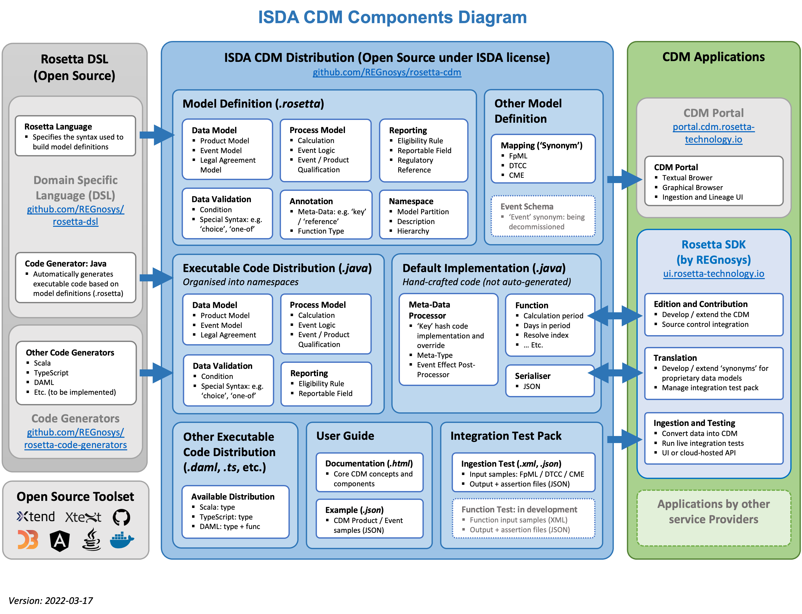

.. include:: links.rst

Overview of the ISDA CDM
========================
.. role:: raw-html(raw)
    :format: html

**Continuous Integration:** |Codefresh build status| :raw-html:` `

What is the ISDA CDM
--------------------

The ISDA Common Domain Model (CDM) is a standardised, machine-readable and machine-executable blueprint for how financial products are traded and managed across the transaction lifecycle. It is represented as a `domain model`_ and distributed in open source.

Purpose
^^^^^^^

A single, digital processing standard for trade events and actions enhances financial markets' operational efficiency in several ways:

* **Enables inter-operability and straight-through processing** across firms, solutions and platforms, reducing the need for reconciliation caused by variations in how each firm records trade lifecycle events.
* **Accelerates financial technology innovation** by providing a common, readily operational foundation for how technologies like distributed ledger, smart contracts, cloud computing, and artificial intelligence can be applied to financial markets.
* **Delivers better regulatory oversight**, promotes transparency and alignment between regulators and market participants and enables consistency in regulatory reporting, by providing a standard representation of trade data and supporting machine executable reporting requirements.

For further information about the CDM and its applications, please consult the `CDM section`_ of the ISDA website or contact ISDA directly at marketinfrastructureandtechnology@isda.org.

Design Principles
^^^^^^^^^^^^^^^^^

To support these objectives, the CDM is built according to a set of design principles that include the following concepts:

* **Normalisation** through abstraction of common components
* **Composability** where objects are composed and qualified from the bottom up
* **Mapping** to existing industry messaging formats
* **Embedded logic** to represent industry processes
* **Modularisation** into logical layers

These design principles are further detailed in the :ref:`design-principles` section of the CDM documentation.

Governance
^^^^^^^^^^

The CDM `governance framework <contribution.html#governance>`_ regulates the development of the CDM in open source.

Scope
^^^^^

The product scope of the CDM includes OTC derivatives, cash securities, securities financing, and commodities.

CDM Components
--------------

**The CDM is made of three sets of components**, as laid-out in the ISDA CDM components diagram below:

* The ISDA CDM Distribution (in *blue*)
* The Rosetta DSL (in *grey*)
* CDM Applications (in *green*)

ISDA CDM Distribution
^^^^^^^^^^^^^^^^^^^^^

The ISDA CDM distribution is openly accessible to all industry participants, subject to the ISDA CDM open source licence. This distribution is fully downloadable.

The ISDA CDM distribution comprises three main sets of components:

* **Model definition**, which corresponds to the model as expressed in the Rosetta DSL and contained into a set of *.rosetta* files organised as *namespaces*. The primary dimensions of the model are listed below and further described in the :ref:`common-domain-model` of the documentation.

  * Product
  * Event
  * Legal Agreement
  * Process
  * Reference Data
  * Mapping (Synonym)

* **Executable code distribution**, automatically generated from the model definitions expressed in the Rosetta DSL using `available code generators`_. Once a code generator is implemented for a particular language, the corresponding code generation is included as part of the CDM build and release process, allowing the CDM to be automatically distributed in that language going forward.
* **Default implementation**, comprising manually-written code (in Java) which, combined with the auto-generated code, provides a complete implementation of the model. This hand-written code is distributed together with the CDM to facilitate adoption by firms, which can directly use the CDM distribution to set-up and test an implementation. The default implementation can be used in its original state or be disabled or extended by industry participants in their implementations. For example, the default implementation uses the de-facto Java hash function to support cross-referencing in the CDM, but firms may elect to use an alternative implementation.

.. note:: Only the Java executable code distribution is complete: i.e. it represents the entire CDM as defined in Rosetta (plus any associated default implementation). Other distributions may only capture parts of the model: for instance, the Scala and TypeScript distributions include the complete data model and function specifications, but not the functions' executable code.

Rosetta DSL
^^^^^^^^^^^

The CDM is written in a Domain-Specific Language (DSL) called the *Rosetta DSL*, that comprises a `language`_ (i.e. syntax, semantics and rules) and `code generators`_.

The language includes one default code generator into `Java`_. To facilitate adoption and implementation of the CDM by the community of industry participants, the Rosetta DSL is available in open source under an Apache 2.0 license. This allows industry participants to write and share code generators into any other languages.

.. note:: All the language components, their syntax and purpose are detailed in the `Rosetta DSL Documentation`_. The documentation also describes the mechanism to write and use code generators.

CDM Applications
^^^^^^^^^^^^^^^^

An ecosystem of CDM-based application components from software providers exists in order to support the adoption of CDM and the implementation of CDM-based production systems by industry participants. These applications may be open source software or licensed under commercial terms. In particular:

* Rosetta is a Software Development Kit (SDK or *dev-kit*) for the Rosetta DSL, that provides xxx industry community to directly participate in the CDM development by contributing code to the CDM. Please refer to the `Rosetta Documentation`_ for more details.

.. note:: Rosetta have been developed by technology firm `REGnosys`_. ISDA encourages the adoption of CDM by software providers but does not endorse any CDM application component.

Using the CDM (Java)
--------------------

The Java distribution of the CDM is designed to be built and used with Maven.

It depends on some open source java artifacts which are freely available from an artifact repository. Maven can be configured to use this repository using the repository settings contained in the ``settings.xml`` file in the CDM jar.

For more details, please follow the :ref:`java-distribution-guidelines`.

.. note:: These guidelines are intended as a technical documentation for developers to make use of the Java distribution in their implementation.

.. |Codefresh build status| image:: https://g.codefresh.io/api/badges/pipeline/regnosysops/REGnosys%2Frosetta-cdm%2Frosetta-cdm?branch=master&key=eyJhbGciOiJIUzI1NiJ9.NWE1N2EyYTlmM2JiOTMwMDAxNDRiODMz.ZDeqVUhB-oMlbZGj4tfEiOg0cy6azXaBvoxoeidyL0g&type=cf-1
   :target: https://g.codefresh.io/pipelines/rosetta-cdm/builds?repoOwner=REGnosys&repoName=rosetta-cdm&serviceName=REGnosys%2Frosetta-cdm&filter=trigger:build~Build;branch:master;pipeline:5a86c209eaf77d0001daacb6~rosetta-cdm
