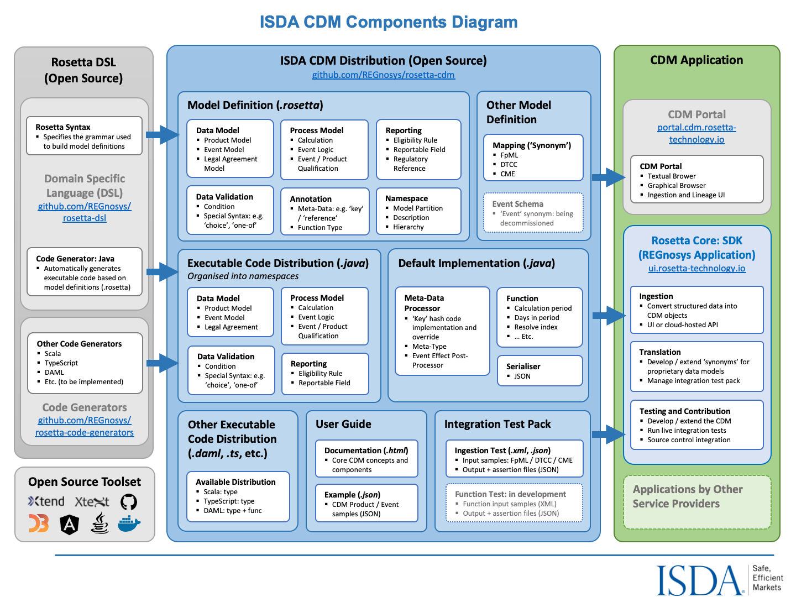

.. |trade|  unicode:: U+02122 .. TRADE MARK SIGN

Overview of the ISDA CDM
========================
.. role:: raw-html(raw)
    :format: html

**Continuous Integration:** |Codefresh build status| :raw-html:` `

What is the ISDA CDM
--------------------

The ISDA Common Domain Model (CDM) is a standardised, machine-readable and machine-executable blueprint for how financial products are traded and managed across the transaction lifecycle. The product scope of the CDM includes OTC derivatives, cash securities, securities financing, and commodities.

A single, digital processing standard for trade events and actions enhances financial markets' operational efficiency in several ways:

* **Enables inter-operability and straight-through processing** across firms, solutions and platforms, reducing the need for reconciliation caused by variations in how each firm records trade lifecycle events.
* **Accelerates financial technology innovation** by providing a common, readily operational foundation for how technologies like distributed ledger, smart contracts, cloud computing, and artificial intelligence can be applied to financial markets.
* **Delivers better regulatory oversight**, promotes transparency and alignment between regulators and market participants and enables consistency in regulatory reporting, by providing a standard representation of trade data and supporting machine executable reporting requirements.

Further detailed information about the CDM and its application is available in the following resources:

* The `ISDA CDM Fact Sheet <https://www.isda.org/a/z8AEE/ISDA-CDM-Factsheet.pdf>`_, published by ISDA in 2018, gives an overview of the CDM and its intended benefits.
* The `CDM Introduction Video <https://vimeo.com/372578450>`_ gives a tour of the main features of the model. It is based on a version of the CDM from October 2019.
* Additional information and announcements about the CDM can be found in the `Market Infrastructure and Technology Section <https://www.isda.org/category/infrastructure/market-infrastructure-technology/>`_ of the ISDA website.

The CDM Components
------------------

**There are three sets of CDM components**, as laid-out in the ISDA CDM components diagram below:

* The Rosetta DSL
* The ISDA CDM Distribution
* CDM Application

The Rosetta DSL
^^^^^^^^^^^^^^^

The Rosetta DSL is the infrastructure component of the CDM. The CDM is a domain model written in a Domain-Specific Language (DSL) called *Rosetta*, comprising a syntax (or *grammar*) and code generators.

To enable adoption and implementation of the CDM by the community of industry participants, the Rosetta DSL and its default code generator (Java) are open source under an Apache 2.0 `licence <https://github.com/REGnosys/rosetta-dsl/blob/master/LICENSE>`_. Further code generators are also open source under an Apache 2.0 `license <https://github.com/REGnosys/rosetta-code-generators/blob/master/LICENSE>`_, allowing industry participants to write and share code generators for any other language.

The `Rosetta DSL documentation <https://docs.rosetta-technology.io/dsl/index.html>`_ explains the Rosetta DSL, describes the mechanism to write and use code generators, and details all the modelling components available in the Rosetta syntax and their purpose, with examples drawn from the CDM.

The ISDA CDM Distribution
^^^^^^^^^^^^^^^^^^^^^^^^^

* The ISDA CDM distribution is openly accessible to all industry participants and can be downloaded from the `CDM Portal <https://portal.cdm.rosetta-technology.io>`_. The ISDA CDM is distributed subject to the ISDA CDM open source licence.

* Information on how to access the CDM Java distribution can be found here: `CDM Java Distribution Guidelines <https://docs.rosetta-technology.io/cdm/documentation/source/cdm-guidelines.html>`_

Components
""""""""""

The ISDA CDM distribution comprises three main sets of components:

* **Model definition**, which corresponds to the model as expressed in the Rosetta DSL syntax and contained into a set of *.rosetta* files organised as *namespaces*. The primary dimensions of the model are listed below and further described in the `Common Domain Model Section <https://docs.rosetta-technology.io/cdm/documentation/source/documentation.html>`_ of the documentation.

  * Product
  * Event
  * Legal Agreement
  * Process
  * Reference Data
  * Mapping (Synonym)

* **Executable code distribution**, automatically generated from the model definitions using `available code generators <https://docs.rosetta-technology.io/dsl/codegen-readme.html#what-code-generators-are-available>`_ from the Rosetta DSL. Once a code generator is implemented for a particular language, the corresponding code generation is included as part of the CDM build and release process, allowing the CDM to be automatically distributed in that language going forward.
* **Default implementation**, comprising manually-written code (in Java) which, combined with the auto-generated code, provides a complete implementation of the model. This hand-written code is distributed together with the CDM to facilitate adoption by firms, which can directly use the CDM distribution to set-up and test an implementation. The default implementation can be used in its original state or be disabled or extended by industry participants in their implementation. For example, the default implementation uses the de-facto Java hash function for the *key* meta-data that supports the CDM cross-referencing mechanism. Firms may elect to use an alternative implementation.

.. note:: While the Java executable code distribution is complete, i.e. it represents the entire CDM as defined in Rosetta (plus any associated default implementation), some other distributions may only capture parts of the model: for instance, the Scala and TypeScript distributions include the complete data model and the function specifications, but not the executable code for functions.

Versioning
""""""""""

The CDM is developed, built and released using standard software source-control management. Each new released version is announced to users via a *release note* that describes the change introduced by that new version. The CDM release history is available in the `Release Section <https://docs.rosetta-technology.io/cdm/releases/all.html>`_ of the CDM documentation.

The CDM is released using the semantic versioning system. The format of a version number is MAJOR.MINOR.PATCH (e.g. ``1.23.456``), where the:

* MAJOR (``1``) version change introduces *backward incompatible* changes and will be used as high level release name (e.g. ``ISDA CDM Version 1``)
* MINOR (``23``) version change may or may not introduce backward incompatible changes, for example supporting a new type of event or feature or upgrading to a new version of the Rosetta DSL.
* PATCH (``456``) version when a backward compatible change is made, for example adding a new class, attribute or updating documentation. An implementor would not have to make any changes to update to this release.

The MAJOR.MINOR.PATCH numbers may increment by more than one unit because release candidates may be created, but not immediately released. Consequently, a subsequent build referenced with the next incremental unit may be released with amendments that include the earlier release candidate.

CDM Application
^^^^^^^^^^^^^^^

An eco-system of CDM-based application components from service providers exists in order to support the adoption of CDM and the implementation of CDM-based production systems by industry participants. These applications may be open source software or licensed under commercial terms.

As an early participant in the development of the CDM, REGnosys have developed an offering to assist other market participants in implementing or contributing to the CDM, in particular:

* The CDM Portal provides a user interface allowing users to navigate through and download the CDM.
* Rosetta Core is a Software Development Kit (SDK or *dev-kit*) for the CDM, corresponding to an *editable* version of the CDM Portal. Rosetta Core consists of an integrated set of tools for adopting, editing and implementing the model, allowing the industry community to directly contribute code to the CDM.

ISDA encourages the adoption of CDM by service providers but does not endorse any of these application components.

The CDM Design Principles
-------------------------

The CDM supports the market objectives of standardisation via a set of design principles that include the following concepts:

* Normalisation through abstraction of common components, e.g. *price* or *quantity*
* Construction by composition and qualification, i.e. "bottom-up" approach
* Mapping to existing industry messaging formats, e.g. *FpML*
* Embedded processing logic, e.g. data validation or state-transition logic
* Modularisation into logical layers, using *namespace* organisation

Normalisation through abstraction of common components
^^^^^^^^^^^^^^^^^^^^^^^^^^^^^^^^^^^^^^^^^^^^^^^^^^^^^^

**To achieve standardisation across products and asset classes, the CDM identifies logical components that fulfil the same function** and normalises them, even when those components may be named and treated differently in the context of their respective markets. By helping to remove inefficiencies that siloed IT environments can create (e.g. different systems dealing with cash, listed, financing and derivative trades make it harder to manage aggregated positions), such design reaffirms the goal of creating an inter-operable ecosystem for the processing of transactions across asset classes.

An example of this approach is the normalisation of the concepts of *quantity*, *price* and *party* in the representation of financial transactions. The CDM identifies that, regardless of the asset class or product type, a financial transaction always involves two counterparties *trading* (i.e. buying or selling) a certain financial product in a specific quantity and at a specific price. Both quantity and price are themselves a type of *measure*, i.e. an amount expressed in a specific unit which could be a currency, a number of shares or barrels, etc. An exchange rate between currencies, or an interest rate, also fit that description and are represented as prices.

This approach means that a single logical concept such as *quantity* represents concepts that may be named and captured differently across markets: e.g. *notional* or *principal* amount etc. This in turn allows to normalise processes that depend on this concept: for instance, how to perform an allocation (essentially a split of the quantity of a transaction into several sub-transactions) or an unwind, instead of specialised IT systems handling it differently for each asset class.

**It is imperative that any request to add new model components or extend existing ones is analysed against existing components** to find patterns that should be factored into common components and avoid specialising the model according to each use case. For instance, in the model for *averaging* options (often used for commodity products, whereby multiple price observations are averaged through time to be compared to the option's strike price), the components are built and named such that they can be re-used across asset classes.

Construction by composition and qualification
^^^^^^^^^^^^^^^^^^^^^^^^^^^^^^^^^^^^^^^^^^^^^

**To ensure re-usability across different markets, the CDM is designed as a composable model** whereby financial objects can be constructed bottom-up based on building-block components. A composable and modular approach allows for a streamlined model to address a broad scope of operational processes consistently across firms' front-to-back flows and across asset classes. The main groups of composable components are:

* **Financial products**: e.g. the same *option* component is re-used to describe option payouts across any asset class, rather than having specialised *Swaption*, *Equity Option* or *FX option* etc. components.
* **Business events** that occur throughout the transaction lifecycle are described by composing more fundamental building blocks called *primitive events*: e.g. a *partial novation* is described by combining a *quantity change* primitive event (describing the partial unwind of the transaction being novated away) and a *contract formation* primitive event (describing the new contract with the novation party).
* **Legal agreements** that document the legal obligations that parties enter into when transacting in financial products are constructed using *election* components associated to functional logic that is re-usable across different types of agreement: e.g. the same logic defining the calculation of margin requirements can be re-used across both initial and variation margin agreements.

In this paradigm, the type of object defined by the CDM, whether a financial product, business event or legal agreement, is not declared upfront: instead, the type is inferred through some business logic applied onto its constituents, which may be context-specific based on a given taxonomy (e.g. a product classification).

**The benefit of this approach is that consistency of object classification is achieved through how those objects are populated**, rather than depending on each market participant's implementation to use the same naming convention. This approach also avoids the model relying on specific taxonomies, labels or identifiers to function and provides the flexibility to maintain multiple values from different taxonomies and identifier sets as data in the model related to the same transaction. This has a number of useful application, not least for regulatory purposes.

Mapping to existing industry messaging formats
^^^^^^^^^^^^^^^^^^^^^^^^^^^^^^^^^^^^^^^^^^^^^^

**To facilitate adoption by market participants, the CDM is made compatible with existing industry messaging formats.** This means that the CDM does not need to be implemented "wholesale" as a replacement to existing messaging systems or databases but can coexist alongside existing systems, with a translation layer. In fact, the CDM is designed to provide only a logical model but does not prescribe any physical data format, neither for storage nor transport. This means that translation to those physical data formats is built-in, and the CDM is best thought of as a logical layer supporting inter-operability between them.

.. note:: Although the CDM features a *serialisation* mechanism (currently in JSON), this format is only provided for the convenience of representing physical CDM objects and is not designed as a storage mechanism.

The need for such inter-operability is illustrated by a typical trade flow, as it exists in derivatives: a trade may be executed using the pre-trade FIX protocol (with an FpML payload representing the product), confirmed electronically using FpML as the contract representation, and reported to a Trade Repository under the ISO 20022 format. What the CDM provides is a consistent logical layer that allows to articulate the different components of that front-to-back flow.

In practice, mapping to existing formats is supported by *synonym* mappings, which are a compact description in the CDM of how data attributes in one format map to model components. In turn, those synonym mappings can support an *ingestion* process that consumes physical data messages and converts them into CDM objects.

**The CDM recognises certain formats as de-facto standards that are widely used to exchange information between market participants.** Their synonym mappings are included and rigorously tested in each CDM release, allowing firms that already use such standards to bootstrap their CDM implementation. Besides, because most standard messaging formats are typically extended and customised by each market participants (e.g. FpML or FIX), the CDM allows the synonym representation for those standards to be similarly inherited and extended to cover each firm's specific customisation.

Embedded processing logic
^^^^^^^^^^^^^^^^^^^^^^^^

**The CDM is designed to lay the foundation for the standardisation, automation and inter-operability of industry processes**. Industry processes represent events and actions that occur through the transaction’s lifecycle, from negotiating a legal agreement to allocating a block-trade, calculating settlement amounts or exchanging margin requirements.

While ISDA defines the protocols for industry processes in its documentation library, differences in the implementation minutia may cause operational friction between market participants. Even the protocols that have a native digital representation have written specifications which require further manual coding in order to result in a complete executable solution: e.g. the validation rules in FpML, the Recommended Practices/Guidelines in FIX or CRIF for SIMM and FRTB, which are only available in the form of PDF documents.

Traditional implementation of a technical standard distributed in prose comes with the risk of misinterpretation and error. The process is duplicated across each firm adopting the standard, ultimately adding up to high implementation costs across the industry.

**By contrast, the CDM provides a fully specified processing model that translates the technical standards supporting industry processes** into a machine-readable and machine-executable format. Systematically providing the domain model as executable code vastly reduces implementation effort and virtually eliminates the risk of inconsistency. For instance, the CDM is designed to provide a fully functional event model, where the state-transition logic for all potential transaction lifecycle events is being specified and distributed as executable code. Another CDM feature is that each model component is associated with data validation constraints to ensure that data is being validated at the point of creation, and this validation logic is distributed alongside the model itself.

Modularisation into logical layers
^^^^^^^^^^^^^^^^^^^^^^^^^^^^^^^^^^

**The set of files that define the CDM data structures and functions are organised into a hierarchy of namespaces**. The first level in the namespace hierarchy corresponds to the layer of the CDM that the components belong to, and those CDM layers are organised from inner- to outer-most as follows:

Namespaces have many benefits:

* Accelerated understanding of the model by allowing users to easily see a high-level view of the model and easily find, select, and study specific areas of interest
* Faster and easier to find data types and functions for referencing/use in new components
* Allowing for partial adoption of areas of interest in the model
* Smaller upgrades representing new versions limited to the name spaces that are impacted

Each of these higher-level namespaces is further divided into lower-level namespaces. The independent components in each namespace are organised according to their core purpose but can be referenced from anywhere in the model to allow all the components to work together for a complete modelling solution. E.g. below is the *product* namespace:

**When developing new CDM components, the positioning of those components in the namespace hierarchy is critical** as part of the design (or potentially the re-organising of the hierarchy following the new development), to ensure the CDM remains well organised.

The CDM Governance
------------------

The CDM governance framework regulates the development of the open source CDM standard via a three-tiered committee structure:

#. The *CDM Executive Committee* is accountable for setting the strategy, promoting adoption of the standard, and overseeing the activity of the Working Groups and the Architecture & Review Committee. Members are senior executives appointed by the ISDA Board considering their strategic influence in the decision making at their firm and active contribution to the development of the CDM.

#. The *CDM Architecture and Review Committee* is responsible for specifying the technical and modelling guidelines and reviewing and approving proposals for new modelling components introduced by the CDM Working Groups. Members include subject matter experts, senior technologists, as well as practitioners in business process, legal documentation, and technical modelling.

#. The *CDM Working Groups* are assembled per subject matter or use cases to actively develop and implement concretely targeted elements of the CDM. Participants include ISDA members and non-members from the CDM user community who commit time and effort for the development and implementation of the CDM as a global standard.

The on-going development of the CDM is organised in accordance with the following process:

Committee members or any user of CDM within the community can propose amendments to the CDM. The proposals can be defined at a conceptual level or a logical level (i.e. in code). In each case, the proposal must be developed in line with the CDM design principles and submitted to ISDA staff and the Architecture & Review Committee for approval. If approved, the amendment will be merged with the CDM master code branch. In some instances, the proposal may not be immediately approved, but may be assigned to an existing or new Working Group for the purpose of reviewing, revising or extending the proposal.

.. |Codefresh build status| image:: https://g.codefresh.io/api/badges/pipeline/regnosysops/REGnosys%2Frosetta-cdm%2Frosetta-cdm?branch=master&key=eyJhbGciOiJIUzI1NiJ9.NWE1N2EyYTlmM2JiOTMwMDAxNDRiODMz.ZDeqVUhB-oMlbZGj4tfEiOg0cy6azXaBvoxoeidyL0g&type=cf-1
   :target: https://g.codefresh.io/pipelines/rosetta-cdm/builds?repoOwner=REGnosys&repoName=rosetta-cdm&serviceName=REGnosys%2Frosetta-cdm&filter=trigger:build~Build;branch:master;pipeline:5a86c209eaf77d0001daacb6~rosetta-cdm

Using the CDM (Java)
--------------------

The Java distribution of the CDM is designed to be built and used with Maven.

It depends on some open source java artifacts which are freely available from an artifact repository. Maven can be configured to use this repository using the repository settings contained in the ``settings.xml`` file in the CDM jar.

For more details, please follow the `CDM Java Distribution Guidelines <https://docs.rosetta-technology.io/cdm/documentation/source/cdm-guidelines.html>`_.

.. note:: These guidelines are intended as a technical documentation for developers to make use of the Java distribution in their implementation.
