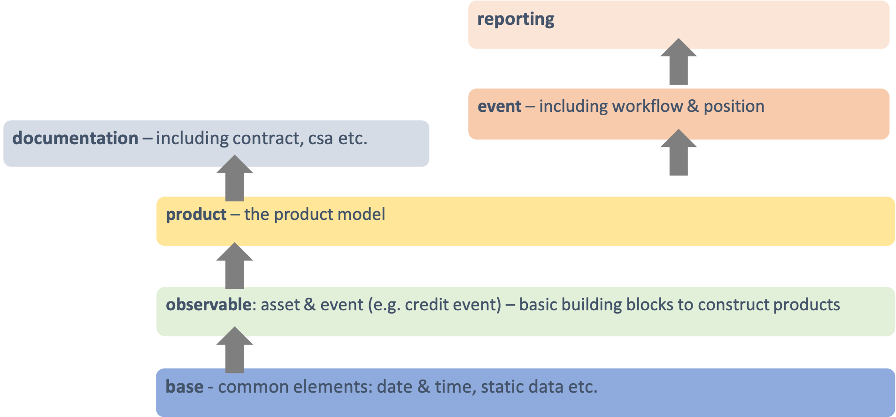
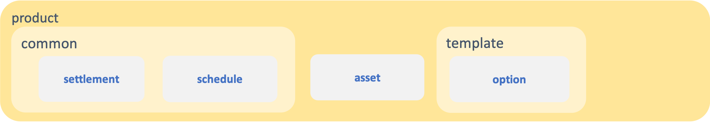

Development Principles
======================

The CDM Design Principles
-------------------------

The CDM supports the market objectives of standardisation via a set of design principles that include the following concepts:

* Normalisation through abstraction of common components, e.g. *price* or *quantity*
* Construction by composition and qualification, i.e. "bottom-up" approach
* Mapping to existing industry messaging formats, e.g. *FpML*
* Embedded processing logic, e.g. data validation or state-transition logic
* Modularisation into logical layers, using *namespace* organisation

Normalisation through abstraction of common components
^^^^^^^^^^^^^^^^^^^^^^^^^^^^^^^^^^^^^^^^^^^^^^^^^^^^^^

**To achieve standardisation across products and asset classes, the CDM identifies logical components that fulfil the same function** and normalises them, even when those components may be named and treated differently in the context of their respective markets. By helping to remove inefficiencies that siloed IT environments can create (e.g. different systems dealing with cash, listed, financing and derivative trades make it harder to manage aggregated positions), such design reaffirms the goal of creating an inter-operable ecosystem for the processing of transactions across asset classes.

An example of this approach is the normalisation of the concepts of *quantity*, *price* and *party* in the representation of financial transactions. The CDM identifies that, regardless of the asset class or product type, a financial transaction always involves two counterparties *trading* (i.e. buying or selling) a certain financial product in a specific quantity and at a specific price. Both quantity and price are themselves a type of *measure*, i.e. an amount expressed in a specific unit which could be a currency, a number of shares or barrels, etc. An exchange rate between currencies, or an interest rate, also fit that description and are represented as prices.

This approach means that a single logical concept such as *quantity* represents concepts that may be named and captured differently across markets: e.g. *notional* or *principal* amount etc. This in turn allows to normalise processes that depend on this concept: for instance, how to perform an allocation (essentially a split of the quantity of a transaction into several sub-transactions) or an unwind, instead of specialised IT systems handling it differently for each asset class.

**It is imperative that any request to add new model components or extend existing ones is analysed against existing components** to find patterns that should be factored into common components and avoid specialising the model according to each use case. For instance, in the model for *averaging* options (often used for commodity products, whereby multiple price observations are averaged through time to be compared to the option's strike price), the components are built and named such that they can be re-used across asset classes.

Construction by composition and qualification
^^^^^^^^^^^^^^^^^^^^^^^^^^^^^^^^^^^^^^^^^^^^^

**To ensure re-usability across different markets, the CDM is designed as a composable model** whereby financial objects can be constructed bottom-up based on building-block components. A composable and modular approach allows for a streamlined model to address a broad scope of operational processes consistently across firms' front-to-back flows and across asset classes. The main groups of composable components are:

* **Financial products**: e.g. the same *option* component is re-used to describe option payouts across any asset class, rather than having specialised *Swaption*, *Equity Option* or *FX option* etc. components.
* **Business events** that occur throughout the transaction lifecycle are described by composing more fundamental building blocks called *primitive events*: e.g. a *partial novation* is described by combining a *quantity change* primitive event (describing the partial unwind of the transaction being novated away) and a *contract formation* primitive event (describing the new contract with the novation party).
* **Legal agreements** that document the legal obligations that parties enter into when transacting in financial products are constructed using *election* components associated to functional logic that is re-usable across different types of agreement: e.g. the same logic defining the calculation of margin requirements can be re-used across both initial and variation margin agreements.

In this paradigm, the type of object defined by the CDM, whether a financial product, business event or legal agreement, is not declared upfront: instead, the type is inferred through some business logic applied onto its constituents, which may be context-specific based on a given taxonomy (e.g. a product classification).

**The benefit of this approach is that consistency of object classification is achieved through how those objects are populated**, rather than depending on each market participant's implementation to use the same naming convention. This approach also avoids the model relying on specific taxonomies, labels or identifiers to function and provides the flexibility to maintain multiple values from different taxonomies and identifier sets as data in the model related to the same transaction. This has a number of useful application, not least for regulatory purposes.

Mapping to existing industry messaging formats
^^^^^^^^^^^^^^^^^^^^^^^^^^^^^^^^^^^^^^^^^^^^^^

**To facilitate adoption by market participants, the CDM is made compatible with existing industry messaging formats.** This means that the CDM does not need to be implemented "wholesale" as a replacement to existing messaging systems or databases but can coexist alongside existing systems, with a translation layer. In fact, the CDM is designed to provide only a logical model but does not prescribe any physical data format, neither for storage nor transport. This means that translation to those physical data formats is built-in, and the CDM is best thought of as a logical layer supporting inter-operability between them.

.. note:: Although the CDM features a *serialisation* mechanism (currently in JSON), this format is only provided for the convenience of representing physical CDM objects and is not designed as a storage mechanism.

The need for such inter-operability is illustrated by a typical trade flow, as it exists in derivatives: a trade may be executed using the pre-trade FIX protocol (with an FpML payload representing the product), confirmed electronically using FpML as the contract representation, and reported to a Trade Repository under the ISO 20022 format. What the CDM provides is a consistent logical layer that allows to articulate the different components of that front-to-back flow.

In practice, mapping to existing formats is supported by *synonym* mappings, which are a compact description in the CDM of how data attributes in one format map to model components. In turn, those synonym mappings can support an *ingestion* process that consumes physical data messages and converts them into CDM objects.

**The CDM recognises certain formats as de-facto standards that are widely used to exchange information between market participants.** Their synonym mappings are included and rigorously tested in each CDM release, allowing firms that already use such standards to bootstrap their CDM implementation. Besides, because most standard messaging formats are typically extended and customised by each market participants (e.g. FpML or FIX), the CDM allows the synonym representation for those standards to be similarly inherited and extended to cover each firm's specific customisation.

Embedded processing logic
^^^^^^^^^^^^^^^^^^^^^^^^^

**The CDM is designed to lay the foundation for the standardisation, automation and inter-operability of industry processes**. Industry processes represent events and actions that occur through the transaction’s lifecycle, from negotiating a legal agreement to allocating a block-trade, calculating settlement amounts or exchanging margin requirements.

While ISDA defines the protocols for industry processes in its documentation library, differences in the implementation minutia may cause operational friction between market participants. Even the protocols that have a native digital representation have written specifications which require further manual coding in order to result in a complete executable solution: e.g. the validation rules in FpML, the Recommended Practices/Guidelines in FIX or CRIF for SIMM and FRTB, which are only available in the form of PDF documents.

Traditional implementation of a technical standard distributed in prose comes with the risk of misinterpretation and error. The process is duplicated across each firm adopting the standard, ultimately adding up to high implementation costs across the industry.

**By contrast, the CDM provides a fully specified processing model that translates the technical standards supporting industry processes** into a machine-readable and machine-executable format. Systematically providing the domain model as executable code vastly reduces implementation effort and virtually eliminates the risk of inconsistency. For instance, the CDM is designed to provide a fully functional event model, where the state-transition logic for all potential transaction lifecycle events is being specified and distributed as executable code. Another CDM feature is that each model component is associated with data validation constraints to ensure that data is being validated at the point of creation, and this validation logic is distributed alongside the model itself.

Modularisation into logical layers
^^^^^^^^^^^^^^^^^^^^^^^^^^^^^^^^^^

**The set of files that define the CDM data structures and functions are organised into a hierarchy of namespaces**. The first level in the namespace hierarchy corresponds to the layer of the CDM that the components belong to, and those CDM layers are organised from inner- to outer-most as follows:

Namespaces have many benefits:

* Accelerated understanding of the model by allowing users to easily see a high-level view of the model and easily find, select, and study specific areas of interest
* Faster and easier to find data types and functions for referencing/use in new components
* Allowing for partial adoption of areas of interest in the model
* Smaller upgrades representing new versions limited to the name spaces that are impacted

Each of these higher-level namespaces is further divided into lower-level namespaces. The independent components in each namespace are organised according to their core purpose but can be referenced from anywhere in the model to allow all the components to work together for a complete modelling solution. E.g. below is the *product* namespace:

**When developing new CDM components, the positioning of those components in the namespace hierarchy is critical** as part of the design (or potentially the re-organising of the hierarchy following the new development), to ensure the CDM remains well organised.

How to Contribute
-----------------

The purpose of this section is to provide guidance for accepting contributions into the CDM by the wider industry community including market participants, trade associations and technology or service vendors. It describes:

- What a Contributor should do to edit and contribute to the CDM
- What a Reviewer should do to review the changes
- How to release a new CDM version once changes have been approved

The CDM is an open source project and any contribution to its on-going development is governed by the `CDM Governance Principles <cdm-overview.html#the-cdm-governance>`_.

Before you start modelling
^^^^^^^^^^^^^^^^^^^^^^^^^^

Before you start modelling, please make sure you have gone through the following pre-modelling checklist:

- Review the `CDM Design Principles <cdm-overview.html#the-cdm-design-principles>`_
- Get approval of your conceptual design from stakeholders (for large model change)
- Review the `Rosetta Starter Guide <https://docs.rosetta-technology.io/rosetta/rosetta-products/0-welcome-to-rosetta>`_

For large model changes, or changes to core data types, it is recommended that the Contributor reviews the CDM Governance Principles and follows these steps:

- **Define Use Case**: Identify and document one or more use cases with details (e.g., a sample trade).
- **Draft Conceptual Design** (High Level): Draft a conceptual view showing the set of data types, their definitions (and/or sample attributes but not the whole set of attributes), their relationships to each other, and, if applicable, a workflow.
- **Design approval**: Obtain approval of high-level conceptual design from CDM stakeholders

  - CDM Owners (ISDA and other involved Trade Associations, where applicable)
  - CDM Sub-Working Group, if applicable
  - CDM Architecture and Review Committee

- **Quality Assurance**: Seek the early appointment of at least one CDM reviewer who can assist modelling discussions and provide early feedback. CDM Reviewers are appointed by the CDM Owners as and when relevant. Please contact `cdmInfo@isda.org <cdminfo@isda.org>`_.

Editing the model
^^^^^^^^^^^^^^^^^

Modelling checklist
"""""""""""""""""""

The CDM can be edited using a modelling platform called `Rosetta <https://rosetta-technology.io>`_, which is accessible via a web browser.

Before you start editing the CDM using Rosetta, please go through the following modelling checklist:

- Use latest available CDM version
- No syntax warnings or errors
- Model compiles (with no "static compilation" errors)
- All translate regression tests expectations for mapping, validation and qualification maintained or improved
- Additional test samples used (if use-case is not covered by existing samples)
- All model components positioned in the correct namespace
- All model components have descriptions

.. note:: The CDM may also be supported through alternative modelling platforms (for instance `Legend <https://legend.finos.org/studio>`_). If you intend on using a platform other than Rosetta to edit the CDM, please go through the Rosetta check-list anyway as you will still need to validate and then contribute your code through Rosetta.

Use latest available CDM version
""""""""""""""""""""""""""""""""

Once ready to start modelling, the Contributor can log into Rosetta and start using the Rosetta Design application to create a workspace and edit the model, referring to the `Rosetta Design Guide <https://docs.rosetta-technology.io/rosetta/rosetta-products/0-welcome-to-rosetta>`_. To the extent possible it is recommended that the Contributor keeps working with a version of the CDM that is as close as possible to the latest to minimise the risk of backward compatibility.

Please refer to the `Source Control Integration Guide <https://docs.rosetta-technology.io/rosetta/rosetta-products/0-welcome-to-rosetta#id1>`_ for more information.

No syntax warning or error
""""""""""""""""""""""""""

The model is edited using the Rosetta DSL syntax. All syntax warnings and errors must be resolved to have a valid model before contributing any changes. The syntax is automatically checked live in Rosetta Design as the user edits the model, as described in the `Rosetta Design Content Assist Guide <https://docs.rosetta-technology.io/rosetta/rosetta-products/0-welcome-to-rosetta#rosetta-design-content-assist>`_.

For further guidance about features of the syntax, please refer to the `Rosetta DSL Documentation <https://docs.rosetta-technology.io/rosetta/rosetta-dsl/rosetta-modelling-component>`_.

Model compilation
"""""""""""""""""

Normally, when the model is syntactically correctly edited, valid code is being auto-generated and compiled in Rosetta. However, certain model changes can cause compilation errors when changes conflict with static code (e.g. certain mapper implementations).

The Rosetta support team can help resolve these errors before the changes are contributed. In most cases you will be able to contact the team via the `In-App chat <https://docs.rosetta-technology.io/rosetta/rosetta-products/0-welcome-to-rosetta#in-app-chat>`_. If the Rosetta support identifies that significant work may be required to resolve these errors, they will notify the Contributor who should then contact the CDM Reviewer originally appointed for the proposed change and/or CDM Owners. The latter will be able to assist in the resolution of the issues.

For more information about auto-compilation in Rosetta, please refer to the `Rosetta Auto Compilation Guide <https://docs.rosetta-technology.io/rosetta/rosetta-products/0-welcome-to-rosetta#auto-compilation>`_.

Testing
"""""""

The CDM has adopted a test-driven development approach that maps model components to existing sample data (e.g., FpML documents or other existing standards).  Mappings are specified in the CDM using ``synonym`` which are collected into a Translation Dictionary, and the sample data are collected into a Test Pack. Each new model version is regression-tested using those mappings to translate the sample data in the Test Pack and then comparing against the expected number of mapped data points, validation and qualification results.

Contributors are invited to test their model changes live against the Test Pack using the Rosetta Translate application, referring to the `Rosetta Translate Guide <https://docs.rosetta-technology.io/rosetta/rosetta-products/0-welcome-to-rosetta>`_. When editing existing model components, the corresponding synonyms should be updated to maintain or improve existing levels. When adding new model components, new sample data and corresponding synonym mappings should also be provided so the new use-case can be added to the set of regression tests.

Please refer to the `Mapping Guide <https://docs.rosetta-technology.io/rosetta/rosetta-dsl/rosetta-modelling-component#mapping-component>`_ for details about the synonym mapping syntax.

Namespace
"""""""""

All model components should be positioned appropriately in the existing namespace hierarchy. If the proposed contribution includes changes to the namespace hierarchy, those changes should be justified and documented. Any new namespace should have an associated description, and be imported where required.

Please refer to the `Namespace documentation <documentation.html#namespace>`_ for more details.

All model components have descriptions
""""""""""""""""""""""""""""""""""""""

All model components (e.g. types, attributes, conditions, functions etc.) should be specified with descriptions in accordance with the `CDM Style Guide <documentation-style-guide.html>`_.

Contributing model changes
^^^^^^^^^^^^^^^^^^^^^^^^^^

Contribution checklist
""""""""""""""""""""""

Before you start contributing your model changes, please go through the following contribution checklist:

- Use Rosetta to contribute model changes to GitHub, specifying a meaningful title and description
- Notify the CDM Reviewers (via email or Slack) of the submitted contribution
- Include:

  - Any notes on expected mapping, validation or qualification changes (success numbers should not decrease)
  - Additional data samples, if necessary
  - Documentation adjustment, if necessary
  - Release notes
  - Any other additional materials or documentation that may help with the review and approval process

Contributing using Rosetta
""""""""""""""""""""""""""

Once the model changes have been completed, use Rosetta to submit changes for review, referring to the `Rosetta Workspace Contribution Guide <https://docs.rosetta-technology.io/rosetta/rosetta-products/0-welcome-to-rosetta#contribute-workspace-changes>`_ and specifying a meaningful title and description.

.. note:: All contributions are submitted as candidate changes to be incorprated under `the CDM licence <https://portal.cdm.rosetta-technology.io/#/terms-isda>`_

The CDM is hosted in GitHub. Any changes contributed through Rosetta are submitted as a "Pull Request" on a one-off CDM branch and will invoke a build process to compile and run all CDM unit tests and regression tests.

.. note:: It is not yet possible to use Rosetta to contribute updated test expectations, documentation, release notes or new sample data, so these must be provided to the CDM Reviewers via Slack or email.

Documentation
"""""""""""""

The CDM documentation must be kept up-to-date with the model in production. Where applicable, the Contributor should provide accompanying documentation (in text format) that can be added to the CDM documentation for their proposed changes.

The documentation includes *.rosetta* code snippets that directly illustrate explanations about certain model components, and those snippets are validated against the actual model definitions. When a model change impacts those snippets, or if new relevant snippets should be added to support the documentation, those snippets should be provided together with the documentation update.

Release note
""""""""""""

A release note should be provided with the proposed model change that concisely describes the high-level conceptual design, model changes and how to review. Please refer to the `Release Note Style Guide <documentation-style-guide.html#content-of-release-notes>`_ for further guidance on editing release notes.

Reviewing model changes
^^^^^^^^^^^^^^^^^^^^^^^

Review checklist
""""""""""""""""

Before starting to review a contribution, the CDM Reviewer should go through the following review checklist:

- Review the GitHub Pull Request to assert that:

  - Model changes fulfil the proposed design and use-case requirements
  - Synonyms have been updated and output (JSON) looks correct
  - Contributed model version is not stale and does not conflict with any recent changes
  - Changes are in accordance with the CDM governance guidelines

.. note:: It is not yet possible to verify that mapping, validation and qualification expectations have been maintained by looking at the output of the GitHub Pull Request and CDM build only. Please refer to the `downstream dependencies <contribution.html#id1>`_ section for more details.

- CDM build process completed with no errors or test failures
- Review additional samples provided (if use-case is not covered by existing samples)
- All model components positioned in the correct namespace
- All model components have descriptions
- Additional documentation provided, if necessary.
- Release note provided

Any review feedback should be sent to the contributor as required via Slack, email or in direct meetings.

.. note:: Depending on the size, complexity or impact of a contribution, the CDM Reviewers can recommend for the contribution to be presented with an appropriate level of details with the CDM Architecture and Review Committee for further feedback. The CDM reviewer will work with the Contributor to orchestrate that additional step. The additional feedback may recommend revisions to the proposed changes. When it is the case the review process will iterate on the revised proposal.

Post-review technical tasks
"""""""""""""""""""""""""""

Following model reviews, a number of technical tasks may be required before the changes can be finally approved, merged and released:

- **Stale CDM version**: Contribution is based on an old CDM version and model changes conflict with more recent changes. If the conflicting change is available in Rosetta, the contributor should be asked to update their contribution to the latest version and resubmit. If the conflicting change is not yet available in Rosetta, this merge will need to be handled by the CDM Reviewer.
- **Failed unit tests**: Java unit tests in the CDM project may fail due to problems in the contributed changes. Alternatively it may be that the test expectations need to be updated. The Reviewer should determine the cause of the test failure and notify either the Contributor or work on adjusting the test expectations.
- **Additional documentation**: If the contributor provided additional documentation, the Reviewer should update the CDM documentation by editing the *documentation.rst* file in GitHub.
- **Documentation code snippets**: To avoid stale documentation, the CDM build process verifies that any code snippets in the documentation exists and is in line with the model itself. The Reviewer should adjust or include any code snippets by editing the *documentation.rst* file on GitHub.
- **Code generation**: Model changes may cause code generator failures (e.g., Java, C#, Scala, Kotlin etc.). In the unlikely event of code generation failures, these will need to be addressed by the Reviewer.

Downstream dependencies
"""""""""""""""""""""""

The CDM has a number of dependent projects that are required for the CDM to be successfully distributed. It is possible that model changes may cause these downstream projects to fail. The Reviewer will need to test and, if necessary, update those before the changes can be released.

- **Translate**: The regression tests in this project compare the contributed model against the expected number of mapping, validation and qualification results. Due to the contributed model changes, it is likely that there will be expectation mismatches that cause this build to fail.
- **CDM Portal**: compile and test.
- **CDM Java Examples**: compile and test.

.. note:: In most cases, the post-review technical tasks and downstream dependencies require software engineering expertise in addition to CDM expertise. The Reviewer should seek additional technical support to address those if they cannot handle those tasks themselves.

The change can be merged into the main CDM code base only upon:

- approval by CDM Reviewers and/or CDM Architecture and Review Committee,
- successful completing of all the above technical tasks, and
- successful builds of the CDM and all its downstream dependencies.

Releasing model changes
^^^^^^^^^^^^^^^^^^^^^^^

Once the contributed model change has been merged, a new release can be built, tested and deployed. The Reviewer will work with the CDM Owners and the Contributor on a deployment timeline.

The following release checklist should be verified before deploying a new model:

- Update CDM version, which uses the semantic version format (see `CDM Versioning Documentation <cdm-overview.html#versioning>`_)
- Build release candidate, and test
- Build documentation website release candidate, and test
- Deploy release candidate and notify channels if need be
- (Currently done at a later stage) Update the latest CDM version available in Rosetta

.. note:: The release process is now being handled by the **Rosetta Deploy** solution. The Reviewer should contact the Rosetta support team to request that deployment and discuss a timeline for the release.
