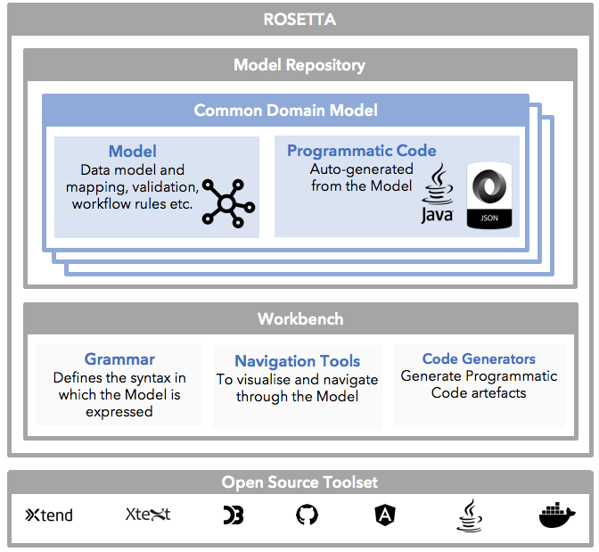

.. |trade|  unicode:: U+02122 .. TRADE MARK SIGN

The ISDA Common Domain Model
============================
The ISDA Common Domain Model is an initiative that ISDA has spearheaded to produce a common, robust, digital blueprint for how derivatives are traded and managed across their lifecycle. It is based on the design principles specified as part of ISDA’s October 2017 `CDM concept paper <https://www.isda.org/a/gVKDE/CDM-FINAL.pdf>`_ for a product scope limited to simple interest and credit derivative products and an agreed sample of business events.

ISDA anticipates that establishing such digital data and processing standards will lead to the following benefits:

* Reduce the current need for continual reconciliations to address mismatches caused by variations in how each firm records trade lifecycle events;
* Enable consistency in regulatory compliance and reporting;
* Accelerate greater automation and efficiency in the derivatives market;
* Provide a common foundation for new technologies like distributed ledger, cloud and smart contracts to facilitate data consistency;
* Facilitate interoperability across firms and platforms.

A high-level presentation of the ISDA CDM and additional information is available on the ISDA website (`www.isda.org <http://www.isda.org/>`_) and particularly with the referred `Short Video <https://www.isda.org/2017/11/30/what-is-the-isda-cdm/>`_.

The Rosetta Workbench
=====================
To tie the design choices made by the Working Group to how they manifest practically, we make reference to the Rosetta Workbench which we will refer to simply as Rosetta. It is useful to think of Rosetta as a set of tools to use when creating domain models. Much like how software engineers use programming languages and tools to create software.

Rosetta is a digital repository whose purpose is to consolidate market standards and practices into a cohesive model, from which executable code is automatically generated.

The key idea behind Rosetta is that financial markets presently have two unappealing characteristics as it relates to their supporting electronic data representation:

*  **Variety of data representations**. The plurality of data standards (the main ones being FIX, FpML, ISO 20022 and EFET) is compounded by the many variations in the implementation of those, to which we need to add a wide range of proprietary data representations.
*  **Limited availability of native digital tools** that would allow those data representations to be directly translated into executable code. Even the protocols that have a native digital representation (e.g. FpML and FIXML, which are available in the form of XML schemas) have associated specifications artefacts which require further manual specification and/or coding in order to result in a complete executable solution. In FpML, this is the case of the associated validation rules. In FIX, an example of such are the Recommended Practices/Guidelines, which are only available in the form of PDF documents.

Rosetta is looking to address those shortcomings by **consolidating various data and workflow representations into a cohesive model** (hence the naming reference to the Rosetta Stone), which can be **automatically translated into executable code**.

As illustrated by the above picture, Rosetta has two main components as it relates to its usage as part of the ISDA CDM: the Model Repository and the Rosetta Workbench.

The **Model Repository** has two components:

* The **legible model**, that expresses the data and associated logic using the Rosetta syntax.
* The **projection of this model** into a variery of executable code representations (presently, JSON and Java).

The **Rosetta Workbench** corresponds to the toolset that supports the CDM, through 4 sets of functions:

* The **grammar**, which is specified as part of a Domain Specific Language (DLS) component which has been developed using open source software. While the CDM syntax is based upon this grammar, access to this grammar is needed for using the CDM.
* The **navigation tools**, which expose through a web portal a textual and a graphical interface into the CDM.
* The **ingestion service**, which transforms events and trades expressed using alternative data representations into JSON documents that conform to the CDM. At present, the ingested trades confirm to the version 5.10 of the FpML standard, and the events are originated using a custom data representation.
* The **code generators**, which are used to produce the executable code projections that are part of the model repository. Those code generators are developed using the same open source software component as the grammar, and access to those is not required for CDM usage purposes.

Those worbench components are presented in the below picture, the further one being the milestoned CDM 1.0 version of the model. Once further version of the CDM will be released, this icon will be repositioned as a generic access to those respective versions.

.. figure:: rosetta-home.png

CDM Modelling Artefacts
=======================

The CDM combines **five modelling artefacts**, which are consistently expressed through the Rosetta syntax:

* Data representation
* Mapping
* Data validation
* Object qualification
* Calculation

The below sections of this documentation detail the purpose and features of each of those CDM artefacts, and highlight the relationships that exists among those.

Data Representation Artefacts
-----------------------------

Rosetta makes use of **six data representation components** to represent the CDM:

* Classes
* Attributes
* Enumerations
* Enumerations values
* Choice rules
* Aliases

Classes
^^^^^^^

Purpose
"""""""

CDM classes are objects that contain the granular data representation elements, in the form of attributes.

Syntax
""""""

The class is delineated by brackets ``{`` ``}``.

The CDM supports the concept of **abstract classes**, which cannot be instantiated as part of the generated executable code and are meant to be extended by other classes.  An example of such is the ``ListedHeader`` class, which contains the attributes that are common among listed products.

.. code-block:: Java

 abstract class ListedHeader <"An abstract class to holds the attributes that are common across listed products.">
 {
  id string (0..1) anchor;
    [synonym FpML value id]
  productTaxonomy ProductTaxonomy (1..*) <"The product taxonomy value(s) associated with a product.">;
  productIdentifier ProductIdentifier (1..*) <"There can be several identifiers associated with a given product.">;
  description string (1..1) <"The product name.">;
    [synonym FpML value description]
  currency string (0..1) scheme "currencyScheme" <"The denomination currency of the instrument.">;
    [synonym FpML value currency]
  clearanceSystem string (0..1) scheme "clearanceSystemScheme" <"Identification of the clearance system associated with the transaction exchange.">;
    [synonym FpML value clearanceSystem]
 }

The Rosetta convention is that class names start with a capital letter. Class names need to be unique across the model, including with respect to rule names. Both those are controlled by the Rosetta grammar.

Attributes
^^^^^^^^^^

Purpose
"""""""

Attributes specify the granular model elements in terms of type of value (e.g. ``integer``, ``string``, enumerated value), cardinality and through an associated definition.

Syntax
""""""

A Rosetta attribute can be specified either as a basic type, a class or an enumeration.

The set of **basic types** available in Rosetta are:

Text - ``string``

Number - ``int`` - ``number``

Logic - ``boolean``

Date and Time - ``date`` - ``dateTime`` - ``time``

Calculation - ``calculation`` (The ``calculation`` qualifier represents the outcome of the CDM interest accrual calculation. It is currently associated with two attributes: ``cashflowCalculation`` in the ``Cashflow`` class, and ``callFunction`` in the ``computedAmount`` class.)

Product and event qualification - ``productType`` - ``eventType``

Rosetta syntax convention is for attribute names to be expressed in lower case, and a warning will be generated by the grammar if this is not the case. Attribute names need to be unique within the context of a class (and within the context of the base class, if a class extends another class), but can be duplicated across classes. The semi-column ``;`` acts as the terminal character for the attribute specification, with associated synonyms being positioned underneath that specification line.

The CDM provides the ability to associate a set of **qualifiers** to the attributes: ``anchor``, ``reference``, ``scheme``, ``rosettaKey`` and ``rosettaKeyValues``.

* The ``anchor`` and ``reference`` qualifiers represent the cross-referencing mechanism widely used in the XML space (and particularly as part of the FpML standard) as a way to provide data integrity within the context of an instance document.

* The ``scheme`` qualifier specifies scheme references.

  The below CDM snippet provides a good illustration as to how those 3 qualifiers are implemented, with the ``anchor`` qualifier being associated to the ``id`` attribute of the ``Party`` class, while the ``reference`` is associated to the ``partyReference`` attribute of the ``PartyAndAccountReference`` class.  The values associated with the *partyIdScheme* being not specified by FpML, this scheme is associated as such with the ``partyId`` attribute.  (As detailed in the Enumerations section below, the schemes which values are specified by FpML are positioned as CDM enumerations.)

.. code-block:: Java

  class Party <"The party class.">
    [synonym FpML value Party]
  {
   id string (0..1) anchor;
     [synonym FpML value id]
   partyId string (1..*) scheme "partyIdScheme" <"The identifier associated with a party, e.g.  the 20 digits LEI code.">;
     [synonym FpML value partyId]
   legalEntity LegalEntity (0..1);
   naturalPerson NaturalPerson (0..*);
  }

  class PartyAndAccountReference <"This class corresponds to the FpML PartyAndAccountReferences.model.">
  {
   partyReference string (1..1) reference;
     [synonym FpML value partyReference]
   accountReference string (0..1) reference;
     [synonym FpML value accountReference]
  }

* The ``rosettaKey`` corresponds to a hash code generated by the CDM as part of the ``EventEffect`` features, which are further detailed below as part of the CDM Model section. In essence, the rosettaKey hash value associated with the relevant class (``Payment`` in the below snippet) is also associated with the corresponding attribute in the ``EventEffect`` class (in this case, the ``payment`` attribute).

 .. code-block:: Java

  class EventEffect <"The set of operational and positional effects associated with a lifecycle event.">
  {
   effectedContract ContractOrContractReference (0..*) rosettaKey <"A pointer to the contract(s) (or reference contract(s)) to which the event effect(s) apply, i.e. in the before event state.">;
   effectedEvent Event (1..1) rosettaKey <"A pointer to the event to which the event effect(s) apply.">;
   contract ContractOrContractReference (0..*) rosettaKey <"A pointer to the contract (or contract reference) effect(s), an example of such being the outcome of a new trade, swaption exercise or novation event.">;
   listedProduct ListedProduct (0..*) rosettaKey <"A pointer to the listed product effect(s), an example of such being the outcome of the physical exercise of a bond option.">;
   payment Payment (0..*) rosettaKey <"A pointer to the payment effect(s), an example of such being the outcome of an option cash exercise.">;
  }

  class Payment extends CashflowBase rosettaKey <"A class for defining payments, an artefact to be used as the input to a payment system or the outcome of it, and is to be distinguished from a cashflow, which is the raw outcome of a calculation or some other assessment. Rosetta extends the FpML Payment type for the purpose of supporting premium payment, by adding the premiumExpression and the paymentDiscounting attributes.">
  {
	 paymentAmount Money (1..1) <"The currency amount of the payment.">;
	 paymentDate AdjustableOrAdjustedOrRelativeDate (0..1) <"The payment date. While FpML specifies this element to be of type AdjustableOrAdjustedDate, Rosetta uses the AdjustableOrAdjustedOrRelativeDate to accommodate the credit default swap option premium, which uses the relative date construct.">;
	 paymentType PaymentTypeEnum (0..1);
		[synonym Rosetta_Workbench value paymentType]
	 grossCashflow GrossCashflow (0..*) <"The gross cashflow components from which the payment would be derived when corresponding to a netted amount across those components.">;
		[synonym Rosetta_Workbench value grossCashflow]
	 paymentStatus PaymentStatusEnum (0..1) <"The payment status, e.g. Instructed, Settled.">;
		[synonym Rosetta_Workbench value paymentStatus]
	 settlementReference string (0..1) <"The settlement reference, when applicable.">;
		[synonym Rosetta_Workbench value settlementReference]
  }

* The ``rosettaKeyValue`` is a variation of the ``RosettaKey``, which associated hash function doesn't include any of those qualifiers that are associated with the attributes.  The reasoning is that some of those qualifiers are automatically generated by algorithm (typically, the anchors and references associated with XML documents) and would then result in differences between two instance documents, even if those documents would have the same actual values. The ``RosettaKeyValue`` is meant to be used for supporting the reconciliation of economic terms, and is hence associated with the ``EconomicTerms`` class.

 .. code-block:: Java

  class EconomicTerms rosettaKeyValue <"This class represents the full set of product economics: the payout component, as well as the legal optional provisions which have valuation implications. A rosettaKey hash is associated to the contractual product economic terms for the purpose of supporting hash-based reconciliations.">
  {
	 payout Payout (1..1) <"The payout specification, which can combine several payout terms, e.g. an interest rate and a credit default payout in the case of a credit default swap.">;
	 earlyTerminationProvision EarlyTerminationProvision (0..1) <"Parameters specifying provisions relating to the optional and mandatory early termination of a swap transaction.">;
		[synonym FpML value earlyTerminationProvision pathExpression "trade.swap"]
	 cancelableProvision CancelableProvision (0..1) <"A provision that allows the specification of an embedded option within a swap giving the buyer of the option the right to terminate the swap, in whole or in part, on the early termination date.">;
		[synonym FpML value cancelableProvision pathExpression "trade.swap"]
	 extendibleProvision ExtendibleProvision (0..1) <"A provision that allows the specification of an embedded option with a swap giving the buyer of the option the right to extend the swap, in whole or in part, to the extended termination date.">;
  }

The reason for supporting those two implementations is that there is a need for associating a hash to the ``ContractReference`` class, which would obviously not work if the hash would not include the attribute qualifiers. This class is indeed in essence a reference to a contract instance:

.. code-block:: Java

 class ContractReference extends ContractIdentifier
 {
  state StateEnum (0..1) <"The state qualification of a contractual product.">;
   [synonym Rosetta_Workbench value state]
 }

 class ContractIdentifier extends Identifier <"A class defining a trade identifier issued by the indicated party. The CDM doesn't extends the base class PartyAndAccountReference because of the choice logic with the issuer element.">
   [synonym FpML value TradeIdentifier]
 {
   partyReference string (0..1) reference <"Reference to a party.">;
     [synonym FpML value partyReference]
   accountReference string (0..1) reference <"Reference to an account.">;
     [synonym FpML value accountReference]
 }

Enumerations
^^^^^^^^^^^^

Purpose
"""""""

Enumerations are the mechanism through which controlled values are specified at the attribute level. They are the container for the corresponding set of enumeration values.

As mentioned in the preceding section, with respect to the FpML standard, the schemes which values are specified as part of the standard are represented through enumerations in the CDM, while schemes with no defined values are represented in the CDM as a type ``string``. In both cases, the scheme reference associated with the originating element is also associated to the CDM attribute, one of the CDM principles being that no originating information should be disregarded.

Syntax
""""""

Enumerations are very simple modelling container artefacts. They can have associated synonyms and regulatory references.

Similar to the class, the enumeration is delineated by brackets ``{`` ``}``.

.. code-block:: Java

 enum CouponTypeEnum <"The enumerated values to specify if the bond has a variable coupon, step-up/down coupon or a zero-coupon.">
   [synonym FpML value couponTypeScheme]
 {
  Fixed <"Bond has fixed rate coupon.">
    [synonym FpML value "Fixed"],
  Float <"Bond has floating rate coupon.">
    [synonym FpML value "Float"],
  Structured <"Bond has structured coupon.">
    [synonym FpML value "Struct"]
 }

Enumeration Values
^^^^^^^^^^^^^^^^^^

Purpose
"""""""

As indicated in the above section, enumeration values are the set of controlled values that are specified as part of an enumeration container.

Syntax
""""""

Enumeration values have a restricted syntax for the purpose of facilitating their integration with executable code: they cannot start with a numerical digit, and the only special character that can be associated with them is the underscore ``_``.

In order to handle the integration of FpML scheme values such as the *dayCountFractionScheme* which has values such as ``ACT/365.FIXED`` or ``30/360``, the Rosetta syntax provides the ability to associate a **displayName synonym**. Those values are then specified in the CDM as ``ACT_365_FIXED`` and ``_30_360``, with the associated display names of ``ACT/365.FIXED`` and ``30/360``, respectively.

.. code-block:: Java

 enum DayCountFractionEnum <"The enumerated values to specify the day count fraction.">
   [synonym FpML value dayCountFractionScheme]
 {
  (...)
  ACT_360 displayName "ACT/360" <"Per 2006 ISDA Definitions, Section 4.16. Day Count Fraction, paragraph (e) or Annex to the 2000 ISDA Definitions (June 2000 Version), Section 4.16. Day Count Fraction, paragraph (d).">
    [synonym FpML value "ACT/360"],
  ACT_ACT_ISDA displayName "ACT/ACT.ISDA" <"Per 2006 ISDA Definitions, Section 4.16. Day Count Fraction, paragraph (b) or Annex to the 2000 ISDA Definitions (June 2000 Version), Section 4.16. Day Count Fraction, paragraph (b). Note that going from FpML 2.0 Recommendation to the FpML 3.0 Trial Recommendation the code in FpML 2.0 'ACT/365.ISDA' became 'ACT/ACT.ISDA'.">
    [synonym FpML value "ACT/ACT.ISDA"],
  (...)
 }

The **synonym syntax** associated with enumeration values differs in two respects from the synonyms associated with other CDM artefacts:

* The synonym value is of type ``string``, for the above reason related to the need to facilitate integration with executable code. (The alternative approach consisting in specifying the value as a compatible identifier alongside with a display name has been disregarded because it has been deemed not appropriate to create a 'code-friendly' value for the respective synonyms. A ``string`` type removes such need.)
* Although this use case is not part of the current CDM scope, the ability to associate a definition to a synonym value has been enabled, the objective being to effectively support the FIX use cases where the synonym value is a letter or numerical code, which is then positioned as the prefix of the associated definition. Although not part of the CDM 1.0 scope, the ``TimeInForceEnum`` illustrates this approach:

 .. code-block:: Java

  enum TimeInForceEnum <"The enumeration values to specify the period of time during which an order remains in effect.">
    [synonym FIX value TimeInForce tag 59]
  {
   Day <"Day (or session)">
     [synonym FIX value "0" definition "0 = Day (or session)"],
   GoodTillCancel <"Good Till Cancel (GTC)">
     [synonym FIX value "1" definition "1 = Good Till Cancel (GTC)"],
   (...)
  }

Choice Rules
^^^^^^^^^^^^

Purpose
"""""""

Choice rules apply within the context of a class. They define a choice constraint between a set of attributes. They are meant as a simple and robust construct to translate the XML *xsd:choicesyntax* as part of any model created using Rosetta, although their usage is not limited to those XML use cases.

Syntax
""""""

Choice rules only apply within the context of a class, and the naming convention is ``<className>_choice``, e.g. ``TradeIdentifier_choice``. If multiple choice rules exist in relation to a class, the naming convention is to suffix the 'choice' term with a number, e.g. ``TradeIdentifier_choice1`` and ``TradeIdentifier_choice2``.

.. code-block:: Java

 class ContractIdentifier extends Identifier <"A class defining a trade identifier issued by the indicated party. The CDM doesn't extends the base class PartyAndAccountReference because of the choice logic with the issuer element.">
   [synonym FpML value TradeIdentifier]
 {
  id string (0..1);
    [synonym FpML value id]
  partyReference string (0..1) reference <"Reference to a party.">;
    [synonym FpML value partyReference]
  accountReference string (0..1) reference <"Reference to an account.">;
    [synonym FpML value accountReference]
 }

 choice rule ContractIdentifier_choice <"Choice rule to represent an FpML choice construct.">
  for ContractIdentifier required choice between
  issuer and partyReference

The choice constraint can either be **required** (implying that exactly one of the attributes needs to be present) or **optional** (implying that at most one of the attributes needs to be present).

While most of the choice rules have two attributes, there is no limit to the number of attributes associated with it… within the limit of the number of attributes associated with the class at stake. ``CashSettlement_choice`` is a good illustration of this.

.. code-block:: Java

 choice rule CashSettlement_choice <"Choice rule to represent an FpML choice construct.">
  for CashSettlement optional choice between
  cashPriceMethod and cashPriceAlternateMethod and parYieldCurveAdjustedMethod and zeroCouponYieldAdjustedMethod
  and parYieldCurveUnadjustedMethod and crossCurrencyMethod and collateralizedCashPriceMethod

Members of a choice rule need to have their lower cardinality set to 0, something which is enforced by a validation rule.

One of syntax as a complement to the choice rule
""""""""""""""""""""""""""""""""""""""""""""""""""""

In the case where all the attributes of a given class are subject to a choice logic, Rosetta provides the ability to qualify the class information with the ``one of`` qualifier. This feature is illustrated by the ``BondOptionStrike`` class.

.. code-block:: Java

  class BondOptionStrike one of <"A class to specify the strike of a bond or convertible bond option.">
    [synonym FpML value BondOptionStrike]
  {
   referenceSwapCurve ReferenceSwapCurve (0..1) <"The strike of an option when expressed by reference to a swap curve. (Typically the case for a convertible bond option.)">;
     [synonym FpML value referenceSwapCurve]
   price OptionStrike (0..1);
     [synonym FpML value price]
  }

Aliases
^^^^^^^

Purpose
"""""""

Two related considerations stand behind the introduction of aliases as part of the Rosetta syntax:
* The recognition that model tree expressions can be cumbersome at time and hence may contradict the primary goals of clarity and legibility.
* Aliases can be reused across the various modeling artefacts that make use of those, i.e. currently data rule, event and product qualification, calculation and projection rules (note that this latter artefact is not currently uased as part of the CDM).

Syntax
""""""

The alias syntax is straightforward: ``alias <name> <Rosetta expression>``.

The alias name needs to be unique across the product and event qualifications, the classes and the aliases, and validation logic is in place to enforce this. The naming convention is to have one CamelCased word, instead of a composite name as for the Rosetta rules, with implied meaning.

The below snippet presents an exemple of such alias and its use as part of an event qualification.

.. code-block:: Java

 alias contractBeforeQuantityChange
   Event -> primitive -> quantityChange -> before -> contract
  or Event -> primitive -> quantityChange -> before -> contractReference

 isEvent Compression <"The qualification of a compression event from the fact that (i) the intent is Compression when specified, (ii) the quantity change primitive exists, (iii) and there are multiple contracts (or contract references) specified in the before state.">
   Event -> intent when present = IntentEnum.Compression
   and Event -> primitive -> quantityChange exists
   and contractBeforeQuantityChange multiple exists

Mapping Artefacts
-----------------

Synonyms
^^^^^^^^

Purpose
"""""""

Synonym is the baseline building block in the relationship between the CDM and alternative data representations, whether those are open standards or proprietary data representations. It can be complemented by relevant mapping logic when the relationship is not a one-to-one or is conditional.

Synonyms can be associated to all four sets of Rosetta data modelling artefacts:

*  Classes
*  Attributes
*  Enumerations
*  Enumeration values

There is no limit to the number of synonyms that can be associated with each of those artefacts, and there can even be several synonyms for a given data source (e.g. in the case of a conditional mapping).

Syntax
""""""

The baseline synonym syntax has two components:

* The **source**, whose possible values are controlled by the grammar and correspond to the various standards and protocols which are subject to associations as part of Rosetta (e.g. ``FpML``, ``ISO 20022``).
* The **value**, which is of type ``identifier``.

Example:

  ``[synonym FpML value accountTypeScheme]``

A further set of attributes can be associated with a synonym, to address specific use cases:

*  A **tag** (e.g. ``[synonym FIX value AccountType tag 581]``) or a **componentID** (e.g. ``[synonym FIX value RateSource componentID 1062]``) can be associated to a synonym value. Those are of type ``integer``. The purpose here is to properly represent the FIX standard. It should be noted that the ability to set those attributes is not restricted to the source value FIX, because it is expected that further protocol sources will actually be variations of the FIX standard. (Note: this is not a relevant use case as it relates to the current CDM model, which scope is limited to the equivalence with the FpML standard.)
*  A **mapping logic** can be associated to a synonym to address the case where the relationship between the CDM data element and that synonym is subject to a logic of some sort.
*  A **definition** (of type ``string``) can be associated with the enumeration value synonyms, as noted above, the purpose being to provide a more explicit reference to the FIX enumeration values, which are specified through a single digit or letter, which value is then positioned as a prefix to the associated definition.
* A **pathExpression** which purpose is allows mapping in cases where the data is nested in different ways between the respective models.  The ``CalculationPeriodDates`` is a good illustration of such cases, as it is a widely used building block that is leveraged from the FpML standard:

 .. code-block:: Java

  class CalculationPeriodDates <"A class defining the parameters used to generate the calculation period dates schedule, including the specification of any initial or final stub calculation periods. A calculation perod schedule consists of an optional initial stub calculation period, one or more regular calculation periods and an optional final stub calculation period. In the absence of any initial or final stub calculation periods, the regular part of the calculation period schedule is assumed to be between the effective date and the termination date. No implicit stubs are allowed, i.e. stubs must be explicitly specified using an appropriate combination of firstPeriodStateDate, firstRegularPeriodStartDate and lastRegularPeriodEndDate..">
    [synonym FpML value CalculationPeriodDates]
  {
   id string (0..1) anchor;
     [synonym FpML value id pathExpression "calculationPeriodDates"]
   effectiveDate AdjustableDate (0..1) <"The first day of the term of the trade. This day may be subject to adjustment in accordance with a business day convention.">;
     [synonym FpML value effectiveDate pathExpression "calculationPeriodDates"]
     [synonym FpML value effectiveDate]
   relativeEffectiveDate AdjustedRelativeDateOffset (0..1) <"Defines the effective date.">;
     [synonym FpML value relativeEffectiveDate pathExpression "calculationPeriodDates"]
   terminationDate AdjustableDate (0..1) <"The last day of the terms of the trade. This date may be subject to adjustments in accordance with the business day convention.">;
     [synonym FpML value terminationDate pathExpression "calculationPeriodDates"]
     [synonym FpML value scheduledTerminationDate]
   (...)
  }

Mapping Logic
^^^^^^^^^^^^^

Purpose
"""""""

There are cases where the rerlationship between the marketplace standards and protocols and their relation to the CDM is not one-to-one or is conditional.

Hence, the need to complement the synonyms with a syntax that provides the ability to express a mapping logic in a mannet that provides a good balance between flexibility and legibility.

Syntax
""""""

The mapping logic differs from the data rule, choice rule and calculation syntax in that its syntax is not expressed as a stand-alone block with a qualifier prefix such as ``rule``. Rather, the mapping rule is positioned as an extension to the synonym expression, and each of the mapping expressions (several mapping expressions can be associated with a given synonym) is prefixed with the ``set`` qualifier, followed by the name of the Rosetta attribute to which the synonym is being mapped to.

The mapping syntax is composed of two (optional) expressions: a **mapping value** that is prefixed with ``to``, which purpose is to provide the ability to map a specific value that is distinct from the one originating from the source document, and a **conditional expression** that is prefixed with ``when``, which purpose is to associate conditional logic to the mapping expression.

The mapping logic associated with the below ``action`` attribute provides a good illustration of such logic.

.. code-block:: Java

 class Event rosettaKey
 {
  messageInformation MessageInformation (0..1);
  timestamp EventTimestamp (1..1);
    [synonym Rosetta_Workbench value timestamp]
  eventIdentifier Identifier (1..1);
  eventQualifier eventType (0..1) <"The CDM event qualifier, which corresponds to the outcome of the isEvent qualification logic. This value is derived by the CDM from the event features.">;
    [synonym Rosetta_Workbench value eventIdentifier]
  eventDate date (1..1);
    [synonym Rosetta_Workbench value eventDate]
  effectiveDate date (0..1);
    [synonym Rosetta_Workbench value effectiveDate]
  action ActionEnum (1..1) <"Specifies whether the event is a new, a correction or a cancellation.">;
    [synonym FpML value isCorrection
      set action to ActionEnum.New when False,
      set action to ActionEnum.Correct when True]
  intent IntentEnum (0..1);
    [synonym Rosetta_Workbench value intent]
  (...)
 }

Data Validation Artefacts
-------------------------

Data Rules
^^^^^^^^^^

Purpose
"""""""

Data rules are the primary channel through which data validation is enforced as part of Rosetta.

A good initial illustration of such role relates to how data constraints specified as part of the FpML documentation are expressed as part of those rules – and hence become part of the executable code case that is generated from the model.

As an example, the ``FpML_ird_61`` data rule implements the **FpML ird validation rule #61**, which states that if the notional step schedule is absent, then the initial value of the notional schedule must not be null. While at present the FpML logic needs to be evaluated and transcribed into code by the relevant teams (with the implication that, more often than not, such logic is actually not enforced), its programmatic implementation is available alongside a legible view of it as part of Rosetta.

.. code-block:: Java

 class NotionalSchedule <"A class specifying defining the notional amount or notional amount schedule associated with a contractual product. The notional schedule will be captured explicitly, specifying the dates that the notional changes and the outstanding notional amount that applies from that date. A parametric representation of the rules defining the notional step schedule can optionally be included.">
   [synonym FpML value Notional]
 {
  id string (0..1);
    [synonym FpML value id]
  notionalStepSchedule NonNegativeAmountSchedule (1..1) <"The notional amount or notional amount schedule expressed as explicit outstanding notional amounts and dates. In the case of a schedule, the step dates may be subject to adjustments in accordance with any adjustments specified in calculationPeriodDatesAdjustments.">;
    [synonym FpML value notionalStepSchedule]
  notionalStepParameters NotionalStepRule (0..1) <"A parametric representation of the notional step schedule, i.e. parameters used to generate the notional schedule.">;
    [synonym FpML value notionalStepParameters]
 }

 data rule FpML_ird_61 <"FpML validation rule ird-61 - Context: NonNegativeSchedule (complex type). If step does not exist, then initialValue must not be equal to 0.">
   when NotionalSchedule -> notionalStepSchedule -> step is absent
   then NotionalSchedule -> notionalStepSchedule -> initialValue <> 0.0

(**Note**: the above ``0.0`` notation is meant to denote the fact that the ``initialValue`` attribute is of type ``number``.)

Syntax
""""""

Data rules apply to classes and associated attributes.

Their name needs to be unique across the model, and the naming convention often used is in the form of ``<className>_<attributeName>`` where attributeName refers to the attribute to which the rule applies. If the data rule applies to several attributes, it is appropriate to have a naming in the form of ``<className>_<attributeName1>_<attributeName2>``.

Variations from this naming convention are needed, as in the case of the data rules that implement FpML data validation rules, the ``FpML_rule_#`` convention has been used.

Another variation example of this naming convention is ``CalculationPeriodFrequency_rollConvention_M_Y``, which sets constraints with respect to the enumeration values applicable to one attribute as a function of the values applicable to another one; as a result, the rule name suffixes the attribute which is subject to that logic with a hint about the conditional terms. This provides an appropriate differenciation with the two other data rules that apply to the ``CalculationPeriodFrequency`` class, as illustrated below.

.. code-block:: Java

 data rule CalculationPeriodFrequency_rollConvention_M_Y <"FpML validation rule ird-57 - Context: CalculationPeriodFrequency. [period eq ('M', 'Y')] not(rollConvention = ('NONE', 'SFE', 'MON', 'TUE', 'WED', 'THU', 'FRI', 'SAT','SUN')).">
  when CalculationPeriodFrequency -> period = PeriodExtendedEnum.M or CalculationPeriodFrequency -> period = PeriodExtendedEnum.Y
  then CalculationPeriodFrequency -> rollConvention <> RollConventionEnum.NONE
   or CalculationPeriodFrequency -> rollConvention <> RollConventionEnum.SFE
   or CalculationPeriodFrequency -> rollConvention <> RollConventionEnum.MON
   or CalculationPeriodFrequency -> rollConvention <> RollConventionEnum.TUE
   or CalculationPeriodFrequency -> rollConvention <> RollConventionEnum.WED
   or CalculationPeriodFrequency -> rollConvention <> RollConventionEnum.THU
   or CalculationPeriodFrequency -> rollConvention <> RollConventionEnum.FRI
   or CalculationPeriodFrequency -> rollConvention <> RollConventionEnum.SAT
   or CalculationPeriodFrequency -> rollConvention <> RollConventionEnum.SUN

 data rule CalculationPeriodFrequency_rollConvention_W <"FpML validation rule ird-58 - Context: CalculationPeriodFrequency (complex type). When the period is 'W', the rollConvention must be a week day, 'SFE' or 'NONE'.">
  when CalculationPeriodFrequency -> period = PeriodExtendedEnum.W
  then CalculationPeriodFrequency -> rollConvention = RollConventionEnum.NONE
   or CalculationPeriodFrequency -> rollConvention = RollConventionEnum.SFE
   or CalculationPeriodFrequency -> rollConvention = RollConventionEnum.MON
   or CalculationPeriodFrequency -> rollConvention = RollConventionEnum.TUE
   or CalculationPeriodFrequency -> rollConvention = RollConventionEnum.WED
   or CalculationPeriodFrequency -> rollConvention = RollConventionEnum.THU
   or CalculationPeriodFrequency -> rollConvention = RollConventionEnum.FRI
   or CalculationPeriodFrequency -> rollConvention = RollConventionEnum.SAT
   or CalculationPeriodFrequency -> rollConvention = RollConventionEnum.SUN

 data rule CalculationPeriodFrequency_rollConvention_T <"FpML validation rule ird-60 - Context: CalculationPeriodFrequency (complex type). When the period is 'T', the rollConvention must be 'NONE'.">
  when CalculationPeriodFrequency -> period = PeriodExtendedEnum.T
  then CalculationPeriodFrequency -> rollConvention = RollConventionEnum.NONE

The main data rule syntax is in the form of ``when <Rosetta expression> then <Rosetta expression>``.

Here are a set of relevant examples of this data rule syntax:

*   ``CalculationPeriodDates_firstCompoundingPeriodEndDate`` combines three Boolean assertions.

 .. code-block:: Java

  data rule CalculationPeriodDates_firstCompoundingPeriodEndDate <"FpML specifies that the firstCompoundingPeriodEndDate must only be specified when the compounding method is specified and not equal to a value of None.">
   when InterestRatePayout -> compoundingMethod is absent
    or InterestRatePayout -> compoundingMethod = CompoundingMethodEnum.None
   then InterestRatePayout -> calculationPeriodDates -> firstCompoundingPeriodEndDate is absent

*   ``CalculationPeriod_calculationPeriodNumberOfDays`` involves an operator.

 .. code-block:: Java

  data rule CalculationPeriod_calculationPeriodNumberOfDays <"FpML specifies calculationPeriodNumberOfDays as a positive integer.">
   when PaymentCalculationPeriod -> calculationPeriod -> calculationPeriodNumberOfDays exists
   then PaymentCalculationPeriod -> calculationPeriod -> calculationPeriodNumberOfDays >= 0

*   ``CalculationPeriodDates_firstPeriodStartDate_stubPeriodType`` involves three assertions as part of the ``when`` statement, two of which consist in evaluating Boolean values.

 .. code-block:: Java

  data rule CalculationPeriodDates_firstPeriodStartDate_stubPeriodType <"FpML specifies that the firstRegularPeriodStartDate must only be specified if there is an initial stub calculation period.">
   when CalculationPeriodDates -> stubPeriodType is absent
    or ( CalculationPeriodDates -> stubPeriodType <> StubPeriodTypeEnum.ShortInitial
    and CalculationPeriodDates -> stubPeriodType <> StubPeriodTypeEnum.LongInitial )
   then CalculationPeriodDates -> firstRegularPeriodStartDate must be absent

*   ``FpML_cd_7`` makes use of parentheses for the purpose of supporting nested assertions.

 .. code-block:: Java

  data rule FpML_cd_7 <"FpML validation rule cd-7 - If condition LongForm is true, then effectiveDate/dateAdjustments exists.">
   when ( Contract -> documentation -> masterConfirmation or Contract -> documentation -> contractualMatrix ) is absent
   and Contract -> contractualProduct -> economicTerms -> payout -> creditDefaultPayout -> generalTerms -> referenceInformation exists
   then Contract -> contractualProduct -> economicTerms -> payout -> interestRatePayout -> calculationPeriodDates -> effectiveDate -> dateAdjustments exists

Object Qualification Artefacts
------------------------------

The CDM modelling approach consists in inferring the product and event qualification from their relevant attributes, rather than qualifying those upfront. As a result, the Rosetta syntax has been adjusted to meet this requirement, with slight variations in the implementation across those two use cases.

The CDM Model section of this documentation details the positioning of those product and event qualification artefacts as part of the CDM and their representation as part of the associated object instanciations.

Product Qualification
^^^^^^^^^^^^^^^^^^^^^

15 interest rate derivative products have so been qualified as part of the CDM, leveraging the ISDA taxonomy approach. Credit derivatives have not yet been qualified because their ISDA taxonomy is based upon the underlying transaction type, instead of the product features as for the interest rate swaps. Follow-up is in progress with the ISDA Credit Group to evaluate whether an alternative product qualification could be developed that would leverage the approach adopted for interest rate derivatives.

Purpose
"""""""

The product qualification leverages the **alias** syntax presented earlier in this documentation, by qualifying a product from its economic terms, those latter being expressed through a set of assertions associated with modelling components.

Syntax
""""""

The product qualification syntax is as follows: ``isProduct <name> <Rosetta expression>``.

The product name needs to be unique across the product and event qualifications, the classes and the aliases, and validation logic is in place to enforce this. The naming convention is to have one CamelCased word.

The CDM makes use of the ISDA taxonomy V2.0 leaf level to qualify the event.  The synonymity with the ISDA taxonomy V1.0 has been systematically indicated as part of the model upon request from CDM group participants, who pointed out that a number of them use it internally.

.. code-block:: Java

 isProduct InterestRate_IRSwap_FixedFloat
   [synonym ISDA_Taxonomy_v1 value InterestRate_IRSwap_FixedFloat]
  EconomicTerms -> payout -> interestRatePayout -> interestRate -> fixedRate exists
  and EconomicTerms -> payout -> interestRatePayout -> interestRate -> floatingRate exists

Event Qualification
^^^^^^^^^^^^^^^^^^^

11 events have currently been qualified as part of the CDM.

Purpose
"""""""

Similar to the product qualification syntax, the purpose of the event qualifier is to qualify a product from the existence of the a set of modelling attributes.

Syntax
""""""

The event qualification syntax is similar to the product and the alias, the difference being that it is possible to associate a set of data rules to a: ``isProduct <name> <Rosetta expression> <Data rule>``.

The event name needs to be unique across the product and event qualifications, the classes and the aliases, and validation logic is in place to enforce this. The naming convention is to have one CamelCased word.

The ``Compression`` illustrates quite well how the syntax qualifies this event by requiring that three conditions be met:

* When specified, the value associated with the ``intent`` attribute of the ``Event`` class must be ``Compression``;

* The quantity change primitive must exist;

* There are multiple contracts (or contract references) specified in the ``before`` state. This latter argument makes use of the ``contractBeforeQuantityChange`` alias.

.. code-block:: Java

 isEvent Compression <"The qualification of a compression event from the fact that (i) the intent is Compression when specified, (ii) the quantity change primitive exists, (iii) and there are multiple contracts (or contract references) specified in the before state.">
  Event -> intent when present = IntentEnum.Compression
  and Event -> primitive -> quantityChange exists
  and contractBeforeQuantityChange multiple exists

 alias contractBeforeQuantityChange
  Event -> primitive -> quantityChange -> before -> contract
  or Event -> primitive -> quantityChange -> before -> contractReference

Calculation Artefacts
---------------------

Purpose
^^^^^^^

One of the objectives of the CDM Initial Phase has been to express in a machine executable format some of the ISDA Definitions as a way to confirm the extent to which this digital CDM solution can be used.

The ISDA 2006 definitions of the **Fixed Amount** and **Floating Amount** have been used as an initial scope.

To this effect, the grammar component of the Rosetta workbench has been extended as a way to express a syntax that can support such expressions.

Syntax
^^^^^^

The calculation syntax has three components: the **calculation** itself, the **argument** used as an input to that calculation and (possibly) associated **function**.

The application of this syntax to the ``ACT/365.FIXED`` ISDA day count fraction definition provides a good illustration of that syntax:

.. code-block:: Java

 calculation DayCountFractionEnum._30E_360 <"2006 ISDA Definition Article 4 section 4.16(g): If '30E/360' or 'Eurobond Basis' is specified, the number of days in the Calculation Period or Compounding Period in respect of which payment is being made divided by 360, calculated on a formula basis as follows:[[360 x (Y2 - Y1)] + [30 x (M2 - M1)] + (D2 - D1)]/360">
 {
   number: (360 * (endYear - startYear) + 30 * (endMonth - startMonth) + (endDay - startDay)) / 360
 }

.. code-block:: Java

 arguments DayCountFractionEnum._30E_360 <"2006 ISDA Definition Article 4 section 4.16(g). 'Y1' is the year, expressed as a number, in which the first day of the Calculation Period or Compounding Period falls; 'Y2' is the year, expressed as a number, in which the day immediately following the last day included in the Calculation Period or Compounding Period falls; 'M1' is the calendar month, expressed as a number, in which the first day of the Calculation Period or Compounding Period falls; 'M2' is the calendar month, expressed as a number, in which the day immediately following the last day included in the Calculation Period or Compounding Period falls; 'D1' is the first calendar day, expressed as a number, of the Calculation Period or Compounding Period, unless such number would be 31, in which case D1 will be 30; and 'D2' is the calendar day, expressed as a number, immediately following the last day included in the Calculation Period or Compounding Period, unless such number would be 31, in which case D2 will be 30.">
 {
  alias period CalculationPeriod( InterestRatePayout -> calculationPeriodDates )

  endYear : is period -> endDate -> year
  startYear : is period -> startDate -> year
  endMonth : is period -> endDate -> month
  startMonth : is period -> startDate -> month
  startDay : is Min( period -> startDate -> day, 30 )
  endDay : is Min( period -> endDate -> day, 30 )
 }

.. code-block:: Java

 function ResolveRateIndex( index FloatingRateIndexEnum ) <"The function to specify that the floating rate index enumeration will be expressed as a number once the rate is observed.">
 {
  rate number;
 }

CDM Model
=========

This section presents an outline of the **four dimensions of the CDM model representation**:

* products
* events
* interest calcution
* reference data

Product Model
-------------

CDM provides a composite product model whereby:

* The economic terms are specified by composition, leveraging the FpML building blocks to the extent possible while also looking for further consistency and simplicity whenever possible;
* The product qualification is inferred from those economic terms.

The scope of the CDM 1.0 is limited to contractual derivative products, and listed products, loans and mortgages are represented only in relation to the features needed to position those as underlyers of such derivative products.

Contractual Derivative Products
^^^^^^^^^^^^^^^^^^^^^^^^^^^^^^^

The scope of products implemented as part of CDM 1.0 is as follows:

* Interest rate derivatives:

  * Interest rate swaps (incl. cross-currency swaps, non-deliverable swaps, basis swaps, swaps with  non-regular periods, ...)
  * Swaptions
  * Bond and convertible bond options

* Credit derivatives:

  * Credit default swaps (incl. baskets, tranche, swaps with mortgage and loans underlyers, ...)
  * Options on credit default swaps

The below sections detail the key features of this product implementation: contract representation, economic terms component and how the product qualification is inferred from those economic terms.

Post-execution: the contract
""""""""""""""""""""""""""""

Contractual products are bilateral contracts between two parties, which terms are specified at trade inception and apply throughout the life of the contract. Contractual products are fungible only under specific terms (e.g. existence of a close-out netting agreement between the parties).

The CDM ``Contract`` class incorporates all the elements that are part of the FpML *Trade* confirmation view, with the exception of the following elements: *tradeSummary*, *originatingPackage*, *allocations* and *approvals*.

The Rosetta ``Contract`` class includes a ``contractState`` attribute whose purpose is to specify the state of a contract as a result of an event, i.e. the state transition outcome as it relates to the contract state.  **Note**: the need to further refine this ``contractState`` attribute has been identified by the CDM group as part of the initial phase, and will be tackled through subsequent work.

.. code-block:: Java

 class Contract <"A class to specify a contract object, which can be invoked either within the context of an event, or independently from it. It corresponds to the FpML Trade, although restricted to execution and post-execution contexts. Attributes also applicable to pre-execution (a.k.a. pre-trade view in FpML) contexts have been positioned as part of the ContractualProduct class.">
 {
  contractIdentifier PartyContractIdentifier (1..*) <"The contract reference identifier(s) allocated by the parties involved in the contract.">;
    [synonym FpML value partyTradeIdentifier pathExpression "trade.tradeHeader"]
    [synonym Rosetta_Workbench value partyTradeIdentifier pathExpression "tradeHeader"]
  tradeDate DateInstances (1..1) <"The trade date. This is the date the trade was originally executed. In the case of a novation, the novated part of the trade should be reported (by both the remaining party and the transferee) using a trade date corresponding to the date the novation was agreed. The remaining part of a trade should be reported (by both the transferor and the remaining party) using a trade date corresponding to the original execution date.">;
  clearedDate date (0..1) <"If the trade was cleared (novated) through a central counterparty clearing service, this represents the date the trade was cleared (transferred to the central counterparty).">;
    [synonym FpML value clearedDate pathExpression "trade.tradeHeader"]
    [synonym Rosetta_Workbench value clearedDate pathExpression "tradeHeader"]
  contractualProduct ContractualProduct (1..1) <"The contractual product information that is associated with the contract. The corresponding FpML construct is the product abstract element and the associated substitution group.">;
  (...)
 }

The scope of the contract is limited to the post-execution lifecycle, as it involves legal entities and has a set of attributes which are only qualified at the execution and post-execution stage: trade date, calculation agent, documentatiom, governing law, etc.

The economic terms of the contract are positioned as part of the ``contractualProduct`` attribute, alongside the product identification and product taxonomy information.

.. code-block:: Java

 class ContractualProduct <"The contractual product class is meant to be used across the entire pre-execution, execution and (as part of the Contract) post-execution lifecycle contexts.">
 {
  productIdentification ProductIdentification (0..1);
  productTaxonomy ProductTaxonomy (1..*) <"The product taxonomy value(s) associated with a contractual product.">;
  economicTerms EconomicTerms (1..1);
 }

In this respect, the CDM ``contract`` corresponds to the confirmation view of the FpML *trade*, while the ``contractualProduct`` corresponds to the pre-trade view of the FpML *trade*.  (The FpML *trade* term has not been used as part of the CDM because deemed ambiguous in this respect. Its use as part of the standard is largely due to an exclusive focus on post-execution activity in the initial stages of its development. Later adjustments in this respect would have been made difficult as a result of backward compatibility considerations.)

The economic terms
""""""""""""""""""

The CDM ``EconomicTerms`` class ands the underlying ``Payout`` class represent a significant departure from the FpML standard. While FpML qualifies the product through the *product* substitution group, CDM specifies the various set of possible economic terms as part of those afore mentioned ``economicTerms`` and ``payout`` classes. A contractual product will then consist in an assembling of such economic terms, from which the product qualification will be syntactically inferred.

.. code-block:: Java

 class EconomicTerms <"This class represents the full set of product economics: the payout component, as well as the legal optional provisions which have valuation implications.">
 {
  payout Payout (1..1) <"The payout specification, which can combine several payout terms, e.g. an interest rate and a credit default payout in the case of a credit default swap.">;
  earlyTerminationProvision EarlyTerminationProvision (0..1) <"Parameters specifying provisions relating to the optional and mandatory early termination of a swap transaction.">;
    [synonym FpML value earlyTerminationProvision pathExpression "trade.swap"]
  cancelableProvision CancelableProvision (0..1) <"A provision that allows the specification of an embedded option within a swap giving the buyer of the option the right to terminate the swap, in whole or in part, on the early termination date.">;
    [synonym FpML value cancelableProvision pathExpression "trade.swap"]
  extendibleProvision ExtendibleProvision (0..1) <"A provision that allows the specification of an embedded option with a swap giving the buyer of the option the right to extend the swap, in whole or in part, to the extended termination date.">;
 }

The ``Payout`` class provides some provide some appropriate insight with respect to the correspondance between an FpML product and its CDM representation, through the FpML synonyms and associated path expressions.  As an example, one can see that the FpML *feeLeg* is represented through the CDM ``interestRatePayout``, while the FpML *singlePayment* and *initialPayment* are both represented through the CDM ``cashflow``.

.. code-block:: Java

 class Payout <"The payout can be specified through a number of combinations, e.g. by associating several interest rate payouts to specify an interest rate swap, or a credit default and an interest rate payout to specify a credit default swap. The implied product is inferred by the isProduct CDM artefact.">
 {
  interestRatePayout InterestRatePayout (0..*);
    [synonym FpML value swapStream pathExpression "trade.swap"]
    [synonym Rosetta_Workbench value swapStream pathExpression "contract.swap"]
    [synonym FpML value swapStream pathExpression "trade.swaption.swap"]
    [synonym Rosetta_Workbench value swapStream pathExpression "contract.swaption.swap"]
    [synonym FpML value feeLeg pathExpression "trade.creditDefaultSwap"]
    [synonym Rosetta_Workbench value feeLeg pathExpression "contract.creditDefaultSwap"]
    [synonym FpML value feeLeg pathExpression "trade.creditDefaultSwapOption.creditDefaultSwap"]
    [synonym FpML value generalTerms pathExpression "trade.creditDefaultSwap"]
    [synonym FpML value generalTerms pathExpression "trade.creditDefaultSwapOption.creditDefaultSwap"]
  creditDefaultPayout CreditDefaultPayout (0..1);
  cashflow Payment (0..*) <"A payment between the parties to the trade. For interest rate products, this corresponds to the FpML additionalPayment element. For credit default swaps, this corresponds to the initialPayment element and the singlePayment element of the fee leg.">;
    [synonym FpML value additionalPayment pathExpression "trade.swap"]
    [synonym FpML value initialPayment pathExpression "trade.creditDefaultSwap.feeLeg"]
    [synonym FpML value singlePayment pathExpression "trade.creditDefaultSwap.feeLeg"]
    [synonym FpML value premium pathExpression "trade.swaption"]
    [synonym Rosetta_Workbench value premium pathExpression "contract.swaption"]
    [synonym FpML value premium pathExpression "trade.creditDefaultSwapOption"]
    [synonym FpML value premium pathExpression "trade.bondOption"]
  optionPayout OptionPayout (0..*);
 }

The absence of synonym entry for the  ``creditDefaultPayout`` attribute is due to the fact that the corresponding CDS constructs are positioned within the ``CreditDefaultPayout`` class:

.. code-block:: Java

 class CreditDefaultPayout <"The credit default payout specification terms.">
 {
  generalTerms GeneralTerms (1..1) <"This element contains all the data that appears in the section entitled '1. General Terms' in the 2003 ISDA Credit Derivatives Confirmation, except for the effectiveDate, terminationDate and dateAdjustments elements, which have been positioned as part of the InterestRatePayout class.">;
  protectionTerms ProtectionTerms (1..1) <"The credit protection terms.">;
    [synonym FpML value protectionTerms pathExpression "trade.creditDefaultSwap"]
    [synonym FpML value protectionTerms pathExpression "trade.creditDefaultSwapOption.creditDefaultSwap"]
  cashSettlementTerms CashSettlementTerms (0..1);
    [synonym FpML value cashSettlementTerms pathExpression "trade.creditDefaultSwap"]
    [synonym FpML value cashSettlementTerms pathExpression "trade.creditDefaultSwapOption.creditDefaultSwap"]
  physicalSettlementTerms PhysicalSettlementTerms (0..1);
    [synonym FpML value physicalSettlementTerms pathExpression "trade.creditDefaultSwapOption.creditDefaultSwap"]
  transactedPrice TransactedPrice (0..1) <"The qualification of the price at which the contract has been transacted, in terms of market fixed rate, initial points, market price and/or quotation style. In FpML, those attributes are positioned as part of the fee leg.">;
 }

Infering the product qualification from its economic terms
""""""""""""""""""""""""""""""""""""""""""""""""""""""""""

The product qualification is inferred from the economic terms through a dedicated Rosetta syntax which navigate the CDM components, which has been detailed as part of the above CDM Modelling Artefacts section.

The qualification of a **zero coupon fixed float inflation swap** provides a good example of the set of logic that can be used for such purpose, and which combines boolean and qualified expressions.

The CDM makes use of the ISDA taxonomy V2.0 leaf level to qualify the product.  That being said, the current CDM implementation only qualifies interest rate swaps, as the ISDA taxonomy V2.0 for credit default swap references the transaction type, which values are not publicly available and hence not positioned as a CDM enumeration.  This issue will be addressed as part of later versions of the model.

.. code-block:: Java

 isProduct InterestRate_InflationSwap_FixedFloat_ZeroCoupon
    [synonym ISDA_Taxonomy_v1 value InterestRate_IRSwap_Inflation]
   EconomicTerms -> payout -> interestRatePayout -> interestRate -> fixedRate exists
   and EconomicTerms -> payout -> interestRatePayout -> interestRate -> inflationRate exists
   and EconomicTerms -> payout -> interestRatePayout -> paymentDates -> paymentFrequency -> periodMultiplier = 1
   and EconomicTerms -> payout -> interestRatePayout -> paymentDates -> paymentFrequency -> period = PeriodExtendedEnum.T

The product qualification is positioned as part of the ``ProductIdentification`` class, alongside the attributes currently used in FpML to specify the product: ``primaryAssetClass``, ``secondaryAssetClass``, ``productType`` and ``productId``.  This approach provides the ability to specify the credit derivatives products using this current approach until such time that an alternative approach to the transaction type is identified as a way to support a proper product qualification.

 .. code-block:: Java

  class ProductIdentification <"A class to combine the CDM product qualifier with other product qualifiers, such as the FpML ones.">
  {
    productQualifier productType (0..1) <"The CDM product qualifier, which corresponds to the outcome of the isProduct qualification logic. This value is derived by the CDM from the product payout features.">;
    primaryAssetClass AssetClassEnum (0..1) scheme "assetClassScheme" <"A classification of the most important risk class of the trade. FpML defines a simple asset class categorisation using a coding scheme.">;
    secondaryAssetClass AssetClassEnum (0..*) scheme "assetClassScheme" <"A classification of additional risk classes of the trade, if any. FpML defines a simple asset class categorisation using a coding scheme.">;
    productType string (0..*) scheme "productTypeScheme" <"A classification of the type of product. FpML defines a simple product categorisation using a coding scheme.">;
    productId string (0..*) scheme "productIdScheme" <"A product reference identifier. The product Id is an identifier that describes the key economic characteristics of the trade type, with the exception of concepts such as size (notional, quantity, number of units) and price (fixed rate, strike, etc.) that are negotiated for each transaction. It can be used to hold identifiers such as the 'UPI' (universal product identifier) required by certain regulatory reporting rules. It can also be used to hold identifiers of benchmark products or product temnplates used by certain trading systems or facilities. FpML does not define the domain values associated with this element. Note that the domain values for this element are not strictly an enumerated list.">;
  }

This CDM product qualification is stamped onto the generated CDM objects and their JSON serialized representation, as shown as part of the below JSON snippet which includes both product identification information associated with an originating FpML document and product qualification generated by the CDM:

 .. code-block:: Java

  "productIdentification": {
    "primaryAssetClass": "INTEREST_RATE",
    "productId": [
      "InterestRate:IRSwap:OIS"
    ],
    "productIdScheme": "http://www.fpml.org/coding-scheme/product-taxonomy",
    "productQualifier": "InterestRate_IRSwap_FixedFloat",
    "productType": [
     "InterestRate:IRSwap:OIS"
    ],
    "productTypeScheme": "http://www.fpml.org/coding-scheme/product-taxonomy",
    "secondaryAssetClassScheme": "http://www.fpml.org/coding-scheme/asset-class-simple"
  }

Infering the event qualification from its features
""""""""""""""""""""""""""""""""""""""""""""""""""

The CDM lifecycle events are qualified as a function of the combination of their features and, when specified, the ``intent``. The associated syntax is specified as part of the above CDM Modelling Artefacts section.

The event qualification is positioned as an attribute of the ``Event`` class:

 .. code-block:: Java

  class Event rosettaKey
  {
  	messageInformation MessageInformation (0..1);
  	timestamp EventTimestamp (1..1);
  		[synonym Rosetta_Workbench value timestamp]
  	eventIdentifier Identifier (1..1);
  		[synonym Rosetta_Workbench value eventIdentifier]
  	eventQualifier eventType (0..1) <"The CDM event qualifier, which corresponds to the outcome of the isEvent qualification logic. This value is derived by the CDM from the event features.">;
  	(...)
  }

Like the product qualifier, the event qualification is stamped onto the generated CDM objects and their JSON serialized representation, as illustrated by the below JSON lifecycle event snippet:

 .. code-block:: Java

  "eventDate": "2018-03-20",
  "eventEffect": {
   "referenceEvent": "d4afb0aa"
  },
  "eventIdentifier": {
   "identifierValue": {
     "identifier": "789325456"
   }
  },
  "eventQualifier": "NewTradeEvent",
  "messageInformation": {
   "messageId": "1486297",
   "messageIdScheme": "http://www.party1.com/message-id",
   "sentBy": "894500DM8LVOSCMP9T34",
   "sentTo": "49300JZDC6K840D7F79"
  },

Listed Products as Underlyers of Derivative Products
^^^^^^^^^^^^^^^^^^^^^^^^^^^^^^^^^^^^^^^^^^^^^^^^^^^^

Listed products have some (or all) of their economic terms abstracted through a **product identifier** and publicly disseminated by a central venue. As a result, fungibility applies as a function of this product identifier. Hence, the approach of qualifying a product from its economic terms is not applicable to such listed products.

The ``ListedProduct`` class provides a **choice between the respective listed product representations**.  As part of the current CDM version, only two of such products have been specified: bonds and convertible bonds.

.. code-block:: Java

 class ListedProduct one of <"Product which terms are abstracted through a product identifier and are then publicly available through a central venue.">
 {
  bond Bond (0..1);
    [synonym FpML value bond pathExpression "trade.bondOption"]
  convertibleBond ConvertibleBond (0..1);
    [synonym FpML value convertibleBond pathExpression "trade.bondOption"]
 }

A **two-levels class inheritance structure** has been specified to provide for a scalable implementation:

* All listed products inherit from a ``ListedHeader`` abstract class which contains a ``productTaxonomy``, ``productIdentifier`` and a ``description`` attribute.

 .. code-block:: Java

  abstract class ListedHeader <"An abstract class to holds the attributes that are common across listed products.">
  {
   id string (0..1);
     [synonym FpML value id]
   productTaxonomy ProductTaxonomy (1..*) <"The product taxonomy value(s) associated with a product.">;
   productIdentifier ProductIdentifier (1..*) <"There can be several identifiers associated with a given product.">;
   description string (1..1) <"The product name.">;
     [synonym FpML value description]
  }

* Leveraging the FpML approach for underlyer components, a ``FixedIncomeSecurity`` and an ``EquityAsset`` abstract class then provide the commmon attributes for those respective type of instruments.

 .. code-block:: Java

   class FixedIncomeSecurity extends ListedHeader <"A fixed income security. In FpML, it corresponds to the FixedIncomeSecurityContent.model.">
   {
    issuer Party (0..1) reference <"FpML implements this element as an href into the party information. Rosetta restricts the type of party that can issue a product to a legal entity. FpML provides the ability to specify the issuer name, but this is deemed insufficient in the context of Rosetta at a time when the LEI is available and of paramount importance to identify entities.">;
      [synonym FpML value issuerPartyReference]
    seniority CreditSeniorityEnum (0..1) <"The repayment precedence of a debt instrument, as specified by a set of enumerated values.  FpML specifies that creditSeniorityTradingScheme (specified in Rosetta through the CreditSeniorityTradingEnum) overrides creditSeniorityScheme (specified in Rosetta through the CreditSeniorityEnum) when the underlyer defines the reference obligation used in a single name credit default swap trade.">;
      [synonym FpML value seniority]
    couponType CouponTypeEnum (0..1) <"Specifies if the bond has a variable coupon, step-up/down coupon or a zero-coupon.">;
      [synonym FpML value couponType]
    (...)
   }

Loans and Mortgages as Underlyers of Derivative Products
^^^^^^^^^^^^^^^^^^^^^^^^^^^^^^^^^^^^^^^^^^^^^^^^^^^^^^^^

Loans and mortgages are part of the CDM 1.0 as certain credit default swaps have such underlyers.

The CDM implementation closely reflects the FpML standard, and the approach here has not been to infer the product from its economic terms. This approach could be revisited at a later point, once those products are fully represented as part of the CDM, i.e. not just as underlyer components.

.. code-block:: Java

 class Loan extends IdentifiedAsset
   [synonym FpML value Loan]
 {
  borrower LegalEntity (0..*) <"Specifies the borrower. There can be more than one borrower. It is meant to be used in the event that there is no Bloomberg Id or the Secured List isn't applicable.">;
    [synonym FpML value borrower]
  borrowerReference string (0..*) reference;
    [synonym FpML value borrowerReference]
  lien string (0..1) scheme "lienScheme" <"Specifies the seniority level of the lien.">;
    [synonym FpML value lien]
  (...)
 }

.. code-block:: Java

  class Mortgage extends FixedIncomeSecurity
    [synonym FpML value Mortgage]
  {
   pool AssetPool (0..1) <"The mortgage pool that is underneath the mortgage obligation.">;
     [synonym FpML value pool]
   sector MortgageSectorEnum (0..1) <"The sector classification of the mortgage obligation.">;
     [synonym FpML value sector]
   tranche string (0..1) <"The mortgage obligation tranche that is subject to the derivative transaction.">;
     [synonym FpML value tranche]
   (...)
  }

Event Model
-----------

The CDM event model is based upon the same high-level principles as the product model:

* The events are specified by composition of **primitive events**, which make in turn use of a large set of FpML building blocks;
* The event qualification is inferred from those primitive events and, in some relevant cases, from an **intent** qualifier.

Baseline event modelling features
^^^^^^^^^^^^^^^^^^^^^^^^^^^^^^^^^

The ``Event`` class carries the following set of information:

* **Messaging information**: ``messageId``, ``sentBy``, ``sentTo`` and ``copyTo``. This information is optional, as possibly not applicable in a context such as blockchain. It corresponds to some of the components of the FpML *MessageHeader.model*.
* **Timestamp information**: ``creationTimestamp`` and ``expiryTimestamp``. In FpML, this information is also positioned as part of the *MessageHeader.model*.
* **Event identification** information: the ``identifier``, alongside an optional ``version`` and ``issuer``. As a departure from FpML, which makes use of an event identifier construct (the *Correlation* which is distinct from the one associated with the trade (which itself comes in different variation: *PartyTradeIdentifier*, with the *TradeId* and the *VersionedTradeId* as sub-components of it), the CDM approach consists in using a common identifier component across products and events.

 .. code-block:: Java

  class Identifier
  {
   issuer string (0..1) reference scheme "issuerIdScheme" <"The reference to the party that assigns the trade identifier.">;
     [synonym Rosetta_Workbench value issuer]
   identifierValue IdentifierValue (1..1);
   version int (0..1);
     [synonym FpML value version]
     [synonym Rosetta_Workbench value version]
     [synonym FpML value version pathExpression "versionedTradeId"]
     [synonym Rosetta_Workbench value version pathExpression "versionedTradeId"]
  }

* **event qualifier**, which is derived from the event features.
* **Time dimension** information, through the ``eventDate`` and ``effectiveDate``, with this latter being optional as not applicable to certain events (e.g. observations).
* **Action qualification**, to specify whether the event is a new one, a correction or a cancellation of a prior one.
* **Intent qualification**, in the form of a set of enumerated values, such as ``allocation``, ``earlyTermination``, ``partialTermination``, etc.  This intent is used as part of the event qualification, in order to disambiguate events which features are shared across lifecycle events. As an example, a reduction in a trade quantity/notional could apply to a correction event or a partial termination (although the timing of such event could also be used to qualify the proper event).
* **Party information**, which is optional because not applicable to certain events (e.g. most of the observation events).
* **Lineage information**, in the form of a class that provides the ability to reference an unbounded set of contracts or events, as shown by the below code snippet:

 .. code-block:: Java

  class Lineage
  {
   contractReference Identifier (0..*) scheme "correlationIdScheme";
     [synonym Rosetta_Workbench value contractReference]
   eventReference Identifier (0..*);
     [synonym Rosetta_Workbench value eventReference]
  }

* **Primitive events**: the CDM composite approach uses the primitive events as its building blocks. Those primitive events are detailed in the next section of the documentation.
* **Function call**: an example of such a function call is the interpolation function that would be associated with a **derived observation** event that assembles two observed values (say, a 3 months and a 6 months rate observation) to provide a derived one (say, a 5 months observation). As part of the current CDM version this function call as been specified as a mere string element. It will be appropriately specified once such implementation is developed, some of which consisting in the machine readable implementation of the ISDA Definitions (see next Interest Calculation section).

* **EventEffect** corresponds to the set of operational and positional effects associated with a lifecycle event. This information is generated by the CDM and takes the form of a set of pointers to the relevant objects that are associated with a lifecycle event. The candidate objects are the classes that have an associated ``rosettaKey``. At present, those are the ``Contract``, ``Payment``, ``ListedProduct`` and ``ContractOrContractReference``. The ``rosettaKey`` is also associated with the ``Event`` so that a query of the ``EventEffect`` instantiated objects can provide a link to the respective event events. Events such as observations do not have an event effect, hence the optional cardinality.

 .. code-block:: Java

  class EventEffect <"The set of operational and positional effects associated with a lifecycle event.">
  {
   referenceContract Contract (0..*) rosettaKey <"A pointer to the contract to which the event effect(s) apply. This reference is optional to address the case where an event with candidate event effect(s) would only have associated referenceContract.">;
   referenceEvent Event (1..1) rosettaKey <"A pointer to the event to which the event effect(s) apply.">;
   product ContractOrListedProduct (0..*) rosettaKey <"A pointer to the products effect(s), an example of such being the outcome of an option physical exercise.">;
   payment Payment (0..*) rosettaKey <"A pointer to the payment effect(s).">;
   reset ResetPrimitive (0..*) rosettaKey <"A pointer to the reset effect(s).">;
  }

In the below JSON snippet of a swaption cash exercise, we can see that the eventEffect hash value points to the rosettaKeyentry that is associated with the payment.

 .. code-block:: Java

  "eventDate": "2018-04-10",
  "eventEffect": {
   "payment": [
     "5cafa672"
   ],
   "referenceContract": [
     "366e1ca6"
   ],
   "referenceEvent": "d70cf2e"
  (...)
  "payment": {
  "payerReceiver": {
    "payerPartyReference": "Party2",
    "receiverPartyReference": "Party1"
  },
  "paymentAmount": {
    "amount": 458600.53,
    "currency": "EUR"
  },
  "paymentDate": {
    "adjustedDate": "2019-04-17",
    "dateAdjustments": {
      "businessCenters": {
        "businessCenter": [
          "EUTA",
          "GBLO"
        ]
      },
      "businessDayConvention": "MODFOLLOWING"
    },
    "unadjustedDate": "2019-04-14"
  },
  "rosettaKey": "5cafa672"

Primitive events
^^^^^^^^^^^^^^^^

CDM primitive events are the building block components used to specify business events.

.. code-block:: Java

 class PrimitiveEvent <"The set of primitive events. The purpose of this class it to provide clarity with respect to the event qualification logic.">
 {
  newTrade NewTradePrimitive (0..*) <"The new trade primitive is unbounded to address the case of events such as portfolio compressions, which could result in multiple new trades.">;
    [synonym Rosetta_Workbench value newTrade]
  quantityChange QuantityChangePrimitive (0..*);
    [synonym Rosetta_Workbench value quantityChange]
  allocation AllocationPrimitive (0..*);
    [synonym Rosetta_Workbench value allocation]
  termsChange TermsChangePrimitive (0..1);
    [synonym Rosetta_Workbench value otherTermsChange]
  exercise ExercisePrimitive (0..1);
    [synonym Rosetta_Workbench value exercise]
  observation ObservationPrimitive (0..*);
    [synonym Rosetta_Workbench value observation]
  reset ResetPrimitive (0..*);
    [synonym Rosetta_Workbench value reset]
  payment Payment (0..*);
    [synonym Rosetta_Workbench value payment]
  }

Event qualification from primitive events and intent qualification
""""""""""""""""""""""""""""""""""""""""""""""""""""""""""""""""""

Similar to the product modelling approach, the event qualification is inferred from the primitive events.

One distinction with the product approach is that the ``intent`` qualification is also deemed necessary to complement such primitive event information in certain cases. To this effect, the Rosetta event qualification syntax provides the ability to specify that the intent must have a specified value *when present*, as illustrated by the below snippet.

.. code-block:: Java

 isEvent Termination <"The qualification of a termination event from the fact that (i) the intent is Termination when specified, (ii) the only primitive is the quantityChange and there is only one such primitive involved, the (iii) the remaining quantity is null, and (iv) the contract state has the value 'terminated'.">
  Event -> intent when present = IntentEnum.Termination
  and Event -> primitive -> quantityChange single exists
  or quantityAfterQuantityChange = 0.0
  and ( Event -> primitive -> quantityChange -> after -> contract -> state = StateEnum.Terminated
  or Event -> primitive -> quantityChange -> after -> contractReference -> state = StateEnum.Terminated )

Interest Calculation
--------------------

The current CDM version implements the **Fixed Amount** and **Floating Amount** ISDA 2006 Definitions, alongside with some of the day count fractions.

Fixed Amount and Floating Amount Definitions
^^^^^^^^^^^^^^^^^^^^^^^^^^^^^^^^^^^^^^^^^^^^

The CDM syntax to express the Fixed Amount and Floating Amount is similar in structure: a calculation that reflects the terms of the ISDA 2006 Definitions, and associated arguments.

.. code-block:: Java

 calculation FixedAmount <"2006 ISDA Definition Article 5 Section 5.1. Calculation of a Fixed Amount: The Fixed Amount payable by a party on a Payment Date will be: (a) if an amount is specified for the Swap Transaction as the Fixed Amount payable by that party for that Payment Date or for the related Calculation Period, that amount; or (b) if an amount is not specified for the Swap Transaction as the Fixed Amount payable by that party for that Payment Date or for the related Calculation Period, an amount calculated on a formula basis for that Payment Date or for the related Calculation Period as follows: Fixed Amount = Calculation Amount × Fixed Rate × Day Count Fraction.">
 {
  fixedAmount number: calculationAmount * rate * dayCountFraction
  currencyAmount CurrencyEnum: currencyAmount
 }

 arguments FixedAmount <"The set of arguments to calculate the FixedAmount.">
 {
  calculationAmount: is InterestRatePayout -> quantity -> notionalSchedule -> notionalStepSchedule -> initialValue
  currencyAmount: is InterestRatePayout -> quantity -> notionalSchedule -> notionalStepSchedule -> currency
  rate: is InterestRatePayout -> interestRate -> fixedRate -> initialValue
  dayCountFraction: is InterestRatePayout -> dayCountFraction
 }

.. code-block:: Java

 calculation FloatingAmount <"2006 ISDA Definition Article 6 Section 6.1. Calculation of a Floating Amount: Subject to the provisions of Section 6.4 (Negative Interest Rates), the Floating Amount payable by a party on a Payment Date will be: (a) if Compounding is not specified for the Swap Transaction or that party, an amount calculated on a formula basis for that Payment Date or for the related Calculation Period as follows: Floating Amount = Calculation Amount × Floating Rate + Spread × Floating Rate Day Count Fraction (b) if “Compounding” is specified to be applicable to the Swap Transaction or that party and 'Flat Compounding' is not specified, an amount equal to the sum of the Compounding Period Amounts for each of the Compounding Periods in the related Calculation Period; or (c) if 'Flat Compounding' is specified to be applicable to the Swap Transaction or that party, an amount equal to the sum of the Basic Compounding Period Amounts for each of the Compounding Periods in the related Calculation Period plus the sum of the Additional Compounding Period Amounts for each such Compounding Period.">
 {
   floatingAmount number: calculationAmount * ( floatingRate + spread ) * dayCountFraction
   currencyAmount CurrencyEnum: currencyAmount
 }

 arguments FloatingAmount <"The set of arguments to calculate the FloatingAmount.">
 {
   calculationAmount: is InterestRatePayout -> quantity -> notionalSchedule -> notionalStepSchedule -> initialValue
   currencyAmount: is InterestRatePayout -> quantity -> notionalSchedule -> notionalStepSchedule -> currency
   floatingRate: is ResolveRateIndex( InterestRatePayout -> interestRate -> floatingRate -> floatingRateIndex ) -> rate
   spread: is GetRateSchedule( InterestRatePayout -> interestRate -> floatingRate ) -> schedule -> initialValue
   dayCountFraction: is InterestRatePayout -> dayCountFraction
 }

Day Count Fractions
^^^^^^^^^^^^^^^^^^^

The current CDM version incorporates day count fractions calculations which are quite representative of the set of day count fractions that are specified as part of the ISDA 2006 Definitions.  Among those are the 30E/360 and the ACT/365.FIXED day count fractions. While the **30E/360** definition specifies the actual computation in quite details as a result of the use of a 360 days year and a 30 maximum days month, the **ACT/365.FIXED** is much simpler and relies upon a computation of the number of days in a period which is not specified as part of the syntax because not involving any specific logic.

.. code-block:: Java

 calculation DayCountFractionEnum._30E_360 <"2006 ISDA Definition Article 4 section 4.16(g): If '30E/360' or 'Eurobond Basis' is specified, the number of days in the Calculation Period or Compounding Period in respect of which payment is being made divided by 360, calculated on a formula basis as follows:[[360 x (Y2 - Y1)] + [30 x (M2 - M1)] + (D2 - D1)]/360">
 {
   number: (360 * (endYear - startYear) + 30 * (endMonth - startMonth) + (endDay - startDay)) / 360
 }

 arguments DayCountFractionEnum._30E_360 <"2006 ISDA Definition Article 4 section 4.16(g). 'Y1' is the year, expressed as a number, in which the first day of the Calculation Period or Compounding Period falls; 'Y2' is the year, expressed as a number, in which the day immediately following the last day included in the Calculation Period or Compounding Period falls; 'M1' is the calendar month, expressed as a number, in which the first day of the Calculation Period or Compounding Period falls; 'M2' is the calendar month, expressed as a number, in which the day immediately following the last day included in the Calculation Period or Compounding Period falls; 'D1' is the first calendar day, expressed as a number, of the Calculation Period or Compounding Period, unless such number would be 31, in which case D1 will be 30; and 'D2' is the calendar day, expressed as a number, immediately following the last day included in the Calculation Period or Compounding Period, unless such number would be 31, in which case D2 will be 30.">
 {
  alias period CalculationPeriod( InterestRatePayout -> calculationPeriodDates )

  endYear : is period -> endDate -> year
  startYear : is period -> startDate -> year
  endMonth : is period -> endDate -> month
  startMonth : is period -> startDate -> month
  startDay : is Min( period -> startDate -> day, 30 )
  endDay : is Min( period -> endDate -> day, 30 )
 }

.. code-block:: Java

 calculation DayCountFractionEnum.ACT_365_FIXED <"'2006 ISDA Definition Article 4 section 4.16(d): If'Actual/365 (Fixed)', 'Act/365 (Fixed)', 'A/365 (Fixed)' or 'A/365F' is specified, the actual number of days in the Calculation Period or Compounding Period in respect of which payment is being made divided by 365.">
 {
   number : daysInPeriod / 365
 }

 arguments DayCountFractionEnum.ACT_365_FIXED
 {
   daysInPeriod : is DaysInPeriod( InterestRatePayout -> calculationPeriodDates ) -> days
 }

Reference Data Model
--------------------

CDM only integrates the reference data components that are specifically needed to model the in-scope products, events and interest calculation components.

This translate into the representation of the **party**, with two alternate representations, modeled as attributes: the **legal entity** and the **natural person**.  Indeed, a number of product constructs, such as those applicable to credit default swaps, make use of a a legal entity representation.

It is expected that this CDM reference data representation will be further expanded once use cases for the model will be firmed out.

.. code-block:: Java

 class Party <"The party class.">
   [synonym FpML value Party]
 {
  id string (0..1) anchor;
    [synonym FpML value id]
  partyId string (1..1) scheme "partyIdScheme" <"The identifier associated with a party, e.g. the 20 digits LEI code.">;
    [synonym FpML value partyId]
    [synonym Rosetta_Workbench value partyId]
  legalEntity LegalEntity (0..1);
  naturalPerson NaturalPerson (0..1);
 }

 choice rule Party_choice <"A party is either a legal entity or a natural person.">
  for Party optional choice between
  legalEntity and naturalPerson

 class LegalEntity <"A class to represent the attributes that are specific to a legal entity.">
 {
  id string (0..1);
    [synonym FpML value id]
  entityId string (0..1) scheme "entityIdScheme" <"A legal entity identifier (e.g. RED entity code).">;
    [synonym FpML value entityId]
  name string (1..1) scheme "entityNameScheme" <"The legal entity name.">;
    [synonym FpML value partyName]
    [synonym FpML value entityName]
 }

 class NaturalPerson <"A class to represent the attributes that are specific to a natural person.">
 {
  honorific string (0..1) <"An honorific title, such as Mr., Ms., Dr. etc.">;
    [synonym FpML value honorific]
  firstName string (1..1) <"The natural person's first name. It is optional in FpML.">;
    [synonym FpML value firstName]
  middleName string (0..*);
    [synonym FpML value firstName]
  initial string (0..*);
    [synonym FpML value initial]
  surname string (1..1) <"The natural person's surname. It is optional in FpML.">;
    [synonym FpML value surname]
  suffix string (0..1) <"Name suffix, such as Jr., III, etc.">;
    [synonym FpML value suffix]
  dateOfBirth date (1..1) <"The natural person's date of birth.">;
    [synonym FpML value dateOfBirth]
 }
