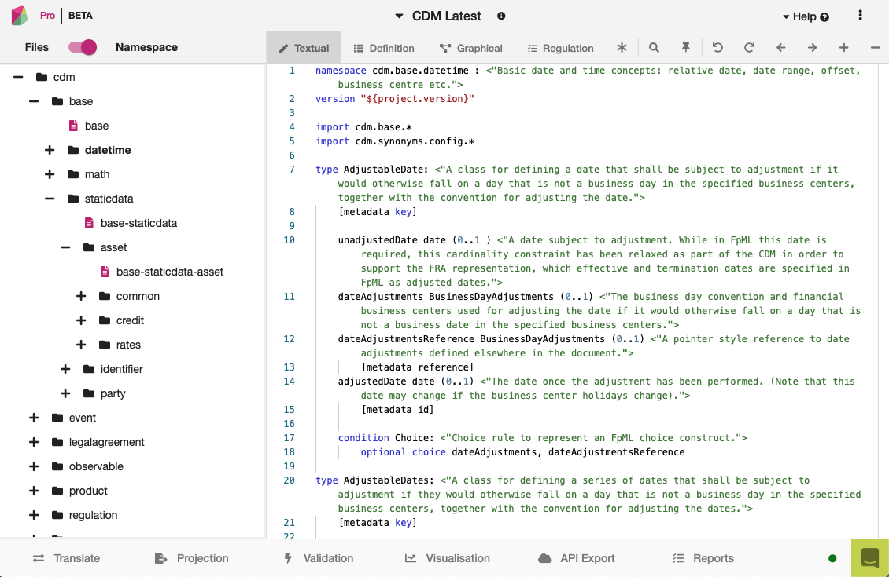

The Common Domain Model
=======================

**There are seven modelling dimensions** to the CDM:

* Product
* Event
* Legal Agreement
* Process
* Reference Data
* Mapping (Synonym)
* Namespace

The following sections define each of these dimensions. Selected examples of model definitions are used as illustrations to help explain each dimension and include, where applicable, data samples to help demonstrate the structure. All the Rosetta DSL modelling components that are used to express the CDM are described in the `Rosetta DSL Documentation`_

The complete model definition, including descriptions and other details can be viewed in the `Textual Browser <https://portal.cdm.rosetta-technology.io/#/text-browser>`_ on the ISDA CDM Portal.

Product Model
-------------

Where applicable, the CDM follows the data structure of the Financial Products Markup Language (FpML), which is widely used in the OTC Derivatives market.  For example, the CDM type ``PayerReceiver`` is equivalent to the FpML PayerReceiver.model. Both of these are data structures used frequently throughout each respective model. In other cases, the CDM data structure is more normalised, per requirements from the CDM Design Working Group.  For example, price and quantity are represented in a single type, ``TradableProduct``, which is shared by all products. Another example is the use of a composable product model whereby:

* **Economic terms are specified by composition**, For example, the ``InterestRatePayout`` type is a component used in the definition of any product with one or more interest rate legs (e.g. Interest Rate Swaps, Equity Swaps, and Credit Default Swaps).
* **Product qualification is inferred** from those economic terms rather than explicitly naming the product type, whereas FpML qualifies the product explcitly through the *product* substitution group.

Regardless of whether the data structure is the same or different from FpML, the CDM includes defined Synonyms that map to FpML (and other models) and can be used for transformation purposes. More details on Synonyms are provided in the Mapping (Synonym) section of this document.

TradableProduct
^^^^^^^^^^^^^^^

A tradable product represents a financial product that is ready to be traded, meaning that there is an agreed financial product, price, quantity, and other details necessary to complete an execution of a security or a negotiated contract between two counterparties. Tradable products are represented by the ``TradableProduct`` type.

.. code-block:: Haskell

 type TradableProduct:
    product Product (1..1)
    tradeLot TradeLot (1..*)
    counterparty Counterparty (2..2) 
    ancillaryParty AncillaryParty (0..*) 
    settlementInstructions SettlementInstructions (0..*)
    adjustment NotionalAdjustmentEnum (0..1) 

.. note:: The conditions for this data type are excluded from the snippet above for purposes of brevity.

The primary set of attributes represented in the ``TradableProduct`` data type are ones that are shared by all trades and transactions.  For example, every trade has a price, a quantity (treated jointly as a trade lot), and a pair of counterparties.  In some cases, there are ancillary parties, settlement terms, and an allowable adjustment to the notional quantity.  All of the other attributes required to describe a product are defined in distinct product data types.

TradeLot
""""""""

A trade lot represents the quantity and price at which a product is being traded.

In certain markets, trading the same product with the same economics (except for price and quantity) and the same counterparty may be treated as a separate trade. Each trade is represented by a tradable product containing only 1 trade lot. In other markets, trading the same product with the same characteristics (except for price and quantity) is represented as part of the same trade. In this case, a single tradable product contains multiple trade lots represented as an array of the ``TradeLot`` data type.

When a trade can have multiple trade lots, increases (or upsize) and decreases (or unwind) are treated differently. An increase adds a new ``TradeLot`` instance to the tradadable product, whereas a decrease reduces the quantity of one or more of the existing trade lots.

.. note:: The term *lot* is borrowed from the Equity terminology that refers to each trade lot as a *tax lot*, where the capital gains tax that may arise upon unwind is calculated based on the price at which the lot was entered.

For each trade lot, the quantity and price are represente by an attribute called ``priceQuantity``.

.. code-block:: Haskell

 type TradeLot:
   lotIdentifier Identifier (0..*)
   priceQuantity PriceQuantity (1..*)

The ``pricequantity`` attribute is represented as an array of the ``PriceQuantity`` data type. For composite financial products that are made of different legs, each leg may require its own price and quantity attributes, and each instance of a ``PriceQuantity`` data type identifies the relevant information for the leg of a trade. For example, for an Interest Rate Swap, a trade lot would have one instance of the ``PriceQuantity`` data type for each interest leg, and potentially a third one for an upfront fee.  By comparison, the purchase or sale of a security or listed derivative would typically have a single ``PriceQuantity`` instance in the trade lot.

PriceQuantity
"""""""""""""

The price and quantity attributes of a trade, or of a leg of a trade in the case of composite products, are part of a data type called ``PriceQuantity``. This data type also contains (optionally) an observable, which describes the asset or reference index to which the price and quantity are related, and a date, which indicates when these price and quantity become effective.

.. code-block:: Haskell

 type PriceQuantity: 
   [metadata key]
   price Price (0..*)
     [metadata location]
   quantity Quantity (0..*)
     [metadata location]
   observable Observable (0..1)
   effectiveDate AdjustableOrRelativeDate (0..1)
	
.. note:: The conditions for this data type are excluded from the snippet above for purposes of brevity.

The price, quantity and observable attributes are joined together in a single ``PriceQuantity`` data type because in some cases, those 3 attributes need to be considered together. For example, the return leg of an Equity Swap will have:

- the identifier for the shares as ``observable``
- the number of shares as ``quantity``
- the initial share price as ``price``

However, those attributes are optional because in other cases, only some of them will be specified. In the fixed leg of an Interest Rate Swap, there is no observable as the rate is already fixed. An option trade will contain an instance of a ``PriceQuantity`` containing only the premium as price attribute, but no quantity or observable (the quantity and/or observable for the option underlyer will be specified in a different ``PriceQuantity`` instance).

Both the price and quantity can be specified as arrays in a single ``PriceQuantity``. All elements in the array express the same values but according to different conventions. For example, the return leg of an Equity Swap may specify both the number of shares and the notional (a currency amount equal to: number of shares x price per share) as quantities. In a Forward FX trade, the spot rate, forward points and forward rate (equal to spot rate + forward points) may all be specified as prices. When mutiple values are specified for either the price or quantity attributes in a single ``PriceQuantity`` instance, they will be tied by rules that enforce that they are internally consistent.

The effective date attribute is optional and will usually be specified when a single trade has multiple trade lots, to indicate when each trade lot become effective (usually on or around the date when the lot was traded). The trade itself will have an effective date, corresponding to the date when the first lot was traded and the trade opened.

The ``price`` and ``quantity`` attributes in the ``PriceQuantity`` data type each have a metadata location which can reference a metadata address in one of the  ``Payout`` data types.  The metadata address-location pair allows for a reference to link objects without populating the address object in persistence.  This capability helps to support an agnostic definition of the product in a trade (i.e. a product definition without a price and quantity). However, the reference can be used to populate values for an input into a function or for other purposes.

MeasureBase
"""""""""""
The ``MeasureBase`` is a base data type that provides a common component that is useful in the definition of prices and quantities, as defined below:

.. code-block:: Haskell

 type MeasureBase: 
	amount number (1..1) 
	unitOfAmount UnitType (1..1)  
  
The ``MeasureBase`` data type consists of two mandatory attributes.  The first is ``amount``, which could be a price or a quantity, as defined by other attributes.  The second attribute is ``unitOfAmount``, which uses the ``UnitType`` data type. This data type requires the definition of units using one of five defined types:

.. code-block:: Haskell

 type UnitType: 
	capacityUnit CapacityUnitEnum (0..1) 
	weatherUnit WeatherUnitEnum (0..1) 
	financialUnit FinancialUnitEnum (0..1) 
	currency string (0..1) 
		[metadata scheme]
        frequency cdm.base.datetime.Frequency (0..1) 
	
	condition:one-of
  
The ``Price`` and ``Quantity`` data types are both extensions of the ``MeasureBase`` data type, as shown below:

Price
"""""
The ``Price`` data type extends the ``MeasureBase`` data type with the addition of the ``priceType`` and ``perUnitOfAmount`` attributes, which together further qualify the price. 

.. code-block:: Haskell

 type Price extends MeasureBase:  
	priceType PriceTypeEnum (1..1)
	perUnitOfAmount UnitType (1..1)

Note that the conditions for this data type are excluded from the snippet above for purposes of brevity.

Consider the example below for the initial price of the underlying equity in a single-name Equity Swap, which is a net price of 37.44 USD per Share:

.. code-block:: Javascript

 "price": [
            {
              "value": {
                "amount": 37.44,
                "unitOfAmount": {
                  "currency": {
                    "value": "USD"
                  }
                },
                "perUnitOfAmount": {
                  "financialUnit": "SHARE"
                },
                "priceType": "NET_PRICE"
              },
              "meta": {
                "location": [
                  {
                    "scope": "DOCUMENT",
                    "value": "price-1"
                  }
                ]
              }
            }
          ]
	  
The full form of this example can be seen in the CDM Portal Ingestion panel, products->equity->eqs-ex01-single-underlyer-execution-long-form-other-party.xml.  As can be seen in the full example, for an interest rate leg, the ``unitOfAmount`` and the ``perUnitOfAmount`` would both be a currency, (e.g. 0.002 USD per USD) and the priceType would be a Spread (in the case of a floating leg, as in this example) or an InterestRate (in the case of a fixed leg).

Quantity
""""""""
The ``Quantity`` data type extends the ``MeasureBase`` data type with the addition of the optonal attributes ``multiplier`` and ``multiplierUnit`` attributes.  

.. code-block:: Haskell

 type Quantity extends MeasureBase: 
	multiplier number (0..1) 
	multiplierUnit UnitType (0..1) 

	condition Quantity_multiplier: 
	    if multiplier exists
		then multiplier >= 0.0

The two inherited attributes of ``amount`` and ``unitOfAmount`` are sufficient to define quantity, in most cases.  The two attributes that are distinct for the ``Quantity`` data type   further qualify the ``amount``, with a multiplier, as needed for listed contracts or other purposes, as shown in the example below:

.. code-block:: Javascript

 "quantity": [
            {
              "value": {
                "amount": 200,
                "unitOfAmount": {
                  "financialUnit": "CONTRACT"
                },
		"multiplier": 1000,
		"multiplierUnit": "BBL"
              },
              "meta": {
                "location": [
                  {
                    "scope": "DOCUMENT",
                    "value": "quantity-1"
                  }
                ]
              }
            }
           ]
	   
In this case, the trade involves the purchase or sale of 200 contracts of the WTI Crude Oil futures contract on the CME.  Each contract represents 1,000 barrels, therefore the total quantity of the trade is for 200,000 barrels.

Observable
""""""""""
The ``Observable`` data type specifies the reference object to be observed for a price, which could be an underlying asset or a reference such as an index.

he Observable data type requires the specification of either a ``rateOption`` (i.e. a floating rate index), ``commodity``, ``productIdentifier``, or ``currencypair``. This choice constraint is supported by specifying a one-of condition, as shown below:

.. code-block:: Haskell

 type Observable: 
	[metadata key]
	rateOption FloatingRateOption (0..1)
        [metadata location]
	commodity Commodity (0..1)
        [metadata location]
	productIdentifier ProductIdentifier (0..*)
        [metadata location]
	currencyPair QuotedCurrencyPair (0..1) 
        [metadata location]

	condition: one-of 

Financial Product
"""""""""""""""""

A financial product is an instrument that is used to transfer financial risk between two parties. Financial products are represented in the ``Product`` type, which is also constrained by a ``one-of`` condition, meaning that for a single Tradable Product, there can only be one Product.

.. code-block:: Haskell

 type Product:
   [metadata key]
   contractualProduct ContractualProduct (0..1)
   index Index (0..1)
   loan Loan (0..1)
   foreignExchange ForeignExchange (0..1)
   commodity Commodity (0..1)
     [metadata address "pointsTo"=Observable->commodity]
   security Security (0..1)
   
   condition: one-of

The CDM allows any one of these products to included in a trade or used as an underlier for another product (see the *Underlier* section). One unlikely case for a direct trade is Index, which is primarily used as an underlier.

Among this set of products, the contractual product is the most complicated and requires the largest data structure. In a contractual product, an exchange of financial risk is materialised by a unique bilateral contract that specifies the financial obligations of each party. The terms of the contract are specified at trade inception and apply throughout the life of the contract (which can last for decades for certain long-dated products), unless amended by mutual agreement. Contractual products are fungible (in other words, replaceable by other identical or similar contracts) only under specific terms: e.g. the existence of a close-out netting agreement between the parties.

Given that each contractual product transaction is unique, all of the contract terms must be specified and stored in an easily accessible transaction lifecycle model so that each party can evaluate the financial and counterparty risks during the life of the agreement.

Foreign Exchange (FX) spot and forward trades (including Non-Deliverable Forwards) and private loans also represent an exchange of financial risk represented by a form of bilateral agreements. FX forwards and private loans can have an extended term, and are generally not fungible. However, these products share few other commonalities with contractual products such as Interest Rate Swaps. Therefore, they are defined separately.

By contrast, in the case of the execution of a security (e.g. a listed equity), the exchange of finanical risk is a one-time event that takes place on the settlement date, which is usually within a few business days of the agreement. The other significant distinction is that securities are fungible instruments for which the terms and security identifiers are publically available.  Therefore, the terms of the security do not have to be stored in a transaction lifecycle model, but can be referenced with public identifiers.

An Index product is an exception because it's not directly tradable, but is included here because it can be referenced as an underlier for a tradable product and can be identified by a public identifier.

Settlement Instructions
"""""""""""""""""""""""

The ``settlementInstructions`` attribute defines how the transaction should be settled (including the settlement date). For instance, a settlement could be a *delivery-versus-payment* scenario for a cash security transaction or a *payment-versus-payment* scenario for an FX spot or forward transaction. The actual settlement amount(s) will need to use the *price* and *quantity* agreed as part of the tradable product.

.. code-block:: Haskell

 type SettlementInstructions extends PayoutBase:

.. code-block:: Haskell

 type PayoutBase:
   payerReceiver PayerReceiver (1..1)
   payoutQuantity ResolvablePayoutQuantity (1..1)
   settlementTerms SettlementTerms (1..1)

.. code-block:: Haskell

 type SettlementTerms extends SettlementBase:
   cashSettlementTerms CashSettlementTerms (0..*)
   physicalSettlementTerms PhysicalSettlementTerms (0..1)

Contractual Product
^^^^^^^^^^^^^^^^^^^
The scope of contractual products in the current model are summarized below:

* **Interest rate derivatives**:

  * Interest Rate Swaps (incl. cross-currency swaps, non-deliverable swaps, basis swaps, swaps with  non-regular periods, ...)
  * Swaptions
  * Caps/floors
  * FRAs
  * OTC Options on Bonds

* **Credit derivatives**:

  * Credit Default Swaps (incl. baskets, tranche, swaps with mortgage and loans underlyers, ...)
  * Options on Credit Default Swaps

* **Equity derivatives**:

  * Equity Swaps (single name)

* **Options**:

  * Any other OTC Options (incl. FX Options)
  
* **Securities Lending**:

  * Single underlyer, cash collateralised, open/term security loan 

In the CDM, contractual products are represented by the ``ContractualProduct`` type:

.. code-block:: Haskell

 type ContractualProduct:
    [metadata key]
    [metadata template]
    productIdentification ProductIdentification (0..1)
    productTaxonomy ProductTaxonomy (0..*)
    economicTerms EconomicTerms (1..1)

Note that price and quantity are defined in ``TradableProduct`` as these are attributes common to all products.  The remaining economic terms of the contractual product are defined in ``EconomicTerms`` which is an encapsulated type in ``ContractualProduct`` .

Economic Terms
""""""""""""""

The CDM specifies the various sets of possible remaining economic terms using the ``EconomicTerms`` type.  This type includes contractual provisions that are not specific to the type of payout, but do impact the value of the contract, such as effective date, termination date, date adjustments, and early termination provisions.  A valid population of this type is constrained by a set of conditions which are not shown here in the interests of brevity.

.. code-block:: Haskell

 type EconomicTerms:
   effectiveDate AdjustableOrRelativeDate (0..1)
   terminationDate AdjustableOrRelativeDate (0..1)
   dateAdjustments BusinessDayAdjustments (0..1)
   payout Payout (1..1)
   earlyTerminationProvision EarlyTerminationProvision (0..1)
   optionProvision OptionProvision (0..1)
   extraordinaryEvents ExtraordinaryEvents (0..1)

Payout
""""""

The ``Payout`` type defines the composable payout types, each of which describes a set of terms and conditions for the financial responsibilities between the contractual parties. Payout types can be combined to compose a product.  For example, an Equity Swap can be composed by combining an ``InterestRatePayout`` and an ``EquityPayout``.

.. code-block:: Haskell

 type Payout:
   [metadata key]
   interestRatePayout InterestRatePayout (0..*)
   creditDefaultPayout CreditDefaultPayout (0..1)
   equityPayout EquityPayout (0..*)
   optionPayout OptionPayout (0..*)
   commodityPayout CommodityPayout (0..*)
   forwardPayout ForwardPayout (0..*)
   fixedForwardPayout FixedForwardPayout (0..*)
   securityPayout SecurityPayout (0..*)
   securityFinancePayout SecurityFinancePayout (0..*)
   cashflow Cashflow (0..*)
   
The ``InterestRatePayout``, ``EquityPayout``, ``OptionPayout``, ``SecurityFinancePayout``, ``Cashflow``, and the ``ProtectionTerms`` data type encapsulated in ``CreditDefaultPayout`` are all extensions of the base type called ``PayoutBase``, which provides a common location for referencing payout quantities, as illustrated below:

.. code-block:: Haskell

 type PayoutBase: 
	payerReceiver PayerReceiver (1..1)
    payoutQuantity ResolvablePayoutQuantity (1..1)
    settlementTerms SettlementTerms (1..1)

.. code-block:: Haskell

 type ResolvablePayoutQuantity: 
	[metadata key]
	resolvedQuantity Quantity (0..1) 
		[metadata address "pointsTo"=PriceQuantity->quantity]
	quantitySchedule NonNegativeQuantitySchedule (0..1) 
	quantityReference ResolvablePayoutQuantity (0..1) 
		[metadata reference]
	quantityMultiplier QuantityMultiplier (0..1) 
	reset boolean (0..1) 
	futureValueNotional FutureValueAmount (0..1) 

Note that the code snippet above excludes the conditions in this data type for purposes of brevity.

Note that the ``resolvedQuantity`` attribute has a metadata address that points to the quantity attribute in the ``PriceQuantity`` data type.  This metadata address allows for referencing a value without requiring the population of the value in the persistent object.  The other attributes in this data type support the definition of additional information such as a schedule, a reference, or the indication that the quantity is resettable.  One of the data types that extends ``PayoutBase`` is ``InterestRatePayout``, as shown below:

.. code-block:: Haskell

 type InterestRatePayout extends PayoutBase:
	[metadata key]
	rateSpecification RateSpecification (1..1)
	dayCountFraction DayCountFractionEnum (0..1) 
		[metadata scheme]
	calculationPeriodDates CalculationPeriodDates (0..1) 
	paymentDates PaymentDates (0..1) 
	paymentDate AdjustableDate (0..1) 
	paymentDelay boolean (0..1) 
	resetDates ResetDates (0..1) 
	discountingMethod DiscountingMethod (0..1) 
	compoundingMethod CompoundingMethodEnum (0..1) 
	cashflowRepresentation CashflowRepresentation (0..1) 
	principalExchanges PrincipalExchanges (0..1)
	stubPeriod StubPeriod (0..1)
	bondReference BondReference (0..1) 
	fixedAmount calculation (0..1) 
	floatingAmount calculation (0..1) 
	
Note that the code snippet above excludes the conditions in this data type for purposes of brevity.

There are other addresses in the model that use the metadata address to point to ``Price`` in ``PriceQuantity``.  Examples include the ``initialValue`` attribute in the ``RateSchedule`` data type and the ``strikePrice`` attribute in the ``OptionStrike`` data type, which are illustrated below:

.. code-block:: Haskell

 type RateSchedule:
	initialValue Price (0..1) 
		[metadata address "pointsTo"=PriceQuantity->price]
	step Step (0..*) 

.. code-block:: Haskell

 type OptionStrike:
	strikePrice Price (0..1) 
	strikeReference FixedRateSpecification (0..1)
		[metadata reference]
	referenceSwapCurve ReferenceSwapCurve (0..1) 
	averagingStrikeFeature AveragingObservation (0..1) 			
	condition: one-of

Reusable Components
"""""""""""""""""""

There are a number of components that are reusable across several payout types.  For example,  the ``CalculationPeriodDates`` class describes the inputs for the underlying schedule of a stream of payments.

.. code-block:: Haskell

 type CalculationPeriodDates:
   [metadata key]
   effectiveDate AdjustableOrRelativeDate (0..1)
   terminationDate AdjustableOrRelativeDate (0..1)
   calculationPeriodDatesAdjustments BusinessDayAdjustments (0..1)
   firstPeriodStartDate AdjustableOrRelativeDate (0..1)
   firstRegularPeriodStartDate date (0..1)
   firstCompoundingPeriodEndDate date (0..1)
   lastRegularPeriodEndDate date (0..1)
   stubPeriodType StubPeriodTypeEnum (0..1)
   calculationPeriodFrequency CalculationPeriodFrequency (0..1)

Underlier
"""""""""

The underlier attribute on types ``OptionPayout``, ``ForwardPayout`` and ``EquityPayout`` allows for any product to be used as the underlier for a corresponding products option, forward, and equity swap.

.. code-block:: Haskell

 type OptionPayout extends PayoutBase:
   [metadata key]
   buyerSeller BuyerSeller (1..1)
   optionType OptionTypeEnum (0..1)
   feature OptionFeature (0..1)
   exerciseTerms OptionExercise (1..1)
   underlier Product (1..1)

This nesting of the product component is another example of a composable product model. One use case is an interest rate swaption for which the high-level product uses the ``OptionPayout`` type and underlier is an Interest Rate Swap composed of two ``InterestRatePayout`` types. Similiarly, the product underlying an Equity Swap composed of an ``InterestRatePayout`` and an ``EquityPayout`` would be a non-contractual product: an equity security.

Data Templates
""""""""""""""

The ``ContractualProduct`` type is specified with the ``[metadata template]`` annotation indicating that it is eligible to be used as a template.

Financial markets often trade a high volume of trades with near identical contractual product data. Templates provide a way to store this data more efficiently. The contractual product data which is duplicated on each contract can be extracted into a single template and replaced by a reference. This allows each trade to specify only the unique contractual product data. The template reference can be resolved to a template object which can then be merged in to form a single, complete object.

For instance, Equity Swaps used by Equity Financing desks sometimes refer to a *Master Confirmation* agreement, which is an overall agreement that specifies all the standard Equity Swap terms that do not need to be renegotiated on each trade. Each contractual product would only specify the unique product details (such as start and end date, underlier, price and spread) together with a reference to the Master Confirmation containing the template product details.

Code libraries, written in Java and distributed with the CDM, contain tools to merge CDM objects together.  Implementors may extend these merging tools to change the merging strategy to suit their requirements.  The CDM Java Examples download, available via the `CDM Portal Downloads page <https://portal.cdm.rosetta-technology.io/#/downloads>`_, contains a example demonstrating usage of a data template and the merging tools. See ``com.regnosys.cdm.example.template.TemplateExample``.

Products with Identifiers
^^^^^^^^^^^^^^^^^^^^^^^^^
The abstract data type ProductBase serves as a base for all products that have an identifier, as illustrated below:

.. code-block:: Haskell

 type ProductBase:
   productIdentifier ProductIdentifier (1..*)

The data types that extend from ProductBase are Index, Commodity, Loan, and Security.  Index and Commodity do not have any additional attributes.  In the case of Commodity, the applicable product identifiers are the ISDA definitions for reference benchmarks.  Loan and Security both have a set of additional attributes, as shown below:

.. code-block:: Haskell

 type Loan extends ProductBase:
   borrower LegalEntity (0..*)
   lien string (0..1)
     [metadata scheme]
   facilityType string (0..1)
     [metadata scheme]
   creditAgreementDate date (0..1)
   tranche string (0..1)
     [metadata scheme]

.. code-block:: Haskell

 type Security extends ProductBase:
   securityType SecurityTypeEnum (1..1)
   debtType DebtType (0..1)
   equityType EquityTypeEnum (0..1)
   fundType FundProductTypeEnum (0..1)

 condition DebtSubType:
   if securityType <> SecurityTypeEnum -> Debt
   then debtType is absent

 condition EquitySubType:
   if securityType <> SecurityTypeEnum -> Equity
   then equityType is absent

 condition FundSubType:
   if securityType <> SecurityTypeEnum -> Fund
   then fundType is absent

The product identifier will uniquely identify the security.  The ``securityType`` is required for specific purposes in the model, for example for validation as a valid reference obligation for a Credit Default Swap.  The additional security details are optional as these could be determined from a reference database using the product identifier as a key

Product Qualification
^^^^^^^^^^^^^^^^^^^^^

**Product qualification is inferred from the economic terms of the product** instead of explicitly naming the product type.  The CDM uses a set of Product Qualification functions to achieve this purpose. These functions can be identified as those annotated with ``[qualification Product]``.

A Product Qualification function applies a taxonomy-specific business logic to identify if the product attribute values, as represented by the product's economic terms, match the specified criteria for the product named in that taxonomy. For example, if a certain set of attributes are populated and others are absent, then that specific product type is inferred. The Product Qualification function name in the CDM begins with the word ``Qualify`` followed by an underscore ``_`` and then the product type from the applicable taxonomy  (also separated by underscores).

The CDM implements the ISDA Product Taxonomy v2.0 to qualify contractual products, foreign exchange, and repurchase agreements. Given the prevalence of usage of the ISDA Product Taxonomy v1.0, the equivalent name from that taxonomy is also systematically indicated in the CDM, using a ``synonym`` annotation displayed under the function output. An example is provided below for the qualification of a Zero-Coupon Fixed-Float Inflation Swap:

.. code-block:: Haskell

 func Qualify_InterestRate_InflationSwap_FixedFloat_ZeroCoupon:
 	[qualification Product]
 	inputs: economicTerms EconomicTerms (1..1)
 	output: is_product boolean (1..1)
 	assign-output is_product:
        (economicTerms -> payout -> interestRatePayout only exists
			or (economicTerms -> payout -> interestRatePayout,  economicTerms -> payout -> cashflow) only exists)
        and economicTerms -> payout -> interestRatePayout count = 2
        and economicTerms -> payout -> interestRatePayout -> rateSpecification -> fixedRate count = 1
        and economicTerms -> payout -> interestRatePayout -> rateSpecification -> inflationRate count = 1
        and economicTerms -> payout -> interestRatePayout -> paymentDates -> paymentFrequency -> periodMultiplier all = 1
        and economicTerms -> payout -> interestRatePayout -> paymentDates -> paymentFrequency -> period all = PeriodExtendedEnum -> T

If all the statements above are true, then the function evaluates to True, and the product is determined to be qualified as the product type referenced by the function name.

.. note:: In a typical CDM model implementation, the full set of Product Qualification functions would be invoked against each instance of the product in order to determine the inferred product type. Given the product model composability, a single product instance may be qualified as more than one type: for example in an Interest Rate Swaption, both the Option and the underlying Interest Rate Swap would be qualified.

The CDM supports Product Qualification functions for Credit Derivatives, Interest Rate Derivatives, Equity Derivatives, Foreign Exchange, and Repurchase Agreements. The full scope for Interest Rate Products has been represented down to the full level of detail in the taxonomy. This is shown in the example above, where the ``ZeroCoupon`` qualifying suffix is part of the function name. Credit Default products are qualified, but not down to the full level of detail. The ISDA Product Taxonomy v2.0 references the FpML *transaction type* field instead of just the product features, whose possible values are not publicly available and hence not positioned as a CDM enumeration.

The output of the qualification function is used to populate the ``productQualifier`` attribute of the ``ProductIdentification`` object, which is created when a ``ContractualProduct`` object is created. The product identification includes both the product qualification generated by the CDM and any additional product identification information which may come from the originating document, such as FpML. In this case, taxonomy schemes may be associated to such product identification information, which are also propagated in the ``ProductIdentification`` object.

The ``productIdentification`` data structure and an instance of a CDM object (`serialised`_ into JSON) are shown below:

.. code-block:: Haskell

 type ProductIdentification:
 	productQualifier productType (0..1)
 	primaryAssetData AssetClassEnum (0..1)
 		[metadata scheme]
 	secondaryAssetData AssetClassEnum (0..*)
 		[metadata scheme]
 	externalProductType ExternalProductType (0..*)
 	productIdentifier ProductIdentifier (0..*)

.. code-block:: Javascript

 "productIdentification" : {
   "externalProductType" : [ {
     "externalProductTypeSource" : "FP_ML_PRODUCT_TYPE",
     "externalproductType" : {
       "value" : "InterestRate:IRSwap:FixedFloat",
       "meta" : {
         "scheme" : "http://www.fpml.org/coding-scheme/product-taxonomy"
       }
     }
   } ],
   "primaryAssetData" : {
     "value" : "INTEREST_RATE",
     "meta" : {
       "scheme" : "http://www.fpml.org/coding-scheme/asset-class-simple"
     }
   },
   "productIdentifier" : [ {
     "identifier" : {
       "value" : "InterestRate:IRSwap:FixedFloat",
       "meta" : {
         "scheme" : "http://www.fpml.org/coding-scheme/product-taxonomy"
       }
     },
     "meta" : {
       "globalKey" : "98513226"
     },
     "source" : "OTHER"
   } ],
   "productQualifier" : "InterestRate_IRSwap_FixedFloat_PlainVanilla",
   "externalProductType" : [ {
     "value" : "InterestRate:IRSwap:FixedFloat",
     "externalProductTypeSource" : "FpMLProductType"

   } ]
 }

.. note:: ``productQualifier`` is a *meta-type* that indicates that its value is meant to be populated via a function. This mechanism is explained in the `Qualified Type Section`_ of the Rosetta DSL documentation. For a further understanding of the underlying qualification logic in the Product Qualification, see the explanation of the *object qualification* feature of the Rosetta DSL, as described in the `Function Definition Section`_.

Event Model
-----------

**The CDM event model provides data structures to represent the trade lifecycle events of financial transactions**. A trade moves from one state to another as the result of *state transition* events initiated by one or both trading parties, by external factors or by contractual terms such as maturity. For example, the execution of the trade is the initial event which results in the state of an executed trade. Subsequently, one party might initiate an allocation, both parties might initiate an amendment to a contractual agreement, or a default by an underlying entity on a Credit Default Swap would trigger a settlement according to defined protection terms.

Examples of lifecycle events supported by the CDM Event Model include the following:

* Trade execution and confirmation
* Clearing
* Allocation
* Settlement (including any future contingent cashflow payment)
* Exercise of options

The representation of state transitions in the CDM event model is based on the following design principles:

* **A lifecycle event describes a change in the state of a trade**, i.e. there must be different before/after trade states based on that lifecycle event.
* **The product definition that underlies the transaction remains immutable**, unless agreed (negotiated) between the parties to that transaction as part of a specific trade lifecycle event. Automated events, for instance resets or cashflow payments, should not alter the product definition.
* **The history of the trade state can be reconstructed at any point in the trade lifecycle**, i.e. the CDM implements a *lineage* between states as the trade goes through state transitions.
* **The state is trade-specific**, not product-specific (i.e. it is not an asset-servicing model). The same product may be associated to infinitely many trades, each with its own specific state, between any two parties.

The data structures in the event model are organised into four main sub-structures to represent state transitions, as described below.

.. figure:: event-model-overview.png

* **Trade state** represents the state in the lifecycle that the trade is in, from execution to settlement and maturity.
* **Primitive event** is a building block component used to specify business events in the CDM. Each primitive event describes a fundamental state-transition component that impacts the trade state during its lifecycle.
* **Business (i.e. trade lifecycle) event** represents a lifecycle event, which may consist of one or more primitive events.
* **Workflow** represents a set of actions or steps that are required to trigger a business event.

Each of these sub-structures are described in the subsequent sections.

Trade State
^^^^^^^^^^^

The trade state is defined in CDM by the ``TradeState`` data type and represents the state of a trade at each stage in its lifecycle. With each trade creation or modification event, a new ``TradeState`` instance is created. Chaining together the sequence of ``TradeState`` instances then recreates the path each trade took within its lifecycle.

``TradeState`` is a foundational data type within the CDM Event Model as it represents the input and output of Primitive Events. Therefore, all trade related information that can change throughout the trade lifecycle are representing within ``TradeState``.

.. code-block:: Haskell

 type TradeState:
   [metadata key]
   [rootType]
   trade Trade (1..1)
   state State (0..1)
   resetHistory Reset (0..*)
   transferHistory Transfer (0..*)

While many different types of events may occur through the trade lifecycle, the ``trade``, ``state``, ``resetHistory`` and ``transferHistory`` attributes are deemed sufficient to describe all of the possible (post-trade) states which may result from lifecycle events. The ``Trade`` data type contains the tradable product, which defines all of the economic terms of the transaction as agreed between the parties.

.. note:: A tradable product is represented by the ``TradableProduct`` data type, which is further detailed in the `Tradable Product Section`_ of the documentation.

The ``Trade``, ``State``, ``Reset``, and ``Transfer`` data types that are utilised within ``TradeState``, are detailed in the sections below.

Trade
"""""

The ``Trade`` data type defines the outcome of a financial transaction between parties, where the terms are primarily reflected in the tradable product. Additionally, ``Trade`` includes attributes such as the trade date, transacting parties, and settlement terms. Some attributes, such as the parties, may already be defined in a workflow step or business event and can simply be referenced in ``Trade``.

.. code-block:: Haskell

 type Trade:
   [metadata key]
   tradeIdentifier Identifier (1..*)
   tradeDate date (1..1)
     [metadata id]
   tradableProduct TradableProduct (1..1)
   party Party (0..*)
   partyRole PartyRole (0..*)
   executionDetails ExecutionDetails (0..1)
   contractDetails ContractDetails (0..1)
   clearedDate date (0..1)
     [deprecated]
   collateral Collateral (0..1)
   account Account (0..*)
     [deprecated]

.. note:: Attributes within ``Trade`` and ``ContractDetails`` incorporates elements from FpML's *trade confirmation* view, whereas the ``TradableProduct`` data type corresponds to FpML's *pre-trade* view.

Additionally, ``Trade`` supports representation of specific execution or contractual details via the ``executionDetails`` and ``contractDetails`` attributes.

ExecutionDetails and ContractDetails
""""""""""""""""""""""""""""""""""""

The ``ExecutionDetails`` data type represents details applicable to trade executions and includes attributes that describe the execution venue and execution type. Not all trades will have been 'executed', such as those created from a Swaption Exercise event. In those cases, the ``executionDetails`` attributes on ``Trade`` is expected to be empty.

``ContractDetails`` are only applicable to trades on contractual products and are typically provided at or prior to trade confirmation.

.. code-block:: Haskell

 type ContractDetails:
   [metadata key]
   documentation RelatedAgreement (0..*)
   governingLaw GoverningLawEnum (0..1)
     [metadata scheme]
   partyContractInformation PartyContractInformation (0..*)

State
"""""

The ``State`` data type defines the state of a trade at a point in the Trade's life cycle. Trades have many state dimensions, all of which are represented here. For example, states useful for position keeping are represented alongside those needed for regulatory reporting.

.. code-block:: Haskell

 type State:
   closedState ClosedState (0..1)
   positionState PositionStatusEnum (0..1)

*ClosedState*.

In the case when a trade is closed, it is necessary to record that closure as part of the trade state.

For instance in a full novation scenario, the initial state is a single ``TradeState`` and the resulting state is two ``TradeState``. The first resulting ``TradeState`` represents a new contract, which is the same as the original but where one of the parties has been changed, and the second resulting ``TradeState`` is the original contract, now marked as *closed*.

The ``ClosedState`` data type (enclosed within ``State``) captures this closed state and defines the reason for closure.

.. code-block:: Haskell

 enum ClosedStateEnum:
   Allocated
   Cancelled
   Exercised
   Expired
   Matured
   Novated
   Terminated

Primitive Event
^^^^^^^^^^^^^^^

**Primitive events are the building block components used to specify business events in the CDM**. They describe the fundamental state-transition components that impact the trade state during its lifecycle. The trade state always transitions from and to a ``TradeState`` data type.

The primitive events include ``before`` and ``after`` attributes, which can define the evolution of the trade state by taking the differences between ``before`` and ``after`` trade states.

The ``before`` attribute is included as a reference using the ``[metadata reference]`` annotation, because by definition the primitive event points to a trade state that *already* existed. By contrast, the ``after`` trade state provides a full definition of that object, because that trade state is occurring for the first time and it is the occurrence of the primitive event that triggered a transition to that new trade state. By tying each trade state in the lifecycle to a previous trade state, primitive events are one of the mechanisms by which *lineage* is implemented in the CDM.

A ``PrimitiveEvent`` can only include one of the primitive components, which is captured by the ``one-of`` condition. The list of primitive events can be seen in the ``PrimitiveEvent`` type definition:

.. code-block:: Haskell

 type PrimitiveEvent:
   execution ExecutionPrimitive (0..1)
   contractFormation ContractFormationPrimitive (0..1)
   split SplitPrimitive (0..1)
   quantityChange QuantityChangePrimitive (0..1)
   reset ResetPrimitive (0..1)
   termsChange TermsChangePrimitive (0..1)
   transfer TransferPrimitive (0..1)

   condition PrimitiveEvent: one-of

Examples of how primitive components can be used are illustrated below.

Example 1: Execution and Contract Formation
"""""""""""""""""""""""""""""""""""""""""""

Within the scope of the CDM, the first step in instantiating a transaction between two parties is an *execution* or a *contract formation*, which is an execution that has been confirmed between the executing parties. In some cases, there is a time delay between execution and confirmation, therefore the execution can be recorded as the first instantiation. In some other cases, the confirmation is nearly simultaneous with the execution, thus there is no need for an intermediate step.

The transition to an executed state prior to confirmation is represented by the ``ExecutionPrimitive``.

.. code-block:: Haskell

 type ExecutionPrimitive:
   before TradeState (0..0)
     [metadata reference]
   after TradeState (1..1)

The execution primitive does not allow any before state (as marked by the 0 cardinality of the ``before`` attribute) because the current CDM event model only covers post-trade lifecycle events. In practice, this execution state represents the conclusion of a pre-trade process, which may be a client order that gets filled or a quote that gets accepted by the client.

Following that execution, the trade is confirmed and a legally binding contract is signed between the two executing parties. In an allocation scenario, the trade would first get split into sub-accounts as designated by one of the executing parties, before a set of legally binding contracts is signed with each of those sub-accounts.

The ``ContractFormationPrimitive`` represents that transition to the trade state after the trade is confirmed, which results in a ``TradeState`` containing a Trade object that can optionally reference legal documentation.

.. code-block:: Haskell

 type ContractFormationPrimitive:
   before TradeState (0..1)
     [metadata reference]
   after TradeState (1..1)

The before state in the contract formation primitive is optional (as marked by the 0 cardinality lower bound of the ``before`` attribute), to represent cases where a new contract may be instantiated between parties without any prior execution, for instance in a clearing or novation scenario.

Example 2: Reset
""""""""""""""""

In many cases, a trade relies on observable values which will become known in the future: for instance, a floating rate observation at the beginning of each period in the case of a Interest Rate Swap, or the equity price at the end of each period in an Equity Swap. That primitive event is known as a *reset*.

When a observable value becomes known (as provided by the relevant market data provider), independently from any specific transaction, this information is captured by the ``Observation`` data type.

.. code-block:: Haskell

 type Observation:
   [rootType]
   [metadata key]
   observedValue Price (1..1)
   observationIdentifier ObservationIdentifier (1..1)

From that ``Observation``, a ``Reset`` can be built and included in ``TradeState`` without changing the ``Trade``. A reset is represented by the ``ResetPrimitive`` data type.

.. code-block:: Haskell

 type ResetPrimitive:
   before TradeState (1..1)
     [metadata reference]
   after TradeState (1..1)
   condition Trade:
     before -> trade = after -> trade

The *reset* process creates instances of the ``Reset`` data type, which are added to ``resetHistory`` of a given ``TradeState``.

.. code-block:: Haskell

 type Reset:
   resetValue Price (1..1)
   resetDate date (1..1)
   rateRecordDate date (0..1)
   observations Observation (1..*)
     [metadata reference]
   aggregationMethodology AggregationMethod (0..1)

The ``resetValue`` attribute represents the ultimate value of the reset as a number and is the number used to compute corresponding cash flows. If multiple ``observations`` were used to derive the ``resetValue``,  ``aggregationMethod`` should be used to describe how the many observations where aggregated into the single value.

Example 3: Transfer
"""""""""""""""""""

A ``TransferPrimitive`` is a multi-purpose primitive that can represent the transfer of any asset, including cash, from one party to another.

.. code-block:: Haskell

 type TransferPrimitive:
   [metadata key]
   before TradeState (1..1)
     [metadata reference]
   after TradeState (1..1)

The *transfer* process creates instances of the ``Transfer`` data type, which are added to ``transferHistory`` of a given ``TradeState``.

.. code-block:: Haskell

 type Transfer:
   identifier Identifier (0..*)
     [metadata scheme]
   quantity Quantity (1..1)
   observable Observable (0..1)
   payerReceiver PartyReferencePayerReceiver (1..1)
   settlementDate AdjustableOrAdjustedOrRelativeDate (1..1)
   settlementOrigin SettlementOrigin (0..1)

By design, the CDM treats the reset and the transfer primitive events separately because there is no one-to-one relationship between reset and transfer.

* Many transfer events are not tied to any reset: for instance, the currency settlement from an FX spot or forward transaction.
* Conversely, not all reset events generate a cashflow: for instance, the single, final settlement that is based on all the past floating rate resets in the case of a compounding floating zero-coupon swap.

Business Event
^^^^^^^^^^^^^^

A Business Event represents a transaction lifecycle event and is built according to the following design principle in the CDM:

* **Business events are specified by composition of primitive events**, which describe the fundamental state-transition components that may impact the trade state during its lifecycle.
* **Business event qualification is inferred from those primitive event components** and, in some relevant cases, from an *intent* qualifier associated with the business event. The inferred value is populated in the ``eventQualifier`` attribute.

.. code-block:: Haskell

 type BusinessEvent:
   [metadata key]
   [rootType]
   primitives PrimitiveEvent (1..*)
   intent IntentEnum (0..1)
   functionCall string (0..1)
   eventQualifier eventType (0..1)
   eventDate date (1..1)
   effectiveDate date (0..1)
   eventEffect EventEffect (0..1)
   workflowEventState WorkflowStepState (0..1)
   [deprecated]

As can be observed in the definition above, the only mandatory attributes of a business event are the ones listed below:

* The ``primitives`` attribute, which contains the list of one or more primitive events composing that business event, each representing one and only one fundamental state-transition.
* The event date. The time dimension has been purposely ommitted from the event's attributes. That is because, while a business event has a unique date, several time stamps may potentially be associated to that event depending on when it was submitted, accepted, rejected etc, all of which are *workflow* considerations.

An example composition of the primitive events to represent a complete lifecycle event is the *partial novation* of a contract, which comprises the following:

* a ``ContractFormation`` primitive that represents the contract between the remaining party and the step in novation party. The ``tradeDate`` in the ``ContractFormation`` primitive should reflect the date of that the novation event was agreed.
* a ``QuantityChange`` primitive which includes a before attribute that defines the terms of the trade between the original parties before the novation and an after attribute the defines the terms of the trade between the original parties after the novation, in which the quantity should be less than the quantity in the before state and greater than 0 (0 would represent the case of a *full novation*).

A business event is *atomic* in the sense that its underlying primitive event constituents cannot happen independently: they either all happen together or they do not happen. In the above partial novation example, the existing trade between the parties must be downsized at the same time as the new trade is instantiated.

Selected attributes of a business event are further explained below:

Intent
""""""

The Intent attribute is an enumeration value that represents the intent of a particular business event, e.g. ``Allocation``, ``EarlyTermination``, ``PartialTermination`` etc. It is used in cases where the primitive events are not sufficient to uniquely inferr a lifecycle event. As an example, a reduction in a trade quantity/notional could apply to a correction event or a partial termination.

Event Effect
""""""""""""

The event effect attribute corresponds to the set of operational and positional effects associated with a lifecycle event. This information is generated by a post-processor associated to the CDM. Certain events such as observations do not have any event effect, hence the optional cardinality.

The ``eventEffect`` contains a set of pointers to the relevant objects that are affected by the event and annotated with ``[metadata reference]``. The candidate objects are types that are marked as referenceable via an associated ``[metadata key]`` annotation.

.. note:: The use of the key/reference mechanism is further described in the `Meta-Data Section`_ of the Rosetta DSL documentation.

.. code-block:: Haskell

 type EventEffect:
   effectedTrade TradeState (0..*)
     [metadata reference]
   trade TradeState (0..*)
     [metadata reference]
   productIdentifier ProductIdentifier (0..*)
     [metadata reference]
   transfer TransferPrimitive (0..*)
     [metadata reference]

The JSON snippet below for a quantity change event on a trade illustrates the use of multiple metadata reference values in ``eventEffect``.

.. code-block:: Javascript

  "effectiveDate": "2018-03-15",
  "eventDate": "2018-03-14",
  "eventEffect": {
    "trade": [
      {
        "globalReference": "600e4873"
      }
    ],
    "effectedTrade": [
      {
        "globalReference": "d36e1d72"
      }
    ]
  },
  (...)
  "primitive": {
    "quantityChange": [
      {
        "after": {
          (...)
          "meta": {
            "globalKey": "600e4873"
          }
          "trade": {
            (...)
            "tradeDate": {
              "date": "2002-12-04",
              "meta": {
                "globalKey": "793cd7c"
              }
            }
          }
        },
        "before": {
          (...)
          "meta": {
            "globalKey": "d36e1d72"
          },
          "trade": {
            (...)
            "tradeDate": {
              "date": "2002-12-04",
              "meta": {
                "globalKey": "793cd7c"
              }
            }
          }
        }
      }
    ]
  }

* For the ``effectedTrade``: ``d36e1d72`` points to the original trade in the ``before`` state of the ``quantityChange`` primitive event.
* For the ``trade``: ``600e4873`` points to the new trade in the ``after`` state of the ``quantityChange`` primitive event. Note how the new contract retains the initial ``tradeDate`` attribute of the original trade even after a quantity change.

Other Misc. Information
"""""""""""""""""""""""

* The effective date is optional as it is not applicable to certain events (e.g. observations), or may be redundant with the event date.
* The event qualifier attribute is derived from the event qualification features. This is further detailed in the `Event Qualification Section`_.

Workflow
^^^^^^^^

The CDM provides support for implementors to develop workflows to process transaction lifecycle events and provides attributes to define lineage from one workflow step to another.

A *workflow* represents a set of actions or steps that are required to trigger a business event, including the initial execution or contract formation. A workflow is organised into a sequence in which each step is represented by a *workflow step*. A workflow may involve multiple parties in addition to the parties to the transaction, and may include automated and manual steps. A workflow may involve only one step.

.. code-block:: Haskell

 type WorkflowStep:
   [metadata key]
   [rootType]
   businessEvent BusinessEvent (0..1)
   proposedInstruction Instruction (0..1)
   rejected boolean (0..1)
   previousWorkflowStep WorkflowStep (0..1)
     [metadata reference]
   messageInformation MessageInformation (0..1)
   timestamp EventTimestamp (1..*)
   eventIdentifier Identifier (1..*)
   action ActionEnum (0..1)
   party Party (0..*)
   account Account (0..*)
   lineage Lineage (0..1)

The different attributes of a workflow step are detailed in the sections below.

Business Event
""""""""""""""

This attribute specifies the business event that the workflow step is meant to generate. It is optional because the workflow may require a number of interim steps before the state-transition embedded within the business event becomes effective, therefore the business event does not exist yet in those steps. The business event attribute is typically associated with the final step in the workflow.

Proposed Instruction
""""""""""""""""""""

This attribute allows for the specification of inputs that when combined with the current trade state, are referenced to generate the state-transition. For example, allocation instructions describe how to divide the initial block trade into smaller pieces, each of which is assigned to a specific party representing a legal entity related to the executing party.  It is optional because it is not required for all workflow steps.  Validation components are in place to check that the ``businessEvent`` and ``proposedInstruction`` attributes are mutually exclusive.

The list of business events for which this process is currently implemented in the CDM is reflected in the structure of the ``Instruction`` data type:

.. code-block:: Haskell

 type Instruction:
   instructionFunction string (1..1)
   allocation AllocationInstruction (0..1)
   clearing ClearingInstruction (0..1)
   contractFormation ContractFormationInstruction (0..1)
   execution ExecutionInstruction (0..1)
   exercise ExerciseInstruction (0..1)
   reset ResetInstruction (0..1)
   transfer TransferInstruction (0..1)
   increase IncreaseInstruction (0..1)
   decrease DecreaseInstruction (0..1)
   indexTransition IndexTransitionInstruction (0..1)
   
   condition OneOfInstruction: required choice allocation, clearing, contractFormation, execution, exercise, reset, transfer, indexTransition, increase, decrease

Previous Workflow Step
""""""""""""""""""""""

This attribute, which is provided as a reference, defines the lineage between steps in a workflow. The result is an audit trail for a business event, which can trace the various steps leading to the business event that was triggered.

Action
""""""

The action enumeration qualification specifies whether the event is a new one or a correction or cancellation of a prior one, which are trade entry references and not reflective of negotiated changes to a contract.

Message Information
"""""""""""""""""""

The ``messageInformation`` attribute defines details for delivery of the message containing the workflow steps.

.. code-block:: Haskell

 type MessageInformation:
   messageId string (1..1)
     [metadata scheme]
   sentBy string (0..1)
     [metadata scheme]
   sentTo string (0..*)
     [metadata scheme]
   copyTo string (0..*)
     [metadata scheme]

``sentBy``, ``sentTo`` and ``copyTo`` information is optional, as possibly not applicable in a all technology contexts (e.g. in case of a distributed architecture).

.. note::  MessageInformation corresponds to some of the components of the FpML *MessageHeader.model*.

Timestamp
"""""""""

The CDM adopts a generic approach to represent timestamp information, consisting of a ``dateTime`` and a ``qualification`` attributes, with the latter specified through an enumeration value.

.. code-block:: Haskell

 type EventTimestamp:
   dateTime zonedDateTime (1..1)
   qualification EventTimestampQualificationEnum (1..1)

The benefits of the CDM generic approach are twofold:

* It allows for flexibility in a context where it would be challenging to mandate which points in the process should have associated timestamps.
* Gathering all of those in one place in the model allows for evaluation and rationalisation down the road.

Below is an instance of a CDM representation (`serialised`_ into JSON) of this approach.

.. code-block:: Javascript

 "timestamp": [
  {
     "dateTime": "2007-10-31T18:08:40.335-05:00",
     "qualification": "EVENT_SUBMITTED"
  },
  {
     "dateTime": "2007-10-31T18:08:40.335-05:00",
     "qualification": "EVENT_CREATED"
  }
 ]

Event Identifier
""""""""""""""""

The Event Identifier provides a unique id that can be used for reference by other workflow steps. The data type is a generic identifier component that is used throughout the product and event models. The event identifier information comprises the ``assignedIdentifier`` and an ``issuer``, which may be provided as a reference or via a scheme.

.. code-block:: Haskell

 type Identifier:
   [metadata key]
   issuerReference Party (0..1)
     [metadata reference]
   issuer string (0..1)
     [metadata scheme]
   assignedIdentifier AssignedIdentifier (1..*)

   condition IssuerChoice:
     required choice issuerReference, issuer

.. note:: FpML also uses an event identifier construct: the ``CorrelationId``, but it is distinct from the identifier associated with the trade itself, which comes in different variations: ``PartyTradeIdentifier``, with the ``TradeId`` and the ``VersionedTradeId`` as sub-components).

Other Misc. Attributes
""""""""""""""""""""""

* The ``party`` and ``account`` information are optional because not applicable to certain events.
* The ``lineage`` attribute was previously used to reference an unbounded set of contracts, events and/or payout components, that an event may be associated to.

.. note:: The ``lineage`` attribute is superseded by the implementation in the CDM of: (i) trade state lineage, via the ``before`` / ``after`` attributes in the primitive event component, and (ii) workflow lineage, via the ``previousWorkflowStep`` attribute.

Event Qualification
^^^^^^^^^^^^^^^^^^^

**The CDM qualifies lifecycle events as a function of their primitive event components** rather than explicitly naming the event type. The CDM uses the same approach for event qualification as for product qualification, which is based on a set of Event Qualification functions. These functions can be identified as those annotated with ``[qualification BusinessEvent]``.

Event Qualification functions apply a taxonomy-specific business logic to identify if the state-transition attributes values, which are embedded in the primitive event components, match the specified criteria for the event named in that taxonomy. Like Product Qualification functions, the Event Qualification function name begins with the word ``Qualify`` followed by an underscore ``_`` and then the taxonomy name.

The CDM uses the ISDA taxonomy V2.0 leaf level to qualify the event. 22 lifecycle events have currently been qualified as part of the CDM.

One distinction with the product approach is that the ``intent`` qualification is also deemed necessary to complement the primitive event information in certain cases. To this effect, the Event Qualification function allows to specify that when present, the intent must have a specified value, as illustrated by the below example.

.. code-block:: Haskell

 func Qualify_Termination:
 	[qualification BusinessEvent]
 	inputs:
 		businessEvent BusinessEvent(1..1)
 	output: is_event boolean (1..1)
 	alias transfer: TransfersForDate( businessEvent -> primitives -> transfer -> after -> transferHistory, businessEvent -> eventDate ) -> transfers only-element
 	assign-output is_event:
 		(businessEvent -> intent is absent or businessEvent -> intent = IntentEnum -> Termination)
 		and ((businessEvent -> primitives count = 1 and businessEvent -> primitives -> quantityChange exists)
 			or (businessEvent -> primitives -> quantityChange exists and transfer exists))
 		and QuantityDecreasedToZero(businessEvent -> primitives -> quantityChange) = True
 		and businessEvent -> primitives -> quantityChange only-element -> after -> state -> closedState -> state = ClosedStateEnum -> Terminated

If all the statements above are true, then the function evaluates to True. In this case, the event is determined to be qualified as the event type referenced by the function name.

The output of the qualification function is used to populate the ``eventQualifier`` attribute of the ``BusinessEvent`` object, similar to how product qualification works. An implementation of the CDM would call all of the Event Qualification functions following the creation of each event and then insert the appropriate value or provide an exception message.

.. note:: ``eventType`` is a *meta-type* that indicates that its value is meant to be populated via a function. This mechanism is explained in the `Qualified Type Section`_ of the Rosetta DSL documentation. For a further understanding of the underlying qualification logic in the Product Qualification, see the explanation of the *object qualification* feature of the Rosetta DSL, as described in the `Function Definition Section`_.

Legal Agreements
----------------

The Use of *Agreements* in Financial Markets
^^^^^^^^^^^^^^^^^^^^^^^^^^^^^^^^^^^^^^^^^^^^

Financial transactions consist primarily of agreements between parties to make future payments or deliveries to each other. To ensure performance, those agreements typically take the form of legally enforceable contracts, which the parties record in writing to minimize potential future disagreements.

It is common practice in some markets for different aspects of these agreements to be recorded in different documents, most commonly dividing those terms that exist at the trading relationship level (e.g. credit risk monitoring and collateral) from those at the transaction level (the economic and risk terms of individual transactions). Relationship agreements and individual transaction level documents are often called “master agreements” and “confirmations” respectively, and multiple confirmations may be linked to a single master agreement.

Both the relationship and transaction level documents may be further divided into those parts that are standard for the relevant market, which may exist in a pre-defined base form published by a trade association or similar body, and those that are more bespoke and agreed by the specific parties. The standard published forms may anticipate that the parties will choose from pre-defined elections in a published form, or create their own bespoke amendments.

The ISDA Master Agreement is an internationally recognised document which is used to provide certain legal and credit protection for parties who enter into OTC derivatives. Parties that execute agreements for OTC derivatives are expected to have bi-lateral Master Agreements with each other that cover an agreed range of transactions. Accordingly in the CDM each transaction can be associated with a single master agreement, and a single master agreement can be associated with multiple transactions.

In addition to the Master Agreement are sets of credit support documentation which parties may enter into as part of Master Agreement to contain the terms on which they will exchange collateral for their OTC derivatives. Collateral provides protection to a party against the risk that its counterparty defaults and fails to pay the amount that it owes on default. The risk of loss in this scenario is for the current cost of replacing the defaulted transactions (for which margin is called “variation margin”) and the risk of further loss before the default can be closed out (called “initial margin” or “independent amount”).

There are several different types of ISDA credit support document, reflecting variation and initial margin, regulatory requirements and terms for legal relationships under different legal jurisdictions. The key components of the suite of credit support documents are summarized below:

* **Credit Support Annexes (CSAs)** exist in New York, English, Irish, French, and Japanese law forms.  They define the terms for the provision of collateral by the parties in derivatives transactions, and in some cases they are specialized for initial margin or variation margin.
* **Credit Support Deed CSD (CSD)** is very similar to a CSA, except that it is used to create specific types of legal rights over the collateral under English and Irish law, which requires a specific type of legal agreement (a deed).
* **The Collateral Transfer Agreement and Security Agreement (CTA and SA)** together define a collateral arrangement where initial margin is posted to a custodian account for use in complying with initial margin requirements. The CTA/SA offers additional flexibility by allowing parties to apply one governing law to the mechanical aspects of the collateral relationship (the CTA) and a different governing law to the grant and enforcement of security over the custodian account (the SA).

In the CDM and in this user documentation, *legal agreement* refers to the written terms of a relationship-level agreement, and *contract* refers to the written terms defining an executed financial transaction.

Legal Agreements in the CDM
^^^^^^^^^^^^^^^^^^^^^^^^^^^

The CDM provides a digital representation of the legal agreements that govern transactions and workflows. The benefits of this digital representation are summarized below:

* **Supporting marketplace initiatives to streamline and standardise legal agreements** with a comprehensive digital representation of such agreements.
* **Providing a comprehensive representation of the financial workflows** by complementing the trade and lifecycle event model and formally tying legal data to the business outcome and performance of legal clauses. (e.g. in collateral management where lifecycle processes require reference to parameters found in the associated legal agreements, such as the Credit Support Annex).
* **Supporting the direct implementation of functional processes** by providing a normalised representation of legal agreements as structured data, as opposed to the unstructured data contained of a full legal text that needs to be interpreted first before any implementation (e.g. for a calculation of an amount specified in a legal definition).

The scope of the CDM legal agreement model includes all of the types of ISDA credit support documents. The legal agreement model is explained below, including examples and references to these types of documents.

The topics covered in this section are listed below:

* Modelling Approach
* Legal Agreement Data Structure
* Linking Legal Agreements to contracts

Modelling Approach
^^^^^^^^^^^^^^^^^^

Scope
"""""

The legal agreement model in the CDM comprises the following features:

* **Composable and normalised model representation** of the ISDA agreements. The terms of an ISDA agreement can be defined by identification of the published base document, and the elections or amendments made to that base in a specific legal agreement. There are distinct versions of the published agreements for jurisdiction and year of publication, but the set of elections and amendments to those base agreements often belong to a common universe. Therefore, the CDM defines each of these terms in a single location, and allows for the representation of a specific legal agreement by combining terms where appropriate. The following legal agreements are supported in the CDM:

  **Initial Margin Agreements**

  * ISDA 2016 Phase One Credit Support Annex (“CSA”) (Security Interest – New York Law)
  * ISDA 2016 Phase One Credit Support Deed (“CSD”) (Security Interest – English Law)
  * ISDA 2016 Phase One CSA (Loan – Japanese Law)
  * ISDA 2016 ISDA-Clearstream Collateral Transfer Agreement (“CTA”) (New York law and Multi Regime English Law) and Security Agreement
  * ISDA 2016 ISDA-Euroclear CTA (New York law and Multi Regime English Law) and Security Agreement
  * ISDA 2018 CSA (Security Interest – New York Law)
  * ISDA 2018 CSD (Security Interest – English Law)
  * ISDA 2019 Bank Custodian CTA and Security Agreement (English Law, New York Law)
  * ISDA 2019 ISDA-Clearstream CTA and Security Agreement (Luxembourg Law – Security-provider or Security-taker name)
  * ISDA 2019 ISDA-Euroclear CTA and Security Agreement

  **Variation Margin Agreements**

  * ISDA 2016 CSA for Variation Margin ("VM") (Security Interest - New York Law)
  * ISDA 2016 CSA for VM (Title Transfer – English Law)
  * ISDA 2016 CSA for VM (Loan – Japanese Law)
  * ISDA 2016 CSA for VM (Title Transfer – Irish Law)
  * ISDA 2016 CSA for VM (Title Transfer – French Law)

  **Master Agreement Schedule**

  * ISDA 2002 Master Agreement Schedule (Partial agreement representation)

* **Composable and normalised model representation** of the eligible collateral schedule for initial and variation margin into a directly machine readable format.

* **Linking of legal agreement into a trade object** through the CDM referencing mechanism.

* **Mapping to ISDA Create derivative documentation negotiation platform** : Synonyms identified as belonging to ``ISDA_Create_1_0`` have been defined to establish mappings that support automated transformation of ISDA Create documents into objects that are compliant with the CDM.

  * The mapping between the two models through the use of Synonyms validated that all the necessary permutations of elections and data associated with the supported agreements have been replicated in the CDM
  * Ingestion of JSON sample files generated from ISDA Create for samples of executed documents has been implemented in the ISDA CDM Portal to demonstrate this capability between ISDA Create and the CDM.
  * More details on Synonyms are provided in the Mapping (Synonym) section of this document.

.. note:: The CDM supports the ISDA CSA for Variation Margin, but this document is not yet represented in ISDA Create - the CDM representation of this document is tested with alternative external sample data.

Design Principles
"""""""""""""""""

The key modelling principles that have been adopted to represent legal agreements are described below:

* **Distinction between the agreement identification features and the agreement content features**

  * The agreement identification features: agreement name, publisher (of the base agreement being used), identification, etc. are represented by the ``LegalAgreementBase`` type.
  * The agreement content features: elections and amendments to the published agreement, related agreements and umbrella agreement terms are represented by the ``AgreementTerms``.

* **Composite and extendable model**.

  * The Legal Agreement model follows the CDM design principles of composability and reusability to develop an extendable model that can support multiple document types.
  * For instance, the ``LegalAgreementBase`` data type uses components that are also used as part of the CDM trade and lifecycle event components: e.g. ``Party``, ``Identifier``, ``date``.

* **Normalisation of the data representation**

  * Strong data type attributes such as numbers, Boolean, or enumerations are used where possible to create a series of normalised elections within terms used in ISDA documentation and create a data representation of the legal agreement that is machine readable and executable. This approach allows CDM users to define normalised elections into a corresponding legal agreement template to support functional processes.
  * In practice the use of elections expressed in a ``string`` format has been restricted, as the ``string`` format is generally unsuitable for the support of standardised functional processes.

The components of the legal agreement model specified in the CDM are detailed in the section below.

Legal Agreement Data Structure
^^^^^^^^^^^^^^^^^^^^^^^^^^^^^^
The ``LegalAgreement`` data type represents the highest-level data type for defining a legal agreement in the CDM.  This data type extends the ``LegalAgreementBase``, which contains information to uniquely identify an agreement. There are three non-inherited components to ``LegalAgreement``, as shown in the code snippet below:.

.. code-block:: Haskell

  type LegalAgreement extends LegalAgreementBase:
	[metadata key]
 	[rootType]
    agreementTerms AgreementTerms (0..1)
    relatedAgreements RelatedAgreement (0..*)
    umbrellaAgreement UmbrellaAgreement (0..1)

The ``LegalAgreementBase``, ``RelatedAgreement``, ``UmbrellaAgreement``, and ``AgreementTerms`` are defined in the following sections.

Agreement Identification
""""""""""""""""""""""""
The CDM provides support for implementors to uniquely identify a legal agreement solely through the specification of the agreement identification features, as represented in the ``LegalAgreementBase`` abstract data type, which is illustrated below:

.. code-block:: Haskell

 type LegalAgreementBase:
   agreementDate date (1..1)
   effectiveDate date (0..1)
   identifier Identifier (0..*)
   agreementType LegalAgreementType (1..1)
   contractualParty Party (2..2)
    [metadata reference]
   otherParty PartyRole (0..*)

As indicated by the cardinality for the attributes in this data type, all legal agreements must contain an agreement date, two contractual parties, and information indicating the published form of market standard agreement being used (including the name and publisher of the legal agreement being specified in the ``agreementType`` attribute).  Provision is made for further information to be captured, for example an agreement identifier, which is an optional attribute.

Related Agreement
"""""""""""""""""

``RelatedAgreement`` is a data type used to specify any higher-level agreement(s) that may govern the agreement, either as a reference to such agreements when specified as part of the CDM, or through identification of some of the key terms of those agreements.

The below snippet represents the ``RelatedAgreement`` data type.

.. code-block:: Haskell

 type RelatedAgreement:
   legalAgreement LegalAgreement (0..1)
   documentationIdentification DocumentationIdentification (0..1)

Through the ``legalAgreement`` attribute the CDM provides support for implementors to do the following:

* Identify some of the key terms of a governing legal agreement such as the agreement identifier, the publisher, the document vintage, and the agreement date.
* Or, reference the entire legal agreement that is electronically represented in the CDM through a reference key into the agreement instance.

.. note:: The ``DocumentationIdentification`` attribute is used to map related agreement terms that are embedded as part of a transaction message converted from another model structure, such as FpML.  For example, this attribute may reference an ISDA Master Agreement, which is not modelled or mapped in the CDM ``LegalAgreement`` data type.

Umbrella Agreement
""""""""""""""""""

``UmbrellaAgreement`` is a data type used to specify the applicability of Umbrella Agreement terms, relevant specific language, and underlying entities associated with the umbrella agreement.

The below snippet represents the ``UmbrellaAgreement`` data type.

.. code-block:: Haskell

 type UmbrellaAgreement:
   isApplicable boolean (1..1)
   language string (0..1)
   parties UmbrellaAgreementEntity (0..*)

Agreement Content
"""""""""""""""""

``AgreementTerms`` is used to specify the content of a legal agreement in the CDM. There are two components to agreement terms, as shown in the code snippet below:

.. code-block:: Haskell

 type AgreementTerms:
   agreement Agreement (1..1)
   counterparty Counterparty (2..2)

The following sections describe each of these components.

Agreement
"""""""""

``Agreement`` is a data type used to specify the individual elections contained within the legal agreement. It contains a set of encapsulated data types, each containing the elections used to define a specific group of agreements.

.. code-block:: Haskell

 type Agreement:
   creditSupportAgreementElections CreditSupportAgreementElections (0..1)
   collateralTransferAgreementElections CollateralTransferAgreementElections (0..1)
   securityAgreementElections SecurityAgreementElections (0..1)
   masterAgreementSchedule MasterAgreementSchedule (0..1)
   condition: one-of

Counterparty
""""""""""""

Each counterparty to the agreement is assigned an enumerated value of either ``Party1`` or ``Party2`` through the association of a ``CounterpartyRoleEnum`` with the corresponding ``Party``.  The ``CounterpartyRoleEnum`` value is then used to specify elections throughout the rest of the document.

.. code-block:: Haskell

 enum CounterpartyRoleEnum:
   Party1
   Party2

.. code-block:: Haskell

 type Counterparty:
   role CounterpartyRoleEnum (1..1)
   partyReference Party (1..1)
    [metadata reference]

The modelling approach for elective provisions is explained in further detail in the corresponding section below.

Elective Provisions
^^^^^^^^^^^^^^^^^^^

This section describes the modelling approach and data structure for election provisions, which are the detailed terms of agreement in each legal document.  The section concludes with relevant examples to illustrate the approach and structure.

Modelling Approach
""""""""""""""""""

In many cases the pre-printed clauses in legal agreement templates for OTC Derivatives offer pre-defined elections that the parties can select. In these cases, the clauses are explicitly identified in the agreement templates, including the potential values for each election (e.g. an election from a list of options or a specific type of information such as an amount, date or city). The design of the elective provisions in the CDM to represent these instances is a direct reflection of the choices in the clause and uses boolean attributes or enumeration lists to achieve the necessary outcome.

However, in some cases, the agreement template may identify a clause but not all the applicable values, e.g. when a single version of a clause term is provided with a space for parties to agree on a term that is not defined in the template. In order to support these instances, the CDM uses string attributes to capture the clause in a free text format.

Election Structure
""""""""""""""""""

For ease of reference, the structure of the elections contained within each agreement data type in the CDM are modelled to reflect the structure of the legal agreements that they represent. Each data type contains a set of elections or election families which can be used to represent the clauses contained within the corresponding legal agreement, regardless of vintage or governing law.

This approach allows the representation of elections in the CDM to focus on their intended business outcome in order to better support the standardisation of related business processes.

For example, ``CreditSupportAgreementElections`` , which is one of the four agreement types, contains all the elections that may be applicable to a credit support agreement and can be used to define any of the Initial Margin or Variation Margin Credit Support Agreements supported by the CDM:

* ISDA 2016 Phase One Credit Support Annex (“CSA”) for Initial Margin ("IM") (Security Interest – New York Law)
* ISDA 2016 Phase One Credit Support Deed (“CSD”) for IM (Security Interest – English Law)
* ISDA 2016 Phase One CSA for IM (Loan – Japanese Law)
* ISDA 2018 CSA for IM (Security Interest – New York Law)
* ISDA 2018 CSD for IM (Security Interest – English Law)
* ISDA 2016 CSA for Variation Margin ("VM") (Security Interest - New York Law)
* ISDA 2016 CSA for VM (Title Transfer – English Law)
* ISDA 2016 CSA for VM (Loan – Japanese Law)
* ISDA 2016 CSA for VM (Title Transfer – Irish Law)
* ISDA 2016 CSA for VM (Title Transfer – French Law)

The ``CreditSupportAgreementElections`` data type therefore contains a super-set of the elections that may apply to any of the above document types.  Common elections used in different document types are represented using common components in this data type.

.. code-block:: Haskell

 type CreditSupportAgreementElections:
   regime Regime (1..1)
   oneWayProvisions OneWayProvisions (1..1)
   generalSimmElections GeneralSimmElections (0..1)
   identifiedCrossCurrencySwap boolean (0..1)
   sensitivityMethodologies SensitivityMethodologies (1..1)
   fxHaircutCurrency FxHaircutCurrency (0..1)
   postingObligations PostingObligations (1..1)
   substitutedRegime SubstitutedRegime (0..*)
   baseAndEligibleCurrency BaseAndEligibleCurrency (1..1)
   additionalObligations string (0..1)
   coveredTransactions CoveredTransactions (1..1)
   creditSupportObligations CreditSupportObligations (1..1)
   exchangeDate string (0..1)
   calculationAndTiming CalculationAndTiming (1..1)
   conditionsPrecedent ConditionsPrecedent (0..1)
   substitution Substitution (1..1)
   disputeResolution DisputeResolution (1..1)
   holdingAndUsingPostedCollateral HoldingAndUsingPostedCollateral (1..1)
   rightsEvents RightsEvents (1..1)
   custodyArrangements CustodyArrangements (0..1)
   distributionAndInterestPayment DistributionAndInterestPayment (0..1)
   creditSupportOffsets boolean (1..1)
   additionalRepresentations AdditionalRepresentations (1..1)
   otherEligibleAndPostedSupport OtherEligibleAndPostedSupport (1..1)
   demandsAndNotices ContactElection (0..1)
   addressesForTransfer ContactElection (0..1)
   otherAgreements OtherAgreements (0..1)
   terminationCurrencyAmendment TerminationCurrencyAmendment (1..1)
   minimumTransferAmountAmendment MinimumTransferAmountAmendment (1..1)
   interpretationTerms string (0..1)
   processAgent ProcessAgent (0..1)
   appropriatedCollateralValuation AppropriatedCollateralValuation (0..1)
   jurisdictionRelatedTerms JurisdictionRelatedTerms (0..1)
   additionalAmendments string (0..1)
   additionalBespokeTerms string (0..1)
   trustSchemeAddendum boolean (1..1)

.. note:: Validation exists in the model to ensure that the set of elections specified within the ``Agreement`` are consistent with the agreement identified as part of ``LegalAgreementBase``.  The below snippet represents a sample of a validation condition:

.. code-block:: Haskell

 condition agreementVerification:
   if agreementTerms -> agreement -> securityAgreementElections exists
   then agreementType -> name = LegalAgreementNameEnum->SecurityAgreement

The validation in this case requires that if the ``securityAgreementElections`` attribute is populated, then the value in ``LegalAgreementNameEnum`` must be ``SecurityAgreement`` .

Selected examples from two of the agreement data types are explained in the following sections to illustrate the overall approach.

Elective Provisions Example 1: Posting Obligations
"""""""""""""""""""""""""""""""""""""""""""""""""""
``postingObligations`` is one of the required attributes in ``CreditSupportAgreementElections`` .  It defines the security provider party to which a set of posting obligations applies and the applicable collateral posting obligations as indicated in the data structure shown below:

.. code-block:: Haskell

 type PostingObligations:
   securityProvider string (1..1)
   partyElection PostingObligationsElection (1..2)

The ``partyElection`` attribute, which is of the type partyElection ``PostingObligationsElection`` defines the party that the collateral posting obligations apply to and defines the collateral that is eligible, as shown below:

.. code-block:: Haskell

 type PostingObligationsElection:
   party CounterpartyRoleEnum (1..1)
   asPermitted boolean (1..1)
   eligibleCollateral EligibleCollateralSchedule (0..*)
   excludedCollateral string (0..1)
   additionalLanguage string (0..1)

.. note:: In order to provide compatibility with ISDA Create the ``party`` attribute in CDM is represented as a string.  Implementors should populate this field with ``PartyA`` , ``PartyB`` , or ``PartyAPartyB`` as appropriate to represent the party that the election terms are being defined for.

The development of a digital data standard for representation of eligible collateral schedules is a crucial component required to drive digital negotiation, straight through processing, and digitisation of collateral management. The standard representation provided within the CDM allows institutions involved in the collateral workflow cycle to exchange eligible collateral information accurately and efficiently in digital form.  The ``EligibleCollateral`` data type is a root type with one attribute, as shown below:

.. code-block:: Haskell

 type EligibleCollateralSchedule:
	[rootType]
	[metadata key]
	scheduleIdentifier Identifier (0..*)
	criteria EligibleCollateralCriteria (1..*)

The ``EligibleCollateralCriteria`` data type contains the following key components to allow the digital representation of the detailed criteria reflected in the legal agreement:

#. **Collateral Issuer Criteria** specifies criteria that the issuer of an asset (if any) must meet when defining collateral eligibility for that asset.
#. **Collateral Product Criteria** specifies criteria that the product must meet when defining collateral eligibility.
#. **Collateral Treatment** specifies criteria for the treatment of collateral assets, including whether the asset is identified as eligible or ineligible, and treatment when posted.

The following code snippets represent these three components of the eligible collateral model. These components are assembled under the ``EligibleCollateralCriteria`` data type, which is contained within the ``postingObligationElection`` component of the credit support agreement elections described above.

.. code-block:: Haskell

 type EligibleCollateralCriteria:
   issuer IssuerCriteria (0..*)
   asset AssetCriteria (0..*)
   treatment CollateralTreatment (1..1)

.. code-block:: Haskell

 type IssuerCriteria:
   issuerType CollateralIssuerType (0..*)
   issuerCountryOfOrigin string (0..*)
     [metadata scheme]
   issuerName LegalEntity (0..*)
   issuerAgencyRating AgencyRatingCriteria (0..*)
   sovereignAgencyRating AgencyRatingCriteria (0..*)
   counterpartyOwnIssuePermitted boolean (0..1)

.. code-block:: Haskell

 type AssetCriteria:
   collateralAssetType AssetType (0..*)
   assetCountryOfOrigin string (0..*)
     [metadata scheme]
   denominatedCurrency string (0..*)
     [metadata scheme]
   agencyRating AgencyRatingCriteria (0..*)
   maturityType MaturityTypeEnum (0..1)
   maturityRange PeriodRange (0..1)
   productIdentifier ProductIdentifier (0..*)
   collateralTaxonomy CollateralTaxonomy (0..*)
   domesticCurrencyIssued boolean (0..1)
   listing ListingType (0..1)

.. code-block:: Haskell

 type CollateralTreatment:
   valuationTreatment CollateralValuationTreatment (0..1)
   concentrationLimit ConcentrationLimit (0..*)
   isIncluded boolean (1..1)

Elective Provisions Example 2: Security Agreement Elections
"""""""""""""""""""""""""""""""""""""""""""""""""""""""""""

The ``SecurityAgreementElections`` data type is another one of the four agreement types.  Given the structure of this type, the CDM model supports nine distinct Security Agreements. Election structures across any of these agreements can be represented through the following data type:

.. code-block:: Haskell

 type SecurityAgreementElections:
   pledgedAccount Account (0..1)
   enforcementEvent EnforcementEvent (0..1)
   deliveryInLieuRight boolean (0..1)
   fullDischarge boolean (0..1)
   appropriatedCollateralValuation AppropriatedCollateralValuation (0..1)
   processAgent ProcessAgent (0..1)
   jurisdictionRelatedTerms JurisdictionRelatedTerms (0..1)
   additionalAmendments string (0..1)
   additionalBespokeTerms string (0..1)
   executionTerms ExecutionTerms (0..1)

Depending on the agreement being specified, a different combination of attributes would be used when specifying the agreement. The cardinality of each attribute allows the appropriate combination to be provided dependent on the agreement.

An equivalent approach is followed for ``CreditSupportAgreementElections`` and ``CollateralTransferAgreementElections``.

Elective Provisions Example 3: Credit Support Obligations
"""""""""""""""""""""""""""""""""""""""""""""""""""""""""

The ``creditSupportObligations`` attribute is contained within two of the agreement types: ``CreditSupportAgreementElections`` and ``CollateralTransferAgreementElections``.  In both cases, the data type is ``CreditSupportObligations``, which is used to represent a key set of terms that are fundamental to collateral calculations within these document families. The ``CollateralTransferAgreementElections`` data type is shown below, in which the ``creditSupportObligations`` is the tenth attribute:

.. code-block:: Haskell

 type CollateralTransferAgreementElections:
   regime Regime (1..1)
   oneWayProvisions OneWayProvisions (1..1)
   generalSimmElections GeneralSimmElections (1..1)
   identifiedCrossCurrencySwap boolean (0..1)
   sensitivityMethodologies SensitivityMethodologies (1..1)
   fxHaircutCurrency FxHaircutCurrency (0..1)
   postingObligations PostingObligations (1..1)
   substitutedRegime SubstitutedRegime (1..*)
   baseAndEligibleCurrency BaseAndEligibleCurrency (1..1)
   creditSupportObligations CreditSupportObligations (1..1)
   calculationAndTiming CalculationAndTiming (1..1)
   conditionsPrecedent ConditionsPrecedent (1..1)
   substitution Substitution (0..1)
   disputeResolution DisputeResolution (1..1)
   rightsEvents RightsEvents (0..1)
   custodyArrangements CustodyArrangements (1..1)
   additionalRepresentations AdditionalRepresentations (1..1)
   demandsAndNotices ContactElection (0..1)
   addressesForTransfer ContactElection (0..1)
   otherCsa string (0..1)
   terminationCurrencyAmendment TerminationCurrencyAmendment (1..1)
   minimumTransferAmountAmendment MinimumTransferAmountAmendment (0..1)
   interpretationTerms string (0..1)
   processAgent ProcessAgent (0..1)
   jurisdictionRelatedTerms JurisdictionRelatedTerms (0..1)
   additionalAmendments string (0..1)
   additionalBespokeTerms string (0..1)

This set of elections in ``CreditSupportObligations`` is modelled to directly reflect the equivalent paragraph in the ISDA documentation, for example Paragraph 13 (c) of the ISDA 2018 CSA (Security Interest – New York Law).  The cardinality constraint requires ``threshold`` and ``minimumTransferAmount`` to be specified, as it is an elective provision in all the Credit Support Agreements supported in CDM.  Other clauses such as ``marginApproach`` are not elective provisions in all supported agreements so the cardinality indicates optionality.

.. code-block:: Haskell

 type CreditSupportObligations:
   deliveryAmount string (0..1)
   returnAmount string (0..1)
   marginApproach MarginApproach (0..1)
   otherEligibleSupport string (0..1)
   threshold Threshold (1..1)
   minimumTransferAmount MinimumTransferAmount (1..1)
   rounding CollateralRounding (0..1)
   bespokeTransferTiming BespokeTransferTiming (0..1)
   creditSupportObligationsVariationMargin CreditSupportObligationsVariationMargin (0..1)

Each attribute is modelled based on the corresponding clause in the relevant legal agreement templates.  Therefore, each provides the necessary components to reflect the election structure. For example the attribute ``rounding`` is of data type ``CollateralRounding`` which allows the specification of rounding terms for the Delivery Amount and the Return Amount, as shown below:

.. code-block:: Haskell

 type CollateralRounding:
   deliveryAmount number (1..1)
   returnAmount number (1..1)

.. note:: The credit support obligations election data type, `CreditSupportObligationsInitialMargin`, is suffixed with ``InitialMargin``, because the initial set of credit support agreement documents that have been digitised in the CDM are Initial Margin CSAs.

Linking Legal Agreements to Contracts
^^^^^^^^^^^^^^^^^^^^^^^^^^^^^^^^^^^^^
Financial transactions defined in CDM can be referenced in the ``ContractTradeDetails`` data type.  This represents the transaction confirmation that is the legally binding agreement between two parties for an execution of a specified tradable product.  The ``documentation`` attribute uses the ``RelatedAgreement`` data type, which can be populated with the details for a relevant agreement that has been defined in the CDM.  For OTC derivatives, this attribute will contain a reference to the ISDA Master Agreement that governs any derivative transaction between the parties.

Similarly, the ``ContractFormation`` business event that creates the legally binding agreement between the parties can reference a ``LegalAgreement`` governing the transaction.

.. code-block:: Haskell

 func Create_ContractFormation:
   [creation BusinessEvent]
   inputs:
     contractFormationInstruction ContractFormationInstruction (1..1)
     contractFormationDate date (1..1)

.. note:: The functions to create such business events are further detailed in the `Lifecycle Event Process Section`_ of the documentation.

Process Model
-------------

Purpose
^^^^^^^

Why a Process Model
"""""""""""""""""""

**The CDM lays the foundation for the standardisation, automation and inter-operability of industry processes**. Industry processes represent events and actions that occur through the transaction's lifecycle, from negotiating a legal agreement to allocating a block-trade or calculating settlement amounts.

While ISDA defines the protocols for industry processes in its library of ISDA Documentation, differences in the implementation minutia may cause operational friction between market participants. Evidence shows that even when calculations are defined in mathematical notation (for example, day count fraction formulae which are used when calculating interest rate payments) can be a source of dispute between parties in a transaction.

What Is the Process Model
"""""""""""""""""""""""""

**The CDM Process Model has been designed to translate the technical standards that support those industry processes** into a standardised machine-readable and machine-executable format.

Machine readability and executability is crucial to eliminate implementation discrepancy between market participants and increase interoperability between technology solutions. It greatly minimises the cost of adoption and provides a blueprint on which industry utilities can be built.

How Does It Work
""""""""""""""""

The data and proces model definitions of the CDM are systematically translated into executable code using purpose-built code generation technology. The CDM executable code is available in a number of modern, widely adopted and freely available programming languages and is systematically distributed as part of the CDM release.

The code generation process is based on the Rosetta DSL and is further described in the `Code Generation Section`_, including an up-to-date `list of available languages <https://docs.rosetta-technology.io/dsl/codegen-readme.html#what-code-generators-are-available>`_. Support for further languages can be added as required by market participants.

Scope
^^^^^

The scope of the process model has two dimensions:

#. **Coverage** - which industry processes should be covered.
#. **Granularity** - at which level of detail each process should be specified.

Coverage
""""""""

**The CDM process model currently covers the post-trade lifecycle of securities, contractual products, and foreign exchange**. Generally, a process is in-scope when it is already covered in ISDA Documentation or other technical documents. For example, the following processes are all in scope:

* Trade execution and confirmation
* Clearing
* Allocation
* Reallocation
* Settlement (including any future contingent cashflow payment)
* Return (settlement of the part and/or full return of the loaned security as defined by a Securities Lending transaction.)
* Billing (calculation and population of invoicing for Securities Lending transactions)
* Exercise of options
* Margin calculation
* Regulatory reporting (although covered in a different documentation section)

Granularity
"""""""""""

**It is important for implementors of the CDM to understand the scope of the model** with regard to specifications and executable code for the above list of post-trade lifecycle processes.

The CDM process model leverages the *function* component of the Rosetta DSL. As detailed in the `Function Component Section`_ of the documentation, a function receives a set of input values and applies logical instructions to return an output. The input and output are both CDM objects (including basic types). While a function specifies its inputs and output, its logic may be *fully defined* or only *partially defined* depending on how much of the output's attribute values it builds. Unspecified parts of a process represent functionality that firms are expected to implement, either internally or through third-parties such as utilities.

It is not always possible or practical to fully specify the business logic of a process from a model. Parts of processes or sub-processes may be omitted from the CDM for the following reasons:

* The sub-process is not needed to create a functional CDM output object.
* The sub-process has already been defined and its implementation is widely adopted by the industry.
* The sub-process is specific to a firm's internal process and therefore cannot be specified in an industry standard.

Given these reasons, the CDM process model focuses on the most critical data and processes required to create functional objects that satisfy the below criterion:

* All of the qualifiable constituents (such as ``BusinessEvent`` and ``Product``) of a function's output can be qualified, which means that they evaluate to True according to at least one of the applicable Qualification functions.
* Lineage and cross-referencing between objects is accurate for data integrity purposes.

For any remaining data or processes, implementors can populate the remaining attribute values required for the output to be valid by extending the executable code generated by the process model or by creating their own functions.

For the trade lifecycle processes that are in scope, the CDM process model covers the following sub-process components, which are each detailed in the next sections:

#. Validation process
#. Calculation process
#. Event creation process

Validation Process
^^^^^^^^^^^^^^^^^^

In many legacy models and technical standards, validation rules are generally specified in text-based documentation, which requires software engineers to evaluate and translate the logic into code. The frequently occuring result of this human interpretation process is inconsistent enforcement of the intended logic.

By contrast, in the CDM, validation components are an integral part of the process model specifications and are distributed as executable code in the Java representation of the CDM. The CDM validation components leverage the validation components of the Rosetta DSL, as described in the `Validation Component Section`_.

Product Validation
""""""""""""""""""

As an example, the *FpML ird validation rule #57*, states that if the calculation period frequency is expressed in units of month or year, then the roll convention cannot be a weekday. A machine readable and executable definition of that specification is provided in the CDM, as a ``condition`` attached to the ``CalculationPeriodFrequency`` type:

.. code-block:: Haskell

 condition FpML_ird_57:
   if period = PeriodExtendedEnum -> M or period = PeriodExtendedEnum -> Y
   then rollConvention <> RollConventionEnum -> NONE
     or rollConvention <> RollConventionEnum -> SFE
     or rollConvention <> RollConventionEnum -> MON
     or rollConvention <> RollConventionEnum -> TUE
     or rollConvention <> RollConventionEnum -> WED
     or rollConvention <> RollConventionEnum -> THU
     or rollConvention <> RollConventionEnum -> FRI
     or rollConvention <> RollConventionEnum -> SAT
     or rollConvention <> RollConventionEnum -> SUN

Calculation Process
^^^^^^^^^^^^^^^^^^^

The CDM provides certain ISDA Definitions as machine executable formulas to standardise the industry calculation processes that depend on those definitions.  Examples include the ISDA 2006 definitions of *Fixed Amount* and *Floating Amount* , the ISDA 2006 definitions of Day Count Fraction rules, and performance calculations for Equity Swaps. The CDM also specifies related utility functions.

These calculation processes leverage the *calculation function* component of the Rosetta DSL, as detailed in the `Function Definition Section`_, and accordingly are associated to a ``calculation`` annotation.

Explanations of these processes are provided in the following sections.

Base Libraries - Vector Math
""""""""""""""""""""""""""""
The CDM includes a very basic library for performing vector math.  This is intended to support more complex calculations such as daily compounded floating amounts.   The CDM includes a basic implementation of these functions in Java, and allows individual implementations to substitute their own more robust representations.

A small library of functions for working with vectors (ordered collections of numbers) has been added to CDM to support Rosetta functions needing to perform complex mathematical operations.  Anticipated uses include averaging and compounding calculations for floating amounts, but the functions are designed to be general use.

The functions are located in base-math-func.

Functions include:

* ToVector: Creates a vector from a list of numbers.
* SelectFromVector: Selects a single value from a vector (list of numbers), i.e. result = val[index].
Returns null if the supplied vector is empty or if the supplied index is out of range.
Returns the first element of the vector when supplied an index of 0, and the index - 1 th element if index is in range.
* LastInVector: Returns the last value in a vector.  If the vector is empty, returns null
* AppendToVector: Appends a single value to a vector
* VectorOperation: Generates a result vector by applying the supplied arithmetic operation to each element of the supplied left and right vectors in turn.  i.e. result[n] = left[n] [op] right[n], where [op] is the arithmetic operation defined by arithmeticOp.   This function can be used to, for example, multiply or add two vectors.
* VectorScalarOperation: Generates a result vector by applying the supplied arithemetic operation and scalar right value to each element of the supplied left vector in turn. i.e. result[n] = left[n] [op] right, where [op] is the arithmetic operation defined by arithmeticOp.  This function can be used to, for example, multiply a vector by a scalar value, or add a scalar to a vector.
* VectorGrowthOperation: Generates a result vector by starting with the supplied base value (typically 1), and then multiplying it in turn by each growth factor, which is typically a number just above 1.  For instance, a growth factor of 1.1 reprsents a 10% increase, and 0.9 a 10% decrease.  The results will show the successive results of applying the successive growth factors, with the first value of the list being the supplied baseValue, and final value of the results list being the product of all of the supplied values.  i.e. result[1] = baseValue * factor[1], result[n] = result[n-1] * factor[n].  The resulting list will have the one more element than the supplied list of factors.  This function is useful for performing compounding calculations.

Also a new scalar functions has been added to better support floating rate processing:
* Round to precision:  Rounds a supplied number to a specified precison (in decimal places) using a roundingMode of type RoundingDirectionEnum.  This is similar to RoundToNearest but takes a precision rather than an amount, and uses a different rounding mode enumeration that supports more values.

Base Libraries - Date Math
"""""""""""""""""""""""""""

The CDM includes a very basic library for performing date math.  This is intended to support more complex calculations such as daily compounded floating amounts.   The CDM includes a basic implementation of these functions in Java, and allows individual implementations to substitute their own more robust representations.

A small library of functions for working with dates and lists of dates has been added to CDM to support Rosetta
functions needing to perform date mathematics.  Anticipated uses include date list generation for modular rate
calculations for floating amounts, but the functions are designed to be general use.

There is a basic Java language implementation that can be used, or users can provide their own implementations
of these fuctions using a more robust date math library.

The functions are located in base-datetime-func.

Functions include:

* CombineBusinessCenters: Creates a BusinessCenters object that includes the union of business centers in the two supplied lists
* RetrieveBusinessCenterHolidays: Returns a merged list of holidays for the supplied business centers
* DayOfWeek: returns the day of week corresponding to the supplied date
* AddDays: adds the specified number of calendar days to the supplied date.  A negative number will generate a date before the supplied date.
* DateDifference: subtracts the two supplied dates to return the number of calendar days between them .  A negative number implies first is after second.
* LeapYearDateDifference: subtracts the two supplied dates to return the number of leap year calendar days between them.(That is, the number of dates that happen to fall within a leap year.)  A negative number implies firstDate is after secondDate.
* SelectDate: Select a date from a list of dates based on index.  If not found return nothing.
* LastInDateList: Return the last date in a list of dates
* AppendDateToList: Add a date to a list of dates
* PopOffDateList:  Remove last element from a list of dates

The following are implemented in Rosetta based on the above primitives.
* IsWeekend: returns whether the supplied date is a weekend.  This implementation currently assumes a 5 day week with Saturday and Sunday as holidays.  A more sophisticated implementation might use the business centers to determine which days are weekends, but most jurisdictions where derivatives are traded follow this convention.
* IsHoliday: Returns whether a day is a holiday for the specified business centers
* IsBusinessDay: returns an indicator of whether the supplied date is a good business date given the supplied business centers.  True => good date, i.e. not a weekend or holiday. False means that it is either a weekend or a holiday
* AddBusinessDays: Returns a good business date that has been offset by the given number of business days given the supplied business centers.  A negative value implies an earlier date (before the supplied originalDate), and a positive value a later date (after the supplied date).
* GenerateDateList: Creates a list of good business days starting from the startDate and going to the end date, inclusive, omitting any days that are weekends or holidays according to the supplied business centers.

Fixed Amount and Floating Amount Definitions
""""""""""""""""""""""""""""""""""""""""""""

The CDM expressions of ``FixedAmount`` and ``FloatingAmount`` are similar in structure: a calculation formula that reflects the terms of the ISDA 2006 Definitions and the arguments associated with the formula.

.. code-block:: Haskell

func FloatingAmount:
	[calculation]
	inputs:
		interestRatePayout InterestRatePayout (1..1)
		spread number (1..1)
		rate number (1..1)
		quantity Quantity (1..1)
		date date (1..1)
		calculationPeriodData CalculationPeriodData (0..1)

	output:
	    floatingAmount number (1..1)

	alias calculationAmount:
	    quantity -> amount

	alias calculationPeriod:
		if calculationPeriodData exists then calculationPeriodData else CalculationPeriod(interestRatePayout -> calculationPeriodDates, date)

	alias dayCountFraction:
	    DayCountFraction(interestRatePayout, interestRatePayout -> dayCountFraction, date, calculationPeriod)

	assign-output floatingAmount:
	    calculationAmount * (rate + spread) * dayCountFraction

Day Count Fraction
""""""""""""""""""

The CDM process model incorporates calculations that represent the set of day count fraction rules specified as part of the ISDA 2006 Definitions, e.g. the *ACT/365.FIXED* and the *30E/360* day count fraction rules. Although these rules are widely accepted in international markets, many of them have complex nuances which can lead to inconsistent implementations and potentially mismatched settlements.

For example, there are three distinct rule sets in which the length of each month is generally assumed to be 30 days for accrual purposes (and each year is assumed to be 360 days). However there are nuances in the rule sets that distinquish the resulting calculations under different circumstances, such as when the last day of the period is the last day of February. These distinct rule sets are defined by ISDA as 30/360 (also known as 30/360 US), 30E/360 (formerly known as 30/360 ICMA or 30/360 Eurobond), and the 30E/360.ISDA.

The CDM process model eliminates the need for implementators to interpret the logic and write unique code for these rules. Instead, it provides a machine-readable expression that generates executable code, such as the example below:

.. code-block:: Haskell

func DayCountFraction(dayCountFractionEnum: DayCountFractionEnum -> _30E_360): <"'2006 ISDA Definition Article 4 section 4.16(e): if 'Actual/360', 'Act/360' or 'A/360' is specified, the actual number of days in the Calculation Period or Compounding Period in respect of which payment is being made divided by 360.">
	[calculation]

	alias startYear: calculationPeriod -> startDate -> year
	alias endYear: calculationPeriod -> endDate -> year
	alias startMonth: calculationPeriod -> startDate -> month
	alias endMonth: calculationPeriod -> endDate -> month
	alias endDay: Min(calculationPeriod -> endDate -> day, 30)
	alias startDay: Min(calculationPeriod -> startDate -> day, 30)

	assign-output result:
		(360 * (endYear - startYear) + 30 * (endMonth - startMonth) + (endDay - startDay)) / 360

Utility Function
""""""""""""""""

CDM elements often need to be transformed by a function to construct the arguments for a formula in a calculation. A typical example is the requirement to identify a period start date, end date, and other date-related attributes required to compute a cashflow amount in accordance with a schedule (as illustrated in the day count fraction calculation shown above). The CDM has two main types to address this requirement:

* ``CalculationPeriodDates`` specifies the inputs required to construct a calculation period schedule
* ``CalculationPeriodData`` specifies actual attribute values of a calculation period such as start date, end date, etc.

The CalculationPeriod function receives the ``CalculationPeriodDates`` and the current date as the inputs and produces the ``CalculationPeriodData`` as the output, as shown below:

.. code-block:: Haskell

 func CalculationPeriod:
   inputs:
     calculationPeriodDates CalculationPeriodDates (1..1)
     date date (1..1)
   output: result CalculationPeriodData (1..1)

Equity Performance
""""""""""""""""""

The CDM process model includes calculations to support the equity performance concepts applied to reset and pay cashflows on Equity Swaps. Those calculations follow the definitions as normalised in the new *2018 ISDA CDM Equity Confirmation for Security Equity Swap* (although this is a new template that is not yet in use across the industry).

Some of those calculations are presented below:

.. code-block:: Haskell

 func EquityCashSettlementAmount:
     inputs:
         tradeState TradeState (1..1)
         date date (1..1)
     output:
         equityCashSettlementAmount Cashflow (1..1)
     alias equityPayout:
         tradeState -> trade -> tradableProduct -> product -> contractualProduct -> economicTerms -> payout -> equityPayout only-element
     alias equityPerformance:
         EquityPerformance(tradeState ->trade, tradeState -> resetHistory only-element -> resetValue, date)
     assign-output equityCashSettlementAmount -> cashflowAmount -> amount:
         Abs(equityPerformance)
     assign-output equityCashSettlementAmount -> cashflowAmount -> unitOfAmount-> currency:
         ResolveEquityInitialPrice( tradeState -> trade -> tradableProduct -> tradeLot only-element -> priceQuantity ) -> unitOfAmount -> currency
     assign-output equityCashSettlementAmount -> payerReceiver -> payer:
         if equityPerformance >= 0 then equityPayout -> payerReceiver -> payer else equityPayout -> payerReceiver -> receiver
     assign-output equityCashSettlementAmount -> payerReceiver -> receiver:
         if equityPerformance >= 0 then equityPayout -> payerReceiver -> receiver else equityPayout -> payerReceiver -> payer
    assign-output equityCashSettlementAmount -> cashflowDate -> adjustedDate:
         ResolveCashSettlementDate(tradeState)

.. code-block:: Haskell

 func RateOfReturn:
	inputs:
		initialPrice Price (1..1)
		finalPrice Price (1..1)
	output:
		rateOfReturn number (1..1)

	alias initialPriceValue:
		initialPrice->amount
	alias finalPriceValue:
		finalPrice->amount
	assign-output rateOfReturn:
		(finalPriceValue - initialPriceValue) / initialPriceValue

Initial Margin
""""""""""""""""""

The CDM process model includes calculations to support the Delivery and Return amount concepts applied to the posting of Initial Margin. Those calculations follow the definitions as normalised in the *ISDA 2018 CSA (Security Interest – New York Law)*

Some of those calculations are presented below:

.. code-block:: Haskell

  func DeliveryAmount:
	[calculation]
    inputs:
      postedCreditSupportItems PostedCreditSupportItem (0..*)
      priorDeliveryAmountAdjustment Money (1..1)
      priorReturnAmountAdjustment Money (1..1)
      disputedTransferredPostedCreditSupportAmount Money (1..1)
      marginAmount Money (1..1)
      threshold Money (1..1)
      marginApproach MarginApproachEnum (1..1)
      marginAmountIA Money (0..1)
      minimumTransferAmount Money (1..1)
      rounding CollateralRounding (1..1)
      disputedDeliveryAmount Money (1..1)
      baseCurrency string (1..1)

    output:
      result Money (1..1)

    alias undisputedAdjustedPostedCreditSupportAmount:
      UndisputedAdjustedPostedCreditSupportAmount(postedCreditSupportItems, priorDeliveryAmountAdjustment, priorReturnAmountAdjustment, disputedTransferredPostedCreditSupportAmount, baseCurrency)

    alias creditSupportAmount:
      CreditSupportAmount(marginAmount, threshold, marginApproach, marginAmountIA, baseCurrency)

    alias deliveryAmount:
      Max(creditSupportAmount -> amount - undisputedAdjustedPostedCreditSupportAmount -> amount, 0.0)

    alias undisputedDeliveryAmount:
      Max(deliveryAmount - disputedDeliveryAmount -> amount, 0.0)

    condition:
      (baseCurrency = minimumTransferAmount -> unitOfAmount -> currency
      and (baseCurrency = disputedDeliveryAmount -> unitOfAmount -> currency))

    assign-output result -> amount:
      if undisputedDeliveryAmount >= minimumTransferAmount -> amount
      then RoundToNearest(undisputedDeliveryAmount, rounding -> deliveryAmount, RoundingModeEnum -> Up)
      else 0.0

    assign-output result -> unitOfAmount -> currency:
      baseCurrency

.. code-block:: Haskell
 func ReturnAmount:
   [calculation]
   inputs:
     postedCreditSupportItems PostedCreditSupportItem (0..*)
     priorDeliveryAmountAdjustment Money (1..1)
     priorReturnAmountAdjustment Money (1..1)
     disputedTransferredPostedCreditSupportAmount Money (1..1)
     marginAmount Money (1..1)
     threshold Money (1..1)
     marginApproach MarginApproachEnum (1..1)
     marginAmountIA Money (0..1)
     minimumTransferAmount Money (1..1)
     rounding CollateralRounding (1..1)
     disputedReturnAmount Money (1..1)
     baseCurrency string (1..1)

   output:
     result Money (1..1)

       alias undisputedAdjustedPostedCreditSupportAmount:
         UndisputedAdjustedPostedCreditSupportAmount( postedCreditSupportItems, priorDeliveryAmountAdjustment, priorReturnAmountAdjustment, disputedTransferredPostedCreditSupportAmount, baseCurrency )
       alias creditSupportAmount:
         CreditSupportAmount( marginAmount, threshold, marginApproach, marginAmountIA, baseCurrency )
       alias returnAmount:
         Max( undisputedAdjustedPostedCreditSupportAmount -> amount - creditSupportAmount -> amount, 0.0 )
       alias undisputedReturnAmount:
         Max( returnAmount - disputedReturnAmount -> amount, 0.0 )

       condition:
         ( baseCurrency = minimumTransferAmount -> currency )
	   and ( baseCurrency = disputedReturnAmount -> currency )

       assign-output result -> amount:
         if undisputedReturnAmount >= minimumTransferAmount -> amount
	 then RoundToNearest( undisputedReturnAmount, rounding -> returnAmount, RoundingModeEnum -> Down )
	 else 0.0
       assign-output result -> currency:
         baseCurrency
	 
Billing
"""""""""

The CDM process model includes calculations to support the billing event consisting of the individual amounts that need to be settled in relation to a portfolio of Security Loans.  These calculations leverage the `FixedAmount`, `FloatingAmount` and `Day Count Fraction` calculations described earlier in the documentation.  A functional model is provided to populate the `SecurityLendingInvoice` data type following the definitions as normalised in the *ISLA best practice handbook*

The data type and function to generate a Security Lending Invoice:

.. code-block:: Haskell
  type SecurityLendingInvoice:
    sendingParty Party (1..1)
    receivingParty Party (1..1)
    billingStartDate date (1..1)
    billingEndDate date (1..1)
    billingRecord BillingRecord (1..*)
    billingSummary BillingSummary (1..*)
    
.. code-block:: Haskell
  func Create_SecurityLendingInvoice: <"Defines the process of calculating and creating a Security Lending Invoice.">

    inputs:
      instruction BillingInstruction (1..1) <"Specifies the instructions for creation of a Security Lending billing invoice.">

    output:
      invoice SecurityLendingInvoice (1..1) <"Produces the Security Lending Invoice">

      assign-output invoice->sendingParty:
        instruction->sendingParty
      assign-output invoice->receivingParty:
	instruction->receivingParty	
      assign-output invoice->billingStartDate:
	instruction->billingStartDate
      assign-output invoice->billingEndDate:
	instruction->billingEndDate
      assign-output invoice -> billingRecord:
	Create_BillingRecords (instruction -> billingRecordInstruction)
      assign-output invoice->billingSummary:
	Create_BillingSummary (invoice -> billingRecord)

Lifecycle Event Process
^^^^^^^^^^^^^^^^^^^^^^^

While the lifecycle event model described in the `Event Model Section`_ provides a standardised data representation of those events using the concept of *primitive event* components, the CDM must further specify the processing of those events to ensure standardised implementations across the industry. This means specifying the *logic* of the state-transition as described by each primitive event component.

In particular, the CDM must ensure that:

* The lifecycle event process model constructs valid CDM event objects.
* The constructed events qualify according to the qualification logic described in the `Event Qualification Section`_.
* The lineage between states allows an accurate reconstruction of the trade's lifecycle sequence.

There are three levels of function components in the CDM to define the processing of lifecycle events:

#. Primitive creation
#. Event creation
#. Workflow step creation

Each of those components can leverage any calculation or utility function already defined in the CDM. As part of the validation processe embedded in the CDM, an object validation step is included in all these object creation functions to ensure that they each construct valid CDM objects. Further details on the underlying calculation and validation processes are described in the `Calculation Process Section`_ and `Validation Process Section`_.

Illustration of the three components are given in the sections below.

Primitive Creation
""""""""""""""""""

Primitive creation functions can be thought of as the fundamental mathematical operators that operate on a *trade state*. While a primitive event object describes each state transition in terms of *before* and *after* trade states, a primitive creation function defines the logic to transition from that *before* trade state to the *after* trade state, using a set of *instructions*.

An example of such use is captured in the reset event of an Equity Swap. The reset is processed in following steps:

1. Resolve the ``Observation`` that contains the equity price, using specific product definition terms defined on ``EquityPayout``.
1. Construct a ``Reset`` using the equity price on ``Observation``. In this scenario, the reset value is the equity price.
1. Append ``Reset`` onto ``TradeState``, creating a new instance of ``TradeState``.

At the end of each period in the life of the Equity Swap, the reset process will append further reset values onto the *trade state*. The series of equity prices then supports equity performance calculation as each reset value will represent the equity price at the end of one period and the start of the next.

These above steps are codified in the ``Create_ResetPrimitive`` function, which defines how the ``ResetPrimitive`` instance should be constructed.

.. code-block:: Haskell

 func Create_ResetPrimitive:
 	[creation PrimitiveEvent]
 	inputs:
 		tradeState TradeState (1..1)
 		instruction ResetInstruction (1..1)
 		resetDate date (1..1)
 	output:
 		resetPrimitive ResetPrimitive (1..1)

 	alias payout:
		instruction -> payout

	alias observationDate:
		if instruction -> rateRecordDate exists
		then instruction -> rateRecordDate
		else resetDate

	alias observationIdentifiers:
		if payout -> equityPayout count = 1 then ResolveEquityObservationIdentifiers(payout -> equityPayout only-element, resetDate)
		else if payout -> interestRatePayout exists then ResolveInterestRateObservationIdentifiers(payout -> interestRatePayout only-element, observationDate)

	alias observation:
		ResolveObservation([observationIdentifiers], empty)

	assign-output resetPrimitive -> before:
		tradeState

	assign-output resetPrimitive -> after:
		tradeState

	assign-output resetPrimitive -> after -> resetHistory:
    	if payout -> equityPayout count = 1 then ResolveEquityReset(payout -> equityPayout only-element, observation, resetDate)
		else if payout -> interestRatePayout exists then ResolveInterestRateReset(payout -> interestRatePayout, observation, resetDate, instruction -> rateRecordDate)

First, ``ResolveEquityObservationIdentifiers`` defines the specific product definition terms used to resolve ``ObservationIdentifier``s. An ``ObservationIdentifier`` uniquely identifies an ``Observation``, which inside holds a single item of market data and in this scenario will hold an equity price.

Specifying precisely which attributes from ``EquityPayout`` should be used to resolve the equity price is important to ensure consistent equity price resolution for all model adopters.

.. code-block:: Haskell

 func ResolveEquityObservationIdentifiers:
 	inputs:
 		payout EquityPayout (1..1)
 		date date (1..1)
 	output:
 		identifiers ObservationIdentifier (1..1)

 	alias periodEndDate:
 		CalculationPeriod( payout -> calculationPeriodDates, date ) -> endDate

 	alias equityValuation:
 		if CalculationPeriod( payout -> calculationPeriodDates, periodEndDate ) -> isLastPeriod then
 			payout -> priceReturnTerms -> valuationPriceFinal
 			else payout -> priceReturnTerms -> valuationPriceInterim

 	assign-output identifiers -> observable -> productIdentifier:
 		payout -> underlier -> security -> productIdentifier only-element

 	assign-output identifiers -> observationDate:
 		ResolveEquityValuationDate(equityValuation, date)

 	assign-output identifiers -> observationTime:
 		ResolveEquityValuationTime(equityValuation, identifiers -> observable -> productIdentifier only-element)

 	assign-output identifiers -> determinationMethodology -> determinationMethod:
 		equityValuation -> determinationMethod

``ResolveObservation`` provides an interface for adopters to integrate their market data systems. It specifies the input types and the output type, which ensures the integrity of the observed value.

.. code-block:: Haskell

 func ResolveObservation:
 	inputs:
 		identifiers ObservationIdentifier (1..*)
 		averagingMethod AveragingMethodEnum (0..1)
 	output:
 		observation Observation (1..1)

The construction of the ``Reset`` in our scenario then becomes trivial, once the equity price has been retrieved, as the equity price and reset date are simply assigned to the corresponding attributes on the ``Reset``.

.. code-block:: Haskell

 func ResolveEquityReset:
 	inputs:
 		equityPayout EquityPayout (1..1)
 		observation Observation (1..1)
 		date date (1..1)
 	output:
 		reset Reset (1..1)

 	assign-output reset -> resetValue:
 		observation -> observedValue

 	assign-output reset -> resetDate:
 		date

 	assign-output reset -> observations:
 		observation

Workflow Step Creation
""""""""""""""""""""""

(*This feature is currently being developed and will be documented upon release in the CDM*)

Reference Data Model
--------------------

The CDM only integrates the reference data components that are specifically needed to model the in-scope products, events, legal agreements and function components.

This translates into the representation of the **party** and **legal entity**.

Parties are not explicitly qualified as a legal entity or a natural person, although the model provides the ability to associate a person (or set of persons) to a party, which use case would imply that such party would be a legal entity (even if not formally specified as such).

The ``LegalEntity`` type is used when only a legal entity reference is appropriate i.e. the value would never be that of a natural person.

.. code-block:: Haskell

 type Party:
   [metadata key]
   partyId string (1..*)
     [metadata scheme]
   name string (0..1)
     [metadata scheme]
   person NaturalPerson (0..*)
   account Account (0..1)

.. code-block:: Haskell

 type NaturalPerson:
   [metadata key]
   honorific string (0..1)
   firstName string (1..1)
   middleName string (0..*)
   initial string (0..*)
   surname string (1..1)
   suffix string (0..1)
   dateOfBirth date (0..1)

.. code-block:: Haskell

 type LegalEntity:
   [metadata key]
   entityId string (0..*)
     [metadata scheme]
   name string (1..1)
     [metadata scheme]

Mapping (Synonym)
-----------------

In order to facilitate the translation of existing industry messages (based on open standards or proprietary ones) into CDM, the CDM is mapped to a set of those alternative data representations using the Rosetta DSL *synonym* feature, as described in the `Mapping Component Section`_.

The following set of synonym sources are currently in place for the CDM:

* **FpML standard** (synonym source: ``FpML_5_10``): synonyms to the version 5.10 of the FpML standard
* **FIX standard** (synonym source: ``FIX_5_0_SP2``): synonyms to the version 5.0 SP2 of the FIX protocol
* **ISO 20022 standard** (synonym source: ``ISO_20022``): synonyms to the ISO 20022 reporting standard, with no version reference at present
* **Workflow event** (synonym source: ``Workflow_Event``): synonyms to the *event.xsd* schema used internally in Rosetta to ingest sample lifecycle events
* **DTCC** (synonym sources: ``DTCC_11_0`` and ``DTCC_9_0``): synonyms to the *OTC_Matching_11-0.xsd* schema used for trade matching confirmations, and to the *OTC_Matching_9-0.xsd* schema used for payment notifications, both including the imported FpML schema version 4.9.
* **CME** (synonym sources: ``CME_ClearedConfirm_1_17`` and ``CME_SubmissionIRS_1_0``): synonyms to the *cme-conf-ext-1-17.xsd* schema (including the imported FpML schema version 5.0) used for clearing confirmation, and to the *bloombergTradeFixml* schema (including the imported FpML schema version 4.6) used for clearing submission
* **AcadiaSoft** (synonym source: ``AcadiaSoft_AM_1_0``): synonyms to version 1.0 of AcadiaSoft Agreement Manager
* **ISDA Create** (synonym source: ``ISDA_Create_1_0``): synonyms to version 1.0 of the ISDA Create tool for Initial Margin negotiation
* **ORE** (synonym source: ``ORE_1_0_39``): synonyms to version 1.0.39 of the ORE XML Model

Those synonym sources are listed as part of a configuration file in the CDM using a special ``synonym source`` enumeration, so that the synonym source value can be controlled when editing synonyms.

Namespace
---------

The CDM is partitioned into groups of namespaces. A namespace is an abstract container created to hold a logical grouping of model artefacts. The approach is designed to make it easier for users to understand the model structure and adopt selected components. It also aids the development cycle by insulating groups of components from unrelated model changes that may occur. The partitioning is visible to users in Rosetta Core by toggling the Namespace view in the left hand panel, and in the generated code files.

Model Artifacts
^^^^^^^^^^^^^^^

Model artifacts are organised into a directory hierarchy that is exposed in the model editor.

Organising Principles
^^^^^^^^^^^^^^^^^^^^^

Namespaces are organised into a hierarchy, with layers going from in to out. The hierarchy contains an intrinsic inheritance structure where each layer has access to (“imports”) the layer outside, and is designed to be usable without any of its inner layers. Layers can contain several namespaces (“siblings”), which can also refer to each other. 

Example – the base namespace

In the example above the layers of the “base” namespace can be observed. There are four layers to the namespace. The outer layer “base” contains one file and three namespaces. The next layer contains three siblings, “datetime”, “math”, and “staticdata”. A third and fourth layer is contained within the “staticdata” namespace.

Hierarchy Structure
^^^^^^^^^^^^^^^^^^^

The namespace hierarchy in the CDM contains 7 components

•	Base – contains basic concepts used across the model: date, time, maths, static data
•	Event – contains business event concepts: primitive, contract state, and associated state transition function specifications
•	Legal Agreement – contains generic documentation concepts: legal agreement, contract, and credit support specifications
•	Observable – contains observable concepts: market data, holiday calendars, asset class specific specifications
•	Product – contains generic product concepts: quantity, price, economic terms and payout, that are built using template features
•	Regulation – contains regulation concepts: regulatory bodies, corpus, report definitions and field rules
•	Synonym – contains model to model synonym mappings

.. _Portal: https://portal.cdm.rosetta-technology.io

.. _Rosetta DSL Documentation: https://docs.rosetta-technology.io/dsl/documentation.html
.. _Qualified Type Section: https://docs.rosetta-technology.io/dsl/documentation.html#qualified-type
.. _Function Definition Section: https://docs.rosetta-technology.io/dsl/documentation.html#function-definition
.. _Function Component Section: https://docs.rosetta-technology.io/dsl/documentation.html#function-component
.. _Code Generation Section: https://docs.rosetta-technology.io/dsl/codegen-readme.html
.. _Validation Component Section: https://docs.rosetta-technology.io/dsl/documentation.html#validation-component
.. _Mapping Component Section: https://docs.rosetta-technology.io/dsl/documentation.html#mapping-component
.. _Special Syntax Section: https://docs.rosetta-technology.io/dsl/documentation.html#special-syntax
.. _Meta-Data Section: https://docs.rosetta-technology.io/dsl/documentation.html#meta-data-and-reference

.. _Event Model Section: https://docs.rosetta-technology.io/cdm/documentation/source/documentation.html#event-model
.. _Event Qualification Section: https://docs.rosetta-technology.io/cdm/documentation/source/documentation.html#event-qualification
.. _Validation Process Section: https://docs.rosetta-technology.io/cdm/documentation/source/documentation.html#validation-process
.. _Calculation Process Section: https://docs.rosetta-technology.io/cdm/documentation/source/documentation.html#calculation-process
.. _Workflow Section: https://docs.rosetta-technology.io/cdm/documentation/source/documentation.html#workflow
.. _Product Model Section: https://docs.rosetta-technology.io/cdm/documentation/source/documentation.html#product-model
.. _Tradable Product Section: https://docs.rosetta-technology.io/cdm/documentation/source/documentation.html#tradable-product
.. _Lifecycle Event Process Section: https://docs.rosetta-technology.io/cdm/documentation/source/documentation.html#lifecycle-event-process

.. _serialised: https://en.wikipedia.org/wiki/Serialization
.. _data modelling: https://en.wikipedia.org/wiki/Cardinality_(data_modeling)#Application_program_modeling_approaches
