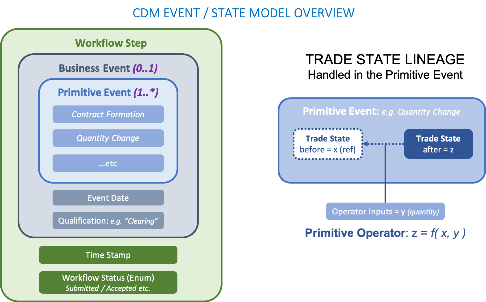
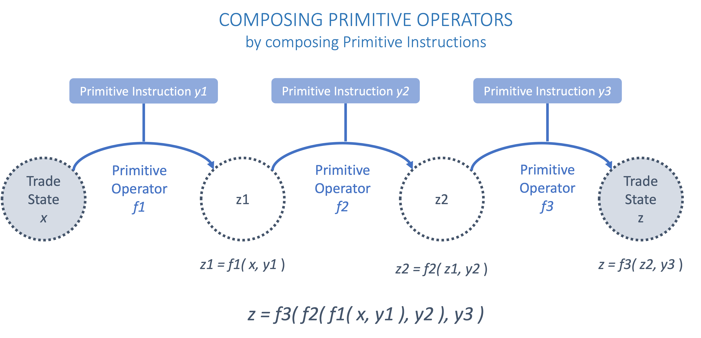

.. include:: links.rst

.. _event-model-section:

Event Model
-----------

**The CDM event model provides data structures to represent the lifecycle events of financial transactions**. A lifecycle event occurs when a transaction goes through a *state transition* initiated either by one or both trading parties, by contractual terms or by external factors. For example, the execution of a trade is the initial event which results in the state of an executed trade. Subsequently, one party might initiate an allocation, both parties might initiate an amendment to a contractual agreement, or a default by an underlying entity on a Credit Default Swap would trigger a settlement according to defined protection terms.

Examples of lifecycle events supported by the CDM Event Model include the following:

* Trade execution and confirmation
* Clearing
* Allocation
* Settlement (including any future contingent cashflow payment)
* Exercise of options

The representation of lifecycle events in the CDM is based on the following design principles:

* **A lifecycle event describes a state transition**. There must be different before/after trade states based on that lifecycle event.
* **State transitions are functional and composable**. The CDM specifies the entire functionalm logic to transition from one state to another. The state transition logic of all in-scope events is obtained by composition from a small set of functional building blocks.
* **The history of the trade state can be reconstructed** at any point in the trade lifecycle. The CDM implements a *lineage* between states as the trade goes through state transitions.
* **The product underlying the transaction remains immutable**, unless agreed (negotiated) between the parties to that transaction as part of a specific trade lifecycle event. Automated events, for instance resets or cashflow payments, should not alter the product definition.
* **The state is trade-specific**, not product-specific (i.e. the CDM is not an asset-servicing model). The same product may be associated to infinitely many trades, each with its own specific state, between any two parties.

To represent a state transition, the event model is organised around four main data structures.

* **Trade state** represents the state in the lifecycle that the trade is in, from execution to settlement and maturity.
* **Primitive operator** is the functional building block that is used to compose business events. Each operator describes a fundamental change to the state of a trade going from a before state to an after state and is parameterised by a primitive instruction.
* **Business event** represents a trade lifecycle event as a composite of primitive instructions. A business event can comprise several instructions, each consisting of a set of primitive instructions applied as a "chain" to a single trade state (before). The resulting trade state (after) can be multiple.
* **Workflow** represents a set of actions or steps that are required to trigger a business event.

The below diagram illustrates the relationship between these data structures. Each of them is described in the next four sections.

Trade State
^^^^^^^^^^^

The trade state is defined in CDM by the ``TradeState`` data type and represents the state of a trade at each stage in its lifecycle. With each trade creation or modification event, a new ``TradeState`` instance is created. Chaining together the sequence of ``TradeState`` instances then recreates the path each trade took within its lifecycle.

``TradeState`` is a foundational data type within the CDM Event Model as it represents the input and output of Primitive Events. Therefore, all trade related information that can change throughout the trade lifecycle are representing within ``TradeState``.

.. code-block:: Haskell

 type TradeState:
   [metadata key]
   [rootType]
   trade Trade (1..1)
   state State (0..1)
   resetHistory Reset (0..*)
   transferHistory TransferState (0..*)

While many different types of events may occur through the trade lifecycle, the ``trade``, ``state``, ``resetHistory`` and ``transferHistory`` attributes are deemed sufficient to describe all of the possible (post-trade) states which may result from lifecycle events. The ``Trade`` data type contains the tradable product, which defines all of the economic terms of the transaction as agreed between the parties.

.. note:: A tradable product is represented by the ``TradableProduct`` data type, which is further detailed in the :ref:`tradable-product` of the documentation.

The ``Trade``, ``State``, ``Reset``, and ``Transfer`` data types that are utilised within ``TradeState``, are detailed in the sections below.

Trade
"""""

The ``Trade`` data type defines the outcome of a financial transaction between parties, where the terms are primarily reflected in the tradable product. Additionally, ``Trade`` includes attributes such as the trade date, transacting parties, and settlement terms. Some attributes, such as the parties, may already be defined in a workflow step or business event and can simply be referenced in ``Trade``.

.. code-block:: Haskell

 type Trade:
   [metadata key]
   tradeIdentifier Identifier (1..*)
   tradeDate date (1..1)
     [metadata id]
   tradableProduct TradableProduct (1..1)
   party Party (0..*)
   partyRole PartyRole (0..*)
   executionDetails ExecutionDetails (0..1)
   contractDetails ContractDetails (0..1)
   clearedDate date (0..1)
     [deprecated]
   collateral Collateral (0..1)
   account Account (0..*)
     [deprecated]

.. note:: Attributes within ``Trade`` and ``ContractDetails`` incorporates elements from FpML's *trade confirmation* view, whereas the ``TradableProduct`` data type corresponds to FpML's *pre-trade* view.

Additionally, ``Trade`` supports representation of specific execution or contractual details via the ``executionDetails`` and ``contractDetails`` attributes.

ExecutionDetails and ContractDetails
""""""""""""""""""""""""""""""""""""

The ``ExecutionDetails`` data type represents details applicable to trade executions and includes attributes that describe the execution venue and execution type. Not all trades will have been 'executed', such as those created from a Swaption Exercise event. In those cases, the ``executionDetails`` attributes on ``Trade`` is expected to be empty.

``ContractDetails`` are only applicable to trades on contractual products and are typically provided at or prior to trade confirmation.

.. code-block:: Haskell

 type ContractDetails:
   [metadata key]
   documentation LegalAgreement (0..*)
   governingLaw GoverningLawEnum (0..1)
     [metadata scheme]

State
"""""

The ``State`` data type defines the state of a trade at a point in the Trade's life cycle. Trades have many state dimensions, all of which are represented here. For example, states useful for position keeping are represented alongside those needed for regulatory reporting.

.. code-block:: Haskell

 type State:
   closedState ClosedState (0..1)
   positionState PositionStatusEnum (0..1)

*ClosedState*.

In the case when a trade is closed, it is necessary to record that closure as part of the trade state.

For instance in a full novation scenario, the initial state is a single ``TradeState`` and the resulting state is two ``TradeState``. The first resulting ``TradeState`` represents a new contract, which is the same as the original but where one of the parties has been changed, and the second resulting ``TradeState`` is the original contract, now marked as *closed*.

The ``ClosedState`` data type (enclosed within ``State``) captures this closed state and defines the reason for closure.

.. code-block:: Haskell

 enum ClosedStateEnum:
   Allocated
   Cancelled
   Exercised
   Expired
   Matured
   Novated
   Terminated

.. _primitive-event:

Primitive Operator
^^^^^^^^^^^^^^^^^^

**Primitive operators are functional building blocks used to compose business events**. Each primitive operator describes a fundamental state transition that applies to a trade.

There are nine fundamental operations on trade state. Other than split and execution, they each impact separate attributes of a trade state and are therefore independent of each other.

#. execution: instantiates a new trade.
#. quantity change: changes the quantity (and/or price) of a trade
#. terms change: changes the terms of the underlying product of a trade
#. party change: changes a party on a trade
#. exercise: exercises an option embedded in a trade
#. contract formation: associates a legal agreement to a trade
#. reset: changes a trade's resettable value based on an observation
#. transfer: transfers some asset (cash, security, commodity) from one party to another
#. split: splits a trade into multiple identical trades

Primitive Function
""""""""""""""""""

A primitive operator is represented by a primitive function that takes a before trade state as input and returns an after trade state as output, both of type ``TradeState``. The only exceptions to this rule are:

- execution, for which there is no before state since its purpose is to instantiate a new trade, and
- split, which results in multiple trade states as copies of the original trade.

All primitive functions are prefixed by ``Create_`` followed by the name of the primitive operator. The business logic of primitive functions is fully implemented. An example of primitive function, for the ``PartyChange`` primitive, is illustrated below.

.. code-block:: Haskell

 func Create_PartyChange:
   inputs:
     counterparty Counterparty (1..1)
     ancillaryParty AncillaryParty (0..1)
     partyRole PartyRole (0..1)
     tradeId Identifier (1..*)
     originalTrade TradeState (1..1)
   output:
     newTrade TradeState (1..1)

Primitive Instruction
"""""""""""""""""""""

Primitive functions take additional inputs alongside the before trade state to specify the parameters of the state transition. Each primitive operator
is associated to a primitive instruction data type that contains the function's required parameters as attributes - illustrated below using the same ``PartyChange`` example.

.. code-block:: Haskell

 type PartyChangeInstruction:
   counterparty Counterparty (1..1)
   ancillaryParty AncillaryParty (0..1)
   partyRole PartyRole (0..1)
   tradeId Identifier (1..*)

The ``PrimitiveInstruction`` data type allows to build composite primitive instructions and therefore compose primitive operators. This data type contains one instruction attribute for each of the possible nine primitive instruction types - aligned onto the nine fundamental primitive operators.

.. code-block:: Haskell

 type PrimitiveInstruction: <"A Primitive Instruction describes the inputs required to pass into the corresponding PrimitiveEvent function.">
   contractFormation ContractFormationInstruction (0..1) <"Specifies instructions describing an contract formation primitive event.">
   execution ExecutionInstruction (0..1) <"Specifies instructions describing an execution primitive event.">
   exercise ExerciseInstruction (0..1) <"Specifies instructions describing an exercise primitive event.">
   partyChange PartyChangeInstruction (0..1) <"Specifies instructions describing a party change primitive event.">
   quantityChange QuantityChangeInstruction (0..1) <"Specifies instructions describing an quantity change primitive event.">
   reset ResetInstruction (0..1) <"Specifies instructions describing a reset event.">
   split SplitInstruction (0..1) <"Specifies instructions to split a trade into multiple branches.">
   termsChange TermsChangeInstruction (0..1) <"Specifies instructions describing a terms change primitive event.">
   transfer TransferInstruction (0..1) <"Specifies instructions describing a transfer primitive event.">

Primitive Composition
"""""""""""""""""""""

The separation between the before trade state and primitive instructions allows to compose primitive operators. This is done using the ``Create_TradeState`` function. This function chains the primitive operators by applying a composite primitive instruction to a single trade state, as represented in the diagram below.

.. note:: When a primitive instruction is composite, interim trade states will be created when executing each primitive operator. These interim trade state may not correspond to any actual business outcome (only the final after trade state does), so implementors will usually choose not to persist them.

The ``Create_TradeState`` function takes a single trade state and a composite primitive instruction as inputs and returns a single trade state. The before trade state input is optional, in case a new execution is specified in the instructions.

This function applies each of the primitive operators (other than split) to the trade state in the order listed in the `primitive operator`_ section. Apart from execution which, when present, must always be applied first, the order does not affect the outcome because each primitive operator impacts a different part of the trade state.

.. code-block:: Haskell

 func Create_TradeState:
   inputs:
     primitiveInstruction PrimitiveInstruction (0..1)
     before TradeState (0..1)
   output:
     after TradeState (1..1)

Special Case: Split
"""""""""""""""""""

Split is a special case of primitive operator. It is used in many lifecycle events that require a trade to be copied, such as in clearing or allocation scenarios.

- In itself, it does not change the state of a trade - it just creates identical copies
- Contrary to other operators, it outputs multiple trade states
- Order matters: when present, a split must be executed before other operators can be applied to its multiple output

Like other primitive operators, split is associated to a split function and a split instruction. But unlike other operators, the split function cannot be handled in the ``Create_TradeState`` function because it returns a multiple output. Instead, a split instruction provides a breakdown of primitive instructions to apply to each post-split trade state, using the ``Create_TradeState`` function on each.

The size of that breakdown directs the size of the split.

.. code-block:: Haskell

 type SplitInstruction:
   breakdown PrimitiveInstruction (1..*)

.. code-block:: Haskell

 func Create_Split:
   inputs:
     breakdown PrimitiveInstruction (1..*) <"Each primitive instruction contains the set of instructions to be applied to each post-split trade.">
     originalTrade TradeState (1..1) <"The original trade to be split, which must be of single cardinality.">
   output:
     splitTrade TradeState (1..*)
   
   add splitTrade: <"Iterate over each breakdown and apply the set of primitive instructions to each copy of the original trade.">
     breakdown
       map [ Create_TradeState( item, originalTrade ) ]
			
Examples of how primitive opearors can be used are illustrated below.

Example 1: Execution and Contract Formation
"""""""""""""""""""""""""""""""""""""""""""

Within the scope of the CDM, the first step in instantiating a transaction between two parties is an *execution* or a *contract formation*, which is an execution that has been confirmed between the executing parties. In some cases, there is a time delay between execution and confirmation, therefore the execution can be recorded as the first instantiation. In some other cases, the confirmation is nearly simultaneous with the execution, thus there is no need for an intermediate step.

The transition to an executed state prior to confirmation is represented by the ``ExecutionPrimitive``.

.. code-block:: Haskell

 type ExecutionPrimitive:
   before TradeState (0..0)
     [metadata reference]
   after TradeState (1..1)

The execution primitive does not allow any before state (as marked by the 0 cardinality of the ``before`` attribute) because the current CDM event model only covers post-trade lifecycle events. In practice, this execution state represents the conclusion of a pre-trade process, which may be a client order that gets filled or a quote that gets accepted by the client.

Following that execution, the trade is confirmed and a legally binding contract is signed between the two executing parties. In an allocation scenario, the trade would first get split into sub-accounts as designated by one of the executing parties, before a set of legally binding contracts is signed with each of those sub-accounts.

The ``ContractFormationPrimitive`` represents that transition to the trade state after the trade is confirmed, which results in a ``TradeState`` containing a Trade object that can optionally reference legal documentation.

.. code-block:: Haskell

 type ContractFormationPrimitive:
   before TradeState (0..1)
     [metadata reference]
   after TradeState (1..1)

The before state in the contract formation primitive is optional (as marked by the 0 cardinality lower bound of the ``before`` attribute), to represent cases where a new contract may be instantiated between parties without any prior execution, for instance in a clearing or novation scenario.

Example 2: Reset
""""""""""""""""

In many cases, a trade relies on observable values which will become known in the future: for instance, a floating rate observation at the beginning of each period in the case of a Interest Rate Swap, or the equity price at the end of each period in an Equity Swap. That primitive event is known as a *reset*.

When a observable value becomes known (as provided by the relevant market data provider), independently from any specific transaction, this information is captured by the ``Observation`` data type.

.. code-block:: Haskell

 type Observation:
   [rootType]
   [metadata key]
   observedValue Price (1..1)
   observationIdentifier ObservationIdentifier (1..1)

From that ``Observation``, a ``Reset`` can be built and included in ``TradeState`` without changing the ``Trade``. A reset is represented by the ``ResetPrimitive`` data type.

.. code-block:: Haskell

 type ResetPrimitive:
   before TradeState (1..1)
     [metadata reference]
   after TradeState (1..1)
   condition Trade:
     before -> trade = after -> trade

The *reset* process creates instances of the ``Reset`` data type, which are added to ``resetHistory`` of a given ``TradeState``.

.. code-block:: Haskell

 type Reset:
   [metadata key]
   resetValue Price (1..1)
   resetDate date (1..1)
   rateRecordDate date (0..1)
   observations Observation (1..*)
     [metadata reference]
   aggregationMethodology AggregationMethod (0..1)

The ``resetValue`` attribute represents the ultimate value of the reset as a number and is the number used to compute corresponding cash flows. If multiple ``observations`` were used to derive the ``resetValue``,  ``aggregationMethod`` should be used to describe how the many observations where aggregated into the single value.

Example 3: Transfer
"""""""""""""""""""

A ``TransferPrimitive`` is a multi-purpose primitive that can represent the transfer of any asset, including cash, from one party to another.

.. code-block:: Haskell

 type TransferPrimitive:
   [metadata key]
   before TradeState (1..1)
     [metadata reference]
   after TradeState (1..1)

The *transfer* process creates instances of the ``Transfer`` data type, which are added to ``transferHistory`` of a given ``TradeState``.

.. code-block:: Haskell

 type Transfer extends TransferBase:
   settlementOrigin SettlementOrigin (0..1)
   resetOrigin Reset (0..1)
   transferExpression TransferExpression (1..1)

.. code-block:: Haskell

 type TransferBase:
   identifier Identifier (0..*)
     [metadata scheme]
   quantity Quantity (1..1)
   observable Observable (0..1)
   payerReceiver PartyReferencePayerReceiver (1..1)
   settlementDate AdjustableOrAdjustedOrRelativeDate (1..1)

By design, the CDM treats the reset and the transfer primitive events separately because there is no one-to-one relationship between reset and transfer.

* Many transfer events are not tied to any reset: for instance, the currency settlement from an FX spot or forward transaction.
* Conversely, not all reset events generate a cashflow: for instance, the single, final settlement that is based on all the past floating rate resets in the case of a compounding floating zero-coupon swap.

.. _business-event:

Business Event
^^^^^^^^^^^^^^

A Business Event represents a transaction lifecycle event and is built according to the following design principle in the CDM:

* **Business events are specified by composition of primitive events**, which describe the fundamental state-transition components that may impact the trade state during its lifecycle.
* **Business event qualification is inferred from those primitive event components** and, in some relevant cases, from an *intent* qualifier associated with the business event. The inferred value is populated in the ``eventQualifier`` attribute.

.. code-block:: Haskell

 type BusinessEvent:
   [metadata key]
   [rootType]
   primitives PrimitiveEvent (0..*)
     [deprecated]
   intent EventIntentEnum (0..1)
   functionCall string (0..1)
   eventQualifier eventType (0..1)
   eventDate date (1..1)
   effectiveDate date (0..1)
   packageInformation IdentifiedList (0..1)
   instruction Instruction (0..*)
   after TradeState (0..*)

As can be observed in the definition above, the only mandatory attributes of a business event are the ones listed below:

* The ``primitives`` attribute, which contains the list of one or more primitive events composing that business event, each representing one and only one fundamental state-transition.
* The event date. The time dimension has been purposely ommitted from the event's attributes. That is because, while a business event has a unique date, several time stamps may potentially be associated to that event depending on when it was submitted, accepted, rejected etc, all of which are *workflow* considerations.

An example composition of the primitive events to represent a complete lifecycle event is the *partial novation* of a contract, which comprises the following:

* a ``ContractFormation`` primitive that represents the contract between the remaining party and the step in novation party. The ``tradeDate`` in the ``ContractFormation`` primitive should reflect the date of that the novation event was agreed.
* a ``QuantityChange`` primitive which includes a before attribute that defines the terms of the trade between the original parties before the novation and an after attribute the defines the terms of the trade between the original parties after the novation, in which the quantity should be less than the quantity in the before state and greater than 0 (0 would represent the case of a *full novation*).

A business event is *atomic* in the sense that its underlying primitive event constituents cannot happen independently: they either all happen together or they do not happen. In the above partial novation example, the existing trade between the parties must be downsized at the same time as the new trade is instantiated.

The ``before`` attribute is included as a reference using the ``[metadata reference]`` annotation, because by definition the primitive event points to a trade state that *already* existed. By contrast, the ``after`` trade state provides a full definition of that object, because that trade state is occurring for the first time and it is the occurrence of the primitive event that triggered a transition to that new trade state. By tying each trade state in the lifecycle to a previous trade state, primitive events are one of the mechanisms by which *lineage* is implemented in the CDM.

Selected attributes of a business event are further explained below:

Intent
""""""

The Intent attribute is an enumeration value that represents the intent of a particular business event, e.g. ``Allocation``, ``EarlyTermination``, ``PartialTermination`` etc. It is used in cases where the primitive events are not sufficient to uniquely infer a lifecycle event. As an example, a reduction in a trade quantity/notional could apply to a correction event or a partial termination.

Other Misc. Information
"""""""""""""""""""""""

* The effective date is optional as it is not applicable to certain events (e.g. observations), or may be redundant with the event date.
* The event qualifier attribute is derived from the event qualification features. This is further detailed in the :ref:`event-qualification-section`.

Workflow
^^^^^^^^

The CDM provides support for implementors to develop workflows to process transaction lifecycle events and provides attributes to define lineage from one workflow step to another.

A *workflow* represents a set of actions or steps that are required to trigger a business event, including the initial execution or contract formation. A workflow is organised into a sequence in which each step is represented by a *workflow step*. A workflow may involve multiple parties in addition to the parties to the transaction, and may include automated and manual steps. A workflow may involve only one step.

.. code-block:: Haskell

 type WorkflowStep:
   [metadata key]
   [rootType]
   businessEvent BusinessEvent (0..1)
   proposedEvent EventInstruction (0..1)
   rejected boolean (0..1)
   previousWorkflowStep WorkflowStep (0..1)
     [metadata reference]
   nextEvent EventInstruction (0..1)
   messageInformation MessageInformation (0..1)
   timestamp EventTimestamp (1..*)
   eventIdentifier Identifier (1..*)
   action ActionEnum (0..1)
   party Party (0..*)
   account Account (0..*)
   lineage Lineage (0..1)
     [deprecated]
   creditLimitInformation CreditLimitInformation (0..1)
   workflowState WorkflowState (0..1)

The different attributes of a workflow step are detailed in the sections below.

Workflow Step Business Event
""""""""""""""""""""""""""""

This attribute specifies the business event that the workflow step is meant to generate. It is optional because the workflow may require a number of interim steps before the state-transition embedded within the business event becomes effective, therefore the business event does not exist yet in those steps. The business event attribute is typically associated with the final step in the workflow.

Proposed Instruction
""""""""""""""""""""

This attribute allows for the specification of inputs that when combined with the current trade state, are referenced to generate the state-transition. For example, allocation instructions describe how to divide the initial block trade into smaller pieces, each of which is assigned to a specific party representing a legal entity related to the executing party.  It is optional because it is not required for all workflow steps.  Validation components are in place to check that the ``businessEvent`` and ``proposedInstruction`` attributes are mutually exclusive.

The list of business events for which this process is currently implemented in the CDM is reflected in the structure of the ``Instruction`` data type:

.. code-block:: Haskell

 type Instruction:
    [rootType]
    instructionFunction string (0..1)
        [deprecated]
    transfer TransferInstruction (0..1)
        [deprecated]
    primitiveInstruction PrimitiveInstruction (0..1)
    before TradeState (0..1)
        [metadata reference]

    condition ExclusiveSplitPrimitive:
       if primitiveInstruction -> split exists then primitiveInstruction -> split only exists

Previous Workflow Step
""""""""""""""""""""""

This attribute, which is provided as a reference, defines the lineage between steps in a workflow. The result is an audit trail for a business event, which can trace the various steps leading to the business event that was triggered.

Action
""""""

The action enumeration qualification specifies whether the event is a new one or a correction or cancellation of a prior one, which are trade entry references and not reflective of negotiated changes to a contract.

Message Information
"""""""""""""""""""

The ``messageInformation`` attribute defines details for delivery of the message containing the workflow steps.

.. code-block:: Haskell

 type MessageInformation:
   messageId string (1..1)
     [metadata scheme]
   sentBy string (0..1)
     [metadata scheme]
   sentTo string (0..*)
     [metadata scheme]
   copyTo string (0..*)
     [metadata scheme]

``sentBy``, ``sentTo`` and ``copyTo`` information is optional, as possibly not applicable in a all technology contexts (e.g. in case of a distributed architecture).

.. note::  MessageInformation corresponds to some of the components of the FpML *MessageHeader.model*.

Timestamp
"""""""""

The CDM adopts a generic approach to represent timestamp information, consisting of a ``dateTime`` and a ``qualification`` attributes, with the latter specified through an enumeration value.

.. code-block:: Haskell

 type EventTimestamp:
   dateTime zonedDateTime (1..1)
   qualification EventTimestampQualificationEnum (1..1)

The benefits of the CDM generic approach are twofold:

* It allows for flexibility in a context where it would be challenging to mandate which points in the process should have associated timestamps.
* Gathering all of those in one place in the model allows for evaluation and rationalisation down the road.

Below is an instance of a CDM representation (`serialised`_ into JSON) of this approach.

.. code-block:: Javascript

 "timestamp": [
  {
     "dateTime": "2007-10-31T18:08:40.335-05:00",
     "qualification": "EVENT_SUBMITTED"
  },
  {
     "dateTime": "2007-10-31T18:08:40.335-05:00",
     "qualification": "EVENT_CREATED"
  }
 ]

Event Identifier
""""""""""""""""

The Event Identifier provides a unique id that can be used for reference by other workflow steps. The data type is a generic identifier component that is used throughout the product and event models. The event identifier information comprises the ``assignedIdentifier`` and an ``issuer``, which may be provided as a reference or via a scheme.

.. code-block:: Haskell

 type Identifier:
   [metadata key]
   issuerReference Party (0..1)
     [metadata reference]
   issuer string (0..1)
     [metadata scheme]
   assignedIdentifier AssignedIdentifier (1..*)

   condition IssuerChoice:
     required choice issuerReference, issuer

.. note:: FpML also uses an event identifier construct: the ``CorrelationId``, but it is distinct from the identifier associated with the trade itself, which comes in different variations: ``PartyTradeIdentifier``, with the ``TradeId`` and the ``VersionedTradeId`` as sub-components).

Other Misc. Attributes
""""""""""""""""""""""

* The ``party`` and ``account`` information are optional because not applicable to certain events.
* The ``lineage`` attribute was previously used to reference an unbounded set of contracts, events and/or payout components, that an event may be associated to.

.. note:: The ``lineage`` attribute is superseded by the implementation in the CDM of: (i) trade state lineage, via the ``before`` / ``after`` attributes in the primitive event component, and (ii) workflow lineage, via the ``previousWorkflowStep`` attribute.

.. _event-qualification-section:

Event Qualification
^^^^^^^^^^^^^^^^^^^

**The CDM qualifies lifecycle events as a function of their primitive event components** rather than explicitly naming the event type. The CDM uses the same approach for event qualification as for product qualification, which is based on a set of Event Qualification functions. These functions are identified with a ``[qualification BusinessEvent]`` annotatation.

Event Qualification functions apply a taxonomy-specific business logic to identify if the state-transition attributes values, which are embedded in the primitive event components, match the specified criteria for the event named in that taxonomy. Like Product Qualification functions, the Event Qualification function name begins with the word ``Qualify`` followed by an underscore ``_`` and then the taxonomy name.

The CDM uses the ISDA taxonomy V2.0 leaf level to qualify the event. 22 lifecycle events have currently been qualified as part of the CDM.

One distinction with the product approach is that the ``intent`` qualification is also deemed necessary to complement the primitive event information in certain cases. To this effect, the Event Qualification function allows to specify that when present, the intent must have a specified value, as illustrated by the below example.

.. code-block:: Haskell

 func Qualify_Termination:
    [qualification BusinessEvent]
    inputs:
        businessEvent BusinessEvent (1..1)
    output: is_event boolean (1..1)
    alias primitiveInstruction: businessEvent -> instruction -> primitiveInstruction only-element
    alias transfer: TransfersForDate( businessEvent -> primitives -> transfer -> after -> transferHistory -> transfer, businessEvent -> eventDate ) only-element
    set is_event:
        businessEvent -> intent is absent
        and ((businessEvent -> primitives count = 1 and businessEvent -> primitives -> quantityChange exists)
            or (businessEvent -> primitives -> quantityChange exists and transfer exists)
            or (primitiveInstruction -> quantityChange only exists
                or (primitiveInstruction -> quantityChange, primitiveInstruction -> transfer) only exists))
        and (QuantityDecreasedToZeroPrimitive(businessEvent -> primitives -> quantityChange) = True
            or QuantityDecreasedToZero(businessEvent -> instruction -> before, businessEvent -> after) = True)
        and (businessEvent -> primitives -> quantityChange only-element -> after -> state -> closedState -> state = ClosedStateEnum -> Terminated
            or businessEvent -> after -> state -> closedState -> state all = ClosedStateEnum -> Terminated)

If all the statements above are true, then the function evaluates to True. In this case, the event is determined to be qualified as the event type referenced by the function name.

The output of the qualification function is used to populate the ``eventQualifier`` attribute of the ``BusinessEvent`` object, similar to how product qualification works. An implementation of the CDM would call all of the Event Qualification functions following the creation of each event and then insert the appropriate value or provide an exception message.

.. note:: The type of the ``eventQualifier`` attribute in ``BusinessEvent``, called ``eventType``, is a *meta-type* that indicates that its value is meant to be populated using some functional logic. That functional logic must be represented by a qualification function annotated with ``[qualification BusinessEvent]``, as in the example above. This mechanism is further detailed in the Rosetta DSL documentation.
